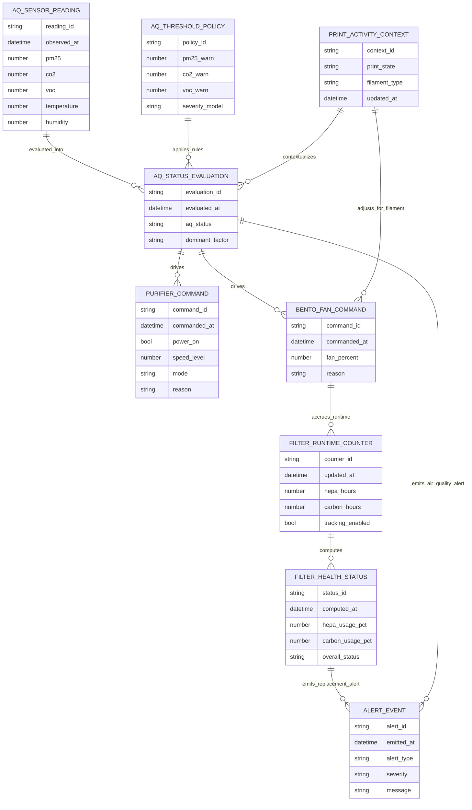
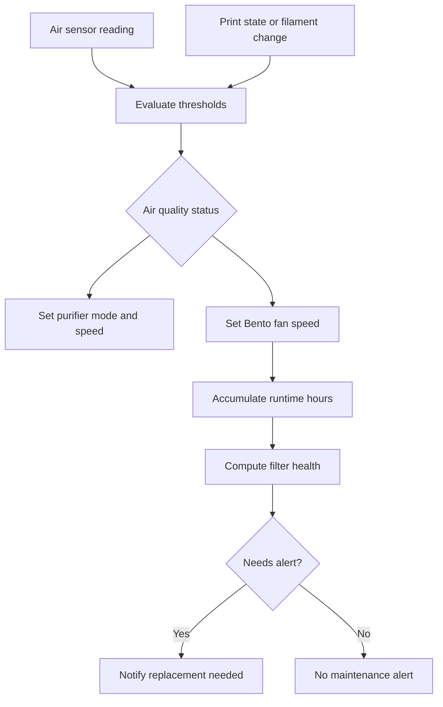

# Air Quality Entity Relationship Diagram

This document models the core entities and control relationships for the `air_quality` feature, including sensor ingestion, threshold evaluation, purifier control, Bento Box fan control, and filter tracking.

## ER Diagram

## Runtime Notes

- `AQ_STATUS_EVALUATION` is the decision boundary that converts raw sensor values and print context into actuator commands.
- `PRINT_ACTIVITY_CONTEXT` enables filament-aware fan behavior and post-print runtime windows.
- `FILTER_RUNTIME_COUNTER` and `FILTER_HEALTH_STATUS` provide maintenance state separate from real-time air quality control.

## Control Flow View

