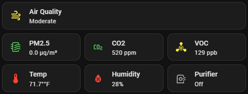

# Air Quality Dashboard - Visual Preview

This document shows what your air quality dashboard will look like after configuration.

<!-- SCREENSHOT: id=air-quality-visual-good | format=png | version=1.0 | package=air_quality | added=2026-03-15 | captured=2026-03-15 -->



<!-- SCREENSHOT: id=air-quality-visual-moderate | format=png | version=1.0 | package=air_quality | added=2026-03-15 -->
<!-- Capture: Sensor cards with yellow/moderate indicators (during PLA print) -->
> **📸 Screenshot needed:** Air quality sensors — moderate state (yellow) *(png)*

<!-- SCREENSHOT: id=air-quality-visual-poor | format=png | version=1.0 | package=air_quality | added=2026-03-15 -->
<!-- Capture: Sensor cards with orange/poor indicators (during ABS/ASA print) -->
> **📸 Screenshot needed:** Air quality sensors — poor state (orange) *(png)*

<!-- SCREENSHOT: id=air-quality-visual-purifier | format=png | version=1.0 | package=air_quality | added=2026-03-15 | captured=2026-03-15 -->


## Desktop View - Horizontal Layout

### Air Quality Sensors Row

When air quality is **GOOD** (normal operation):

```
┌─────────────────────────────────────────────────────────────────────────────────┐
│                                                                                 │
│  ┌──────────┐  ┌──────────┐  ┌──────────┐  ┌──────────┐  ┌──────────┐       │
│  │  PM2.5   │  │   CO2    │  │   VOC    │  │   Temp   │  │ Humidity │       │
│  │  🟢      │  │  🟢      │  │  🟢      │  │  🟢      │  │  🟢      │       │
│  │ 8.2 µg/m³│  │  580 ppm │  │  65 ppb  │  │  22.5°C  │  │   45%    │       │
│  └──────────┘  └──────────┘  └──────────┘  └──────────┘  └──────────┘       │
│                                                                                 │
└─────────────────────────────────────────────────────────────────────────────────┘
```

When air quality is **MODERATE** (printing PLA):

```
┌─────────────────────────────────────────────────────────────────────────────────┐
│                                                                                 │
│  ┌──────────┐  ┌──────────┐  ┌──────────┐  ┌──────────┐  ┌──────────┐       │
│  │  PM2.5   │  │   CO2    │  │   VOC    │  │   Temp   │  │ Humidity │       │
│  │  🟡      │  │  🟡      │  │  🟡      │  │  🟢      │  │  🟢      │       │
│  │ 18.5 µg/m³│  │  920 ppm │  │ 125 ppb  │  │  23.1°C  │  │   47%    │       │
│  └──────────┘  └──────────┘  └──────────┘  └──────────┘  └──────────┘       │
│                                                                                 │
└─────────────────────────────────────────────────────────────────────────────────┘
```

When air quality is **POOR** (printing ABS/ASA):

```
┌─────────────────────────────────────────────────────────────────────────────────┐
│                                                                                 │
│  ┌──────────┐  ┌──────────┐  ┌──────────┐  ┌──────────┐  ┌──────────┐       │
│  │  PM2.5   │  │   CO2    │  │   VOC    │  │   Temp   │  │ Humidity │       │
│  │  🟠      │  │  🟡      │  │  🟠      │  │  🟠      │  │  🟢      │       │
│  │ 42.3 µg/m³│  │ 1050 ppm │  │ 285 ppb  │  │  27.8°C  │  │   48%    │       │
│  └──────────┘  └──────────┘  └──────────┘  └──────────┘  └──────────┘       │
│                                                                                 │
└─────────────────────────────────────────────────────────────────────────────────┘
```

### Govee Air Purifier Control Section

**Purifier Status - OFF:**

```
┌─────────────────────────────────────────────────────────────┐
│                                                             │
│  ┌───────────────────────────────────────────────────────┐ │
│  │  Govee Air Purifier                                    │ │
│  │  ⚪ Off                                                 │ │
│  │                                                         │ │
│  │  [Tap to turn ON]                                      │ │
│  └───────────────────────────────────────────────────────┘ │
│                                                             │
└─────────────────────────────────────────────────────────────┘
```

**Purifier Status - ON at Medium Speed:**

```
┌─────────────────────────────────────────────────────────────┐
│                                                             │
│  ┌───────────────────────────────────────────────────────┐ │
│  │  Govee Air Purifier                                    │ │
│  │  🟠 On - 66%                                           │ │
│  │                                                         │ │
│  │  [Tap to turn OFF]                                     │ │
│  └───────────────────────────────────────────────────────┘ │
│                                                             │
│  ┌─────────────┬─────────────┬─────────────┐              │
│  │    Low      │   Medium    │    High     │              │
│  │    ⚪       │    🟠       │    ⚪       │              │
│  │    33%      │    66%      │    100%     │              │
│  │             │  [ACTIVE]   │             │              │
│  └─────────────┴─────────────┴─────────────┘              │
│                                                             │
└─────────────────────────────────────────────────────────────┘
```

**Overall Air Quality Status:**

```
┌─────────────────────────────────────────────────────────────┐
│  Air Quality Status                                         │
│  🟢 Good - Air Quality Excellent                            │
└─────────────────────────────────────────────────────────────┘

┌─────────────────────────────────────────────────────────────┐
│  Air Quality Status                                         │
│  🟡 Moderate - Monitor                                      │
└─────────────────────────────────────────────────────────────┘

┌─────────────────────────────────────────────────────────────┐
│  Air Quality Status                                         │
│  🟠 Poor - Consider Purifier                                │
└─────────────────────────────────────────────────────────────┘

┌─────────────────────────────────────────────────────────────┐
│  Air Quality Status                                         │
│  🔴 Very Poor - Purifier Recommended                        │
└─────────────────────────────────────────────────────────────┘
```

## Mobile View - Grid Layout

### 2-Column Layout (Optimized for Phones)

```
┌───────────────────────────────────────┐
│                                       │
│  ┌────────────┐  ┌────────────┐      │
│  │   PM2.5    │  │    CO2     │      │
│  │   🟢       │  │    🟢      │      │
│  │ 8.2 µg/m³  │  │  580 ppm   │      │
│  └────────────┘  └────────────┘      │
│                                       │
│  ┌────────────┐  ┌────────────┐      │
│  │    VOC     │  │  Purifier  │      │
│  │    🟢      │  │    ⚪      │      │
│  │  65 ppb    │  │    Off     │      │
│  └────────────┘  └────────────┘      │
│                                       │
│  ┌─────────────────────────────┐     │
│  │   Air Quality Status        │     │
│  │   🟢 Good - Excellent       │     │
│  └─────────────────────────────┘     │
│                                       │
└───────────────────────────────────────┘
```

## Complete Dashboard Integration

### Recommended Layout (Desktop)

```
┌─────────────────────────────────────────────────────────────────────────────────┐
│                       3D PRINTER DASHBOARD                                      │
├─────────────────────────────────────────────────────────────────────────────────┤
│                                                                                 │
│  ┌───────────────────────────────────────────────────────────────────────┐     │
│  │  PRINTER STATUS                                                       │     │
│  │  🟢 Printing: benchy.3mf                                              │     │
│  │  Progress: 45% | Remaining: 2h 15m                                    │     │
│  └───────────────────────────────────────────────────────────────────────┘     │
│                                                                                 │
│  ┌───────────────────────────────────────────────────────────────────────┐     │
│  │  AIR QUALITY MONITORING                                               │     │
│  │  ┌────────┬────────┬────────┬────────┬────────┐                      │     │
│  │  │ PM2.5  │  CO2   │  VOC   │  Temp  │Humidity│                      │     │
│  │  │  🟡    │  🟡    │  🟡    │  🟢    │  🟢    │                      │     │
│  │  │18.5    │ 920    │ 125    │ 23.1°C │  47%   │                      │     │
│  │  └────────┴────────┴────────┴────────┴────────┘                      │     │
│  └───────────────────────────────────────────────────────────────────────┘     │
│                                                                                 │
│  ┌───────────────────────────────────────────────────────────────────────┐     │
│  │  AIR PURIFICATION                                                     │     │
│  │  🟠 Govee Air Purifier - On 66%                                       │     │
│  │  ┌─────────────┬─────────────┬─────────────┐                         │     │
│  │  │    Low      │   Medium    │    High     │                         │     │
│  │  │    ⚪       │    🟠       │    ⚪       │                         │     │
│  │  └─────────────┴─────────────┴─────────────┘                         │     │
│  │  🟡 Air Quality Status: Moderate - Monitor                            │     │
│  └───────────────────────────────────────────────────────────────────────┘     │
│                                                                                 │
│  ┌───────────────────────────────────────────────────────────────────────┐     │
│  │  FAN CONTROLS                                                         │     │
│  │  ┌────────┬────────┬────────┬────────┐                               │     │
│  │  │ Aux    │Chamber │Cooling │ Bento  │                               │     │
│  │  │ 🟠 55% │ 🟡 30% │ 🔵 85% │ 🟢 50% │                               │     │
│  │  └────────┴────────┴────────┴────────┘                               │     │
│  └───────────────────────────────────────────────────────────────────────┘     │
│                                                                                 │
└─────────────────────────────────────────────────────────────────────────────────┘
```

## Real-Time Behavior Examples

### Scenario 1: Print Starts (PLA)

**Before Print:**
```
PM2.5: 8.2 µg/m³ 🟢  |  CO2: 580 ppm 🟢  |  VOC: 65 ppb 🟢
Purifier: OFF
Status: Good - Air Quality Excellent
```

**Print Starts (automation triggers):**
```
PM2.5: 8.2 µg/m³ 🟢  |  CO2: 580 ppm 🟢  |  VOC: 65 ppb 🟢
Purifier: ON - 33% (Auto-enabled at low speed)
Status: Good - Air Quality Excellent
Notification: "Print started: benchy.3mf. Air purifier turned on at 33%."
```

**5 Minutes into Print:**
```
PM2.5: 15.1 µg/m³ 🟡  |  CO2: 720 ppm 🟢  |  VOC: 95 ppb 🟢
Purifier: ON - 33%
Status: Moderate - Monitor
```

**15 Minutes into Print:**
```
PM2.5: 18.5 µg/m³ 🟡  |  CO2: 920 ppm 🟡  |  VOC: 125 ppb 🟡
Purifier: ON - 50% (Auto-adjusted to medium-low)
Status: Moderate - Monitor
```

**Print Completes:**
```
PM2.5: 16.2 µg/m³ 🟡  |  CO2: 850 ppm 🟡  |  VOC: 110 ppb 🟡
Purifier: ON - 66% (Set to medium for post-print filtering)
Status: Moderate - Monitor
Notification: "Print completed. Air purifier will continue running for 30 minutes."
```

**30 Minutes After Print:**
```
PM2.5: 9.5 µg/m³ 🟢  |  CO2: 630 ppm 🟢  |  VOC: 70 ppb 🟢
Purifier: OFF (Auto-turned off - air quality good)
Status: Good - Air Quality Excellent
Notification: "Air quality has returned to good levels. Purifier turned off."
```

### Scenario 2: Print Starts (ABS - High VOC)

**Before Print:**
```
PM2.5: 10.1 µg/m³ 🟢  |  CO2: 650 ppm 🟢  |  VOC: 75 ppb 🟢
Purifier: OFF
Status: Good - Air Quality Excellent
```

**Print Starts:**
```
PM2.5: 10.1 µg/m³ 🟢  |  CO2: 650 ppm 🟢  |  VOC: 75 ppb 🟢
Purifier: ON - 33% (Auto-enabled)
Status: Good - Air Quality Excellent
```

**10 Minutes into Print:**
```
PM2.5: 28.3 µg/m³ 🟡  |  CO2: 980 ppm 🟡  |  VOC: 185 ppb 🟡
Purifier: ON - 50% (Auto-adjusted)
Status: Moderate - Monitor
```

**20 Minutes into Print:**
```
PM2.5: 42.3 µg/m³ 🟠  |  CO2: 1050 ppm 🟡  |  VOC: 285 ppb 🟠
Purifier: ON - 80% (Auto-increased to high)
Status: Poor - Consider Purifier
Notification: "Air quality has degraded. Purifier speed: 50% → 80%"
```

**Alert Triggered:**
```
⚠️ Alert: High PM2.5 Detected
PM2.5 level is 42.3 µg/m³ (Unhealthy: >35)

Recommended Actions:
- Turn on air purifier ✓ (Already on at 80%)
- Close windows if outdoor air quality is poor
- Monitor printer area during print
```

**Print Completes:**
```
PM2.5: 38.1 µg/m³ 🟠  |  CO2: 1020 ppm 🟡  |  VOC: 265 ppb 🟠
Purifier: ON - 80% (Continues at high speed)
Status: Poor - Consider Purifier
```

**30 Minutes After Print:**
```
PM2.5: 32.5 µg/m³ 🟡  |  CO2: 890 ppm 🟡  |  VOC: 195 ppb 🟡
Purifier: ON - 80% (Still elevated, continues running)
Status: Moderate - Monitor
Notification: "Air quality still elevated. Keeping purifier running."
```

**60 Minutes After Print:**
```
PM2.5: 11.2 µg/m³ 🟢  |  CO2: 720 ppm 🟢  |  VOC: 95 ppb 🟢
Purifier: OFF (Finally good, turned off)
Status: Good - Air Quality Excellent
```

## Interactive Features

### Tap Actions

**Sensor Cards:**
- **Tap PM2.5 card** → Opens detailed history graph
  - Shows 24-hour trend
  - Includes statistics (min/max/average)
  - Can change time range

**Purifier Status Card:**
- **Tap purifier card** → Toggles ON/OFF
  - Instant response
  - Icon and color update immediately

**Speed Buttons:**
- **Tap "Low" button** → Sets purifier to 33%
- **Tap "Medium" button** → Sets purifier to 66%
- **Tap "High" button** → Sets purifier to 100%
- Active button is highlighted in color
- Inactive buttons are grey

### Color Key

```
Status Colors:
🟢 Green  = Good/Normal (Safe levels)
🟡 Yellow = Moderate (Starting to increase)
🟠 Orange = Poor/Unhealthy (Action recommended)
🔴 Red    = Very Poor (Immediate action needed)
⚪ Grey   = Off/Unavailable
🔵 Blue   = Cold (for temperature)
```

## Notifications

### Mobile Notification Example

```
┌─────────────────────────────────────┐
│  🖨️ Air Purification Started        │
│                                     │
│  Print started: benchy.3mf          │
│                                     │
│  Air purifier turned on at 66%.     │
│  Bento Box fan enabled.             │
│                                     │
│  Current Air Quality:               │
│  PM2.5: 18.5 µg/m³                  │
│  CO2: 920 ppm                       │
│  VOC: 125 ppb                       │
│                                     │
│  [Tap to view dashboard]            │
└─────────────────────────────────────┘
```

### Alert Notification Example

```
┌─────────────────────────────────────┐
│  ⚠️ High VOC Detected               │
│                                     │
│  VOC level is 285 ppb (Poor: >200)  │
│                                     │
│  Consider:                          │
│  • Turn on air purifier             │
│  • Increase ventilation             │
│  • Check for VOC sources            │
│                                     │
│  [View Details] [Dismiss]           │
└─────────────────────────────────────┘
```

## Summary

This air quality integration provides:

✅ **Visual Clarity** - Color-coded sensors show status at a glance
✅ **Easy Control** - One-tap purifier control and speed adjustment
✅ **Smart Automation** - Intelligent speed selection based on conditions
✅ **Proactive Alerts** - Notifications when air quality degrades
✅ **Comprehensive Monitoring** - PM2.5, CO2, VOC, temperature, humidity
✅ **Responsive Design** - Works great on desktop and mobile

Just configure your entity names, paste into your dashboard, and enjoy automated air quality management!
