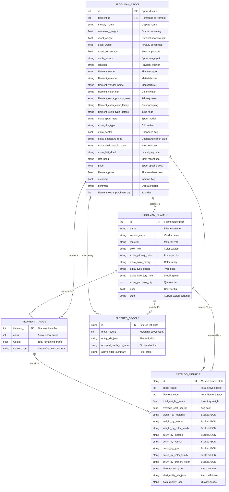
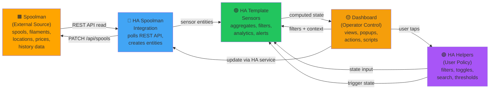

# Filament Catalog ER Diagrams and Spoolman Integration

> **Status**: ER baseline for filament catalog Spoolman integration and HA projection layer
> **Last updated**: 2026-04-23
> **Scope**: Spoolman API contract, HA template sensor aggregates, and operator-facing entities

## Diagram A: Complete Spoolman + HA Template Sensor Schema

Entity-relationship view showing Spoolman spool and filament entities alongside HA-owned template sensor aggregates.



### Table Descriptions

**SPOOLMAN_SPOOL (sensor.spoolman_spool_{id})**
- Purpose: Individual spool record from Spoolman
- Ownership: Spoolman-authoritative; HA reads via REST integration
- Update triggers: Spoolman changes, user edits in Spoolman UI or HA services
- Key use: Card rendering, alert computation, filter matching
- Note: `archived` flag controls visibility in default browse mode

**SPOOLMAN_FILAMENT (sensor.spoolman_filament_{id})**
- Purpose: Filament type definition from Spoolman
- Ownership: Spoolman-authoritative
- State value: Current remaining weight (grams) aggregated from all spools
- Key use: Zero-spool fallback entries, filament-summary mode browsing, inventory rule lookup
- Note: Used in hybrid datasource alongside spool entities

**FILAMENT_TOTALS (sensor.spoolman_filament_totals)**
- Purpose: Per-filament active inventory aggregate
- Ownership: HA-owned template sensor, reads Spoolman spool entities
- Contract: Active spools only (archived excluded)
- Key use: Card context (count, total weight), filament-summary cards, popup sibling lists
- Note: Recorder warns about oversized attributes; backend migration planned for Phase 1-2

**CATALOG_METRICS (sensor.filament_catalog_metrics)**
- Purpose: Multi-faceted KPI + analytics + alert projection
- Ownership: HA-owned template sensor, reads Spoolman spool/filament entities and computed alerts
- State: Active spool count (for quick reference)
- Attributes: Large JSON objects for KPI, chart buckets, alert counts, quality issues
- Key use: KPI chips, chart cards, alert badges, quality filters
- Note: Highest oversized-attribute risk; backend migration Phase 1-3 targets splitting this into smaller entities

**FILTERED_SPOOLS (sensor.filament_catalog_filtered_spools)**
- Purpose: Server-side datasource for the single-`auto-entities` view
- Ownership: HA-owned template sensor, applies all active filters and grouping
- State: Match count (# of spools after filtering)
- Attributes: Flat entity list + grouped output per current tab/sort choice
- Key use: Catalog view rendering, filter bar match count, active filter summary

---

## Diagram B: Spoolman API Contract + HA Consumption Patterns

Entity model showing Spoolman API surface and HA read/write patterns.

```mermaid
erDiagram
    SPOOLMAN_API ||--o{ SPOOL_ENDPOINT : "exposes"
    SPOOLMAN_API ||--o{ FILAMENT_ENDPOINT : "exposes"
    SPOOLMAN_API ||--o{ LOCATION_ENDPOINT : "exposes"
    SPOOL_ENDPOINT ||--o{ HA_SPOOL_ENTITY : "mirrored"
    FILAMENT_ENDPOINT ||--o{ HA_FILAMENT_ENTITY : "mirrored"
    HA_SPOOL_ENTITY ||--o{ HA_TEMPLATE_AGGREGATES : "consumed"
    HA_FILAMENT_ENTITY ||--o{ HA_TEMPLATE_AGGREGATES : "consumed"
    HA_TEMPLATE_AGGREGATES ||--o{ DASHBOARD : "displayed"
    DASHBOARD ||--o{ HA_SERVICES : "triggers"
    HA_SERVICES ||--o{ SPOOLMAN_API : "updates"

    SPOOLMAN_API {
        string base_url "Spoolman host"
        string auth_token "Optional OAuth"
    }

    SPOOL_ENDPOINT {
        text "GET /api/spools"
        text "GET /api/spools/{id}"
        text "PATCH /api/spools/{id}"
        text "Supports: queries, sorting, filtering"
    }

    FILAMENT_ENDPOINT {
        text "GET /api/filaments"
        text "GET /api/filaments/{id}"
        text "PATCH /api/filaments/{id}"
        text "Supports: queries, sorting"
    }

    LOCATION_ENDPOINT {
        text "GET /api/locations"
        text "Typically read-only"
    }

    HA_SPOOL_ENTITY {
        text "sensor.spoolman_spool_{id}"
        text "State: friendly_name"
        text "Attributes: all spool fields"
        text "Updates: on Spoolman changes"
    }

    HA_FILAMENT_ENTITY {
        text "sensor.spoolman_filament_{id}"
        text "State: remaining_weight_grams"
        text "Attributes: filament fields"
        text "Updates: on Spoolman changes"
    }

    HA_TEMPLATE_AGGREGATES {
        text "sensor.spoolman_filament_totals"
        text "sensor.filament_catalog_metrics"
        text "sensor.filament_catalog_filtered_spools"
    }

    DASHBOARD {
        text "view_filament_catalog.yaml"
        text "auto-entities grid"
        text "Filter bar (helpers)"
        text "Chart cards"
    }

    HA_SERVICES {
        text "spoolman.update_spool"
        text "spoolman.delete_spool"
        text "input_select / input_boolean"
        text "via user tap actions"
    }
```

### Spoolman API Access Patterns

| Operation | REST Endpoint | HA Integration | Read/Write | Frequency | Notes |
|---|---|---|---|---|---|
| **List all spools** | `GET /api/spools` | Spoolman integration periodic scan | Read | ~30s intervals | Discovers new spools, feeds sensor creation |
| **Get spool detail** | `GET /api/spools/{id}` | Spoolman sensor entity | Read | On-demand or per-poll cycle | Full spool attributes to HA entity |
| **Update spool** | `PATCH /api/spools/{id}` | HA service `spoolman.update_spool` | Write | On user action | Desiccant refresh, location change, notes edit |
| **Update spool location** | `PATCH /api/spools/{id}` (location field) | `select.spoolman_spool_{id}_location` | Write | On user tap | Via dropdown in popup |
| **List all filaments** | `GET /api/filaments` | Spoolman integration periodic scan | Read | ~30s intervals | Discovers filament types |
| **Get filament detail** | `GET /api/filaments/{id}` | Spoolman sensor entity | Read | On-demand | Filament metadata, inventory rule, purchase qty |
| **Update filament** | `PATCH /api/filaments/{id}` | HA service `spoolman.update_filament` | Write | On user action | Qty to order, inventory rule, custom fields |
| **List locations** | `GET /api/locations` | Spoolman integration scan | Read | Rare | Populated once at startup or on refresh |

### Ownership Key

- **Spoolman-owned** (authoritative source): spool record, filament definition, location, price data, desiccant history, use history
- **HA-read** (consumed from Spoolman): all API fields via Spoolman integration → entity attributes
- **HA-computed** (cached locally in template sensors): per-filament totals, KPI summary, chart buckets, filtered/grouped view
- **HA-writable** (user-facing): filtered spools list (via helper state), alerts and quality flags (computed), metrics state

---

## Diagram C: Simplified Operator-Facing View

Operator-centric view showing what the dashboard surfaces for interaction.

```mermaid
erDiagram
    SPOOLS ||--o{ LOCATIONS : "organizedBy"
    SPOOLS ||--o{ MATERIALS : "filtered"
    SPOOLS ||--o{ VENDORS : "filtered"
    SPOOLS ||--o{ ALERTS : "canHave"
    FILAMENTS ||--o{ ZERO_SPOOL_FALLBACK : "appear"
    MATERIALS ||--o{ CHARTS : "displayedIn"
    VENDORS ||--o{ CHARTS : "displayedIn"
    ALERTS ||--o{ BADGE_COUNTS : "countedIn"
    LOCATIONS ||--o{ LOCATION_FILTER : "refineBy"
    MATERIALS ||--o{ MATERIAL_FILTER : "refineBy"

    SPOOLS {
        int spool_id "Identifier"
        string location "Physical location"
        string filament_name "Type name"
        string material "Material type"
        string vendor "Manufacturer"
        string primary_color "Color"
        float remaining_weight "Weight left"
        string status_icon "Sealed/Desiccant/Alert"
        bool is_low_stock "Weight < threshold"
        bool sealed "Unopened"
        int days_since_used "Stale indicator"
    }

    FILAMENTS {
        int filament_id "Identifier"
        string name "Filament name"
        string material "Material type"
        string vendor "Manufacturer"
        float total_weight "All spools combined"
        int spool_count "# of spools"
        string inventory_rule "Stocking policy"
    }

    LOCATIONS {
        string name "Location name"
        int spool_count "Spools at location"
    }

    MATERIALS {
        string name "Material code"
        float total_weight "Kg inventory"
        int spool_count "# of spools"
    }

    VENDORS {
        string name "Vendor name"
        float total_weight "Kg inventory"
        int spool_count "# of spools"
    }

    ALERTS {
        string type "low_stock, nearly_empty, needs_repurchase, desiccant_old, missing_desiccant, needs_drying, stale"
        int affected_spool_count "# of spools"
        string severity "yellow, orange, red"
    }

    CHARTS {
        string chart_type "weight_by_material, count_by_vendor, alert_counts, etc"
        string title "Chart display name"
    }

    ZERO_SPOOL_FALLBACK {
        string filament_name "Filament with no active spools"
        int filament_id "For inventory rule checks"
        string location "Synthetic: 'No Spools'"
    }

    BADGE_COUNTS {
        int low_stock "Count of low-stock spools"
        int nearly_empty "Count < 50g"
        int needs_repurchase "Count needing order"
        int desiccant_overdue "Count > threshold"
        int missing_desiccant "Count with no desiccant"
    }

    LOCATION_FILTER {
        text "Operators select from list"
        text "Dynamically populated"
        text "21 known locations"
    }

    MATERIAL_FILTER {
        text "Operators select from list"
        text "Dynamically populated"
        text "Flat, no hierarchy"
    }
```

---

## Diagram D: Ownership and Data Flow (Colorized)

Flowchart showing component ownership and data flow.



**Color Legend**
- 🟧 **Amber (Spoolman)**: External authoritative source; HA is read-only
- 🔷 **Blue (Integration)**: HA's Spoolman integration; reads API and creates entities
- 🟢 **Green (Template Sensors)**: HA-owned computation layer; aggregates and filtering
- 🟣 **Purple (Helpers)**: User policy controls; filter state and thresholds
- 🟡 **Gold (Dashboard)**: Operator UI; views, popups, actions

---

## HA Entity Field Touchpoint Matrix

Detailed mapping of which HA entities/fields are read/written by each major operation or automation flow.

### Flow: Dynamic Filter Option Sync (Automation)

When automation `sync_filter_options` triggers (HA start, Spoolman change, or 6h timer).

| Entity | Field | Operation | Source | Notes |
|---|---|---|---|---|
| sensor.spoolman_spool_* | filament_material | Read | Automation query | Extract unique materials |
| sensor.spoolman_spool_* | filament_vendor_name | Read | Automation query | Extract unique vendors |
| sensor.spoolman_spool_* | filament_extra_primary_color | Read | Automation query | Extract unique primary colors |
| sensor.spoolman_spool_* | filament_extra_color_family | Read | Automation query | Extract unique color families |
| sensor.spoolman_spool_* | filament_extra_type_details | Read | Automation query | Extract unique types (flatten JSON array) |
| sensor.spoolman_spool_* | location | Read | Automation query | Extract unique locations |
| sensor.spoolman_spool_* | extra_spool_type | Read | Automation query | Extract unique spool types |
| sensor.spoolman_spool_* | extra_clip_type | Read | Automation query | Extract unique clip types |
| sensor.spoolman_spool_* | filament_extra_inventory_rule | Read | Automation query | Extract unique inventory rules |
| sensor.spoolman_spool_* | archived | Read | Automation filter | Exclude archived from discovery |
| sensor.spoolman_filament_* | material | Read | Automation query | For zero-spool entries |
| sensor.spoolman_filament_* | vendor_name | Read | Automation query | For zero-spool entries |
| sensor.spoolman_filament_* | extra_inventory_rule | Read | Automation query | For zero-spool entries |
| sensor.spoolman_filament_totals | totals | Read | Automation context | Check if spool count > 0 |
| input_select.filament_catalog_filter_material | options | Write | Automation service call | Set dropdown options |
| input_select.filament_catalog_filter_vendor | options | Write | Automation service call | Set dropdown options |
| input_select.filament_catalog_filter_color | options | Write | Automation service call | Set dropdown options |
| input_select.filament_catalog_filter_color_family | options | Write | Automation service call | Set dropdown options |
| input_select.filament_catalog_filter_type | options | Write | Automation service call | Set dropdown options |
| input_select.filament_catalog_filter_location | options | Write | Automation service call | Set dropdown options |
| input_select.filament_catalog_filter_spool_type | options | Write | Automation service call | Set dropdown options |
| input_select.filament_catalog_filter_clip_type | options | Write | Automation service call | Set dropdown options ('All', 'None', unique types) |
| input_select.filament_catalog_filter_inventory_rule | options | Write | Automation service call | Set dropdown options |

### Flow: Filter Evaluation and Datasource Computation (Template Sensor)

When `sensor.filament_catalog_filtered_spools` is evaluated (typically on helper state change).

| Entity | Field | Operation | Source | Notes |
|---|---|---|---|---|
| input_select.filament_catalog_filter_scope | state | Read | Template evaluation | Determine if archived/filament-summary mode |
| input_select.filament_catalog_filter_material | state | Read | Template evaluation | Filter by filament_material if not 'All' |
| input_select.filament_catalog_filter_vendor | state | Read | Template evaluation | Filter by filament_vendor_name if not 'All' |
| input_select.filament_catalog_filter_color | state | Read | Template evaluation | Filter by filament_extra_primary_color |
| input_select.filament_catalog_filter_color_family | state | Read | Template evaluation | Filter by filament_extra_color_family |
| input_select.filament_catalog_filter_type | state | Read | Template evaluation | Filter by filament_extra_type_details |
| input_select.filament_catalog_filter_location | state | Read | Template evaluation | Filter by location |
| input_select.filament_catalog_filter_spool_type | state | Read | Template evaluation | Filter by extra_spool_type |
| input_select.filament_catalog_filter_clip_type | state | Read | Template evaluation | Filter by extra_clip_type |
| input_select.filament_catalog_filter_inventory_rule | state | Read | Template evaluation | Filter by filament_extra_inventory_rule |
| input_select.filament_catalog_filter_stock_level | state | Read | Template evaluation | Apply stock threshold logic |
| input_select.filament_catalog_filter_sealed | state | Read | Template evaluation | Filter by extra_sealed flag |
| input_select.filament_catalog_filter_desiccant | state | Read | Template evaluation | Filter by desiccant age |
| input_select.filament_catalog_filter_data_quality | state | Read | Template evaluation | Filter by quality issues |
| input_text.filament_catalog_search | state | Read | Template evaluation | Free-text search across name/vendor/color |
| input_number.filament_catalog_stock_threshold | state | Read | Template evaluation | Threshold for low-stock logic |
| input_boolean.filament_catalog_filter_qty_to_purchase | state | Read | Template evaluation | Include only if filament_extra_purchase_qty > 0 |
| input_boolean.filament_catalog_filter_nearly_empty | state | Read | Template evaluation | Include only if remaining_weight < 50g |
| input_boolean.filament_catalog_filter_needs_repurchase | state | Read | Template evaluation | Include only if rule-shortage or purchase_qty > 0 |
| input_boolean.filament_catalog_filter_needs_drying | state | Read | Template evaluation | Include only if days_since_dried > 90 |
| input_boolean.filament_catalog_filter_stale | state | Read | Template evaluation | Include only if days_since_used > 180 |
| input_boolean.filament_catalog_filter_missing_desiccant | state | Read | Template evaluation | Include only if extra_desiccant_in_spool = false |
| input_select.filament_catalog_sort | state | Read | Template evaluation | Sort matched entities |
| input_select.filament_catalog_tab | state | Read | Template evaluation | Determine grouping attribute |
| sensor.filament_catalog_metrics | data_quality_json | Read | Template evaluation | Quality issue drill-down IDs |
| sensor.spoolman_filament_totals | totals | Read | Template evaluation | Per-filament count for stock logic |
| sensor.filament_catalog_filtered_spools | entity_ids_json | Write | Template output | Flat entity list (auto-entities fallback) |
| sensor.filament_catalog_filtered_spools | grouped_entity_ids_json | Write | Template output | Grouped output per tab/sort |
| sensor.filament_catalog_filtered_spools | active_filter_summary | Write | Template output | Filter bar status display |

### Flow: KPI and Metrics Computation (Template Sensor)

When `sensor.filament_catalog_metrics` is triggered by `sensor.spoolman_filament_totals` change.

| Entity | Field | Operation | Source | Notes |
|---|---|---|---|---|
| sensor.spoolman_spool_* | remaining_weight | Read | Template iteration | Sum for total weight |
| sensor.spoolman_spool_* | filament_material | Read | Template iteration | Group weight by material |
| sensor.spoolman_spool_* | filament_vendor_name | Read | Template iteration | Group weight by vendor |
| sensor.spoolman_spool_* | filament_extra_color_family | Read | Template iteration | Group weight by color family |
| sensor.spoolman_spool_* | filament_extra_primary_color | Read | Template iteration | Group weight/count by color |
| sensor.spoolman_spool_* | price | Read | Template iteration | Compute avg cost/kg |
| sensor.spoolman_spool_* | initial_weight | Read | Template iteration | Used with price for cost/kg |
| sensor.spoolman_spool_* | archived | Read | Template filter | Exclude archived spools |
| sensor.spoolman_filament_* | — | Read | Template count | Count distinct filaments |
| sensor.filament_catalog_metrics | spool_count | Write | Template computation | State = count |
| sensor.filament_catalog_metrics | inventory_summary_json | Write | Template computation | KPI payload |
| sensor.filament_catalog_metrics | weight_by_material_json | Write | Template computation | Chart bucket |
| sensor.filament_catalog_metrics | weight_by_vendor_json | Write | Template computation | Chart bucket |
| sensor.filament_catalog_metrics | weight_by_color_family_json | Write | Template computation | Chart bucket |
| sensor.filament_catalog_metrics | count_by_material_json | Write | Template computation | Chart bucket |
| sensor.filament_catalog_metrics | count_by_vendor_json | Write | Template computation | Chart bucket |
| sensor.filament_catalog_metrics | count_by_primary_color_json | Write | Template computation | Chart bucket |
| sensor.filament_catalog_metrics | alert_counts_json | Write | Template computation | Alert badge counters |
| sensor.filament_catalog_metrics | data_quality_json | Write | Template computation | Quality issue indexes |

---

## Maintenance Checklist: Schema Changes and Verification

Use this checklist when the Filament Catalog integration or Spoolman integration changes, or when new features are added to the template sensors.

### Before Adding a New Filter Dimension

- [ ] **Verify Spoolman provides the field**: Check if all relevant spools have the field as an entity attribute via the Spoolman integration
- [ ] **Identify the field name and type**: Is it a string (material), array (type_details), or numeric (price)?
- [ ] **Handle missing/unknown values**: Decide how to treat empty or null values (group as "Unknown", exclude, etc.)
- [ ] **Update sync_filter_options automation**: Add the new field to the spool entity iteration and the `filter_options` variables
- [ ] **Create or update input_select helper**: Define the new dropdown with `['All']` as initial default
- [ ] **Wire the helper into the filter bar card**: Add a bubble-card sub-button for the new filter
- [ ] **Update template sensor filter logic**: Add the new matching condition to `template_sensor_filament_catalog_filter.yaml`
- [ ] **Update HA entity contract matrix**: Document the new field in the datamodel section
- [ ] **Test dynamic option sync**: Verify the automation discovers values and populates the dropdown correctly
- [ ] **Test filter application**: Verify that applying the filter correctly matches/excludes spools

### Before Adding a New Alert Type or Chart

- [ ] **Identify the alert logic**: What spool attribute or computed value should trigger this alert?
- [ ] **Verify the computation is efficient**: Will iterating all spools add significant overhead to `sensor.filament_catalog_metrics`?
- [ ] **Add the alert counter** to the `alert_counts_json` computation in `filament_catalog_metrics.yaml`
- [ ] **Add the alert entity-id drill-down** to the `alert_entity_ids_json` structure
- [ ] **Update HA entity contract matrix**: Document the new alert in the expected counts and payload shape
- [ ] **Test alert computation**: Verify spools with the alert condition are correctly identified
- [ ] **Create chart card** (if applicable) using `custom:apex-direct-bar-card` and the new bucket payload
- [ ] **Add chart to insights panel**: Include in `catalog_insights_panel.yaml` conditional display
- [ ] **Test chart rendering**: Verify data appears correctly and colors are sensible

### Before Deploying Major Template Sensor Changes

- [ ] **Validate Jinja2 syntax**: Use the HA template editor or test in a dev environment
- [ ] **Check for infinite loops or very long filters**: Template evaluation timeout is typically 10–30 seconds; profile if needed
- [ ] **Minimize `Object.values(states)` calls**: Each call iterates all HA entities; should happen only in template sensors, not button-card templates
- [ ] **Use `triggers_update` carefully**: Button-card templates should set `triggers_update: sensor.filament_catalog_metrics` (not `all`) to prevent re-render storms
- [ ] **Test with full 165-spool dataset**: Don't assume behavior will be acceptable until tested at scale
- [ ] **Monitor recorder database size**: After deployment, check if `sensor.filament_catalog_metrics` or `sensor.spoolman_filament_totals` are still flagged as oversized
- [ ] **Verify filter bar updates correctly**: Ensure dropdowns stay in sync when Spoolman data changes

### When Spoolman Integration Updates

- [ ] **Check for new spool attributes**: Query a spool entity in HA dev tools to see if new fields were added
- [ ] **Check for deprecated fields**: Verify fields still exist if templates reference them
- [ ] **Check for location changes**: If new locations are now possible, the sync_filter_options automation should discover them automatically
- [ ] **Verify backward compatibility**: Ensure templates handle missing fields gracefully (use `| default('', true)`)
- [ ] **Update HA entity contract matrix**: Add any new Spoolman fields to the datamodel reference
- [ ] **Test filter options sync**: Run the automation manually and verify no errors in HA logs

### Operational Monitoring

- [ ] **Check template sensor evaluation time**: Use HA's Developer Tools → States to view last_changed and state update frequency
- [ ] **Monitor alert counts**: Verify `sensor.filament_catalog_alert_*` sensors stay synchronized with computed values
- [ ] **Verify filter bar match count**: Ensure the number shown in the filter bar equals the actual displayed spool count
- [ ] **Test edge cases**: Empty spool list (after selling/using all), new Spoolman fields, very long search queries
- [ ] **Monitor recorder warnings**: Check if attribute payloads still exceed size thresholds after changes

### Rollback Procedure

If a template sensor change causes problems:

1. Restore the previous YAML version from git
2. Restart Home Assistant to force template re-evaluation
3. Verify the catalog view and filter bar work as before
4. Investigate the issue; do NOT retry until root cause is understood
5. Test the corrected version in a dev environment before re-deploying

---

## Spoolman API Integration Notes

### REST API Stability

- All Spoolman endpoints used are stable and documented
- Spool GET, PATCH operations are primary read/write paths
- Filament GET, PATCH operations are secondary (mostly read for rules and qty)
- Location GET is rare (discovered once at startup or on manual rescan)

### Authentication

- HA Spoolman integration supports token-based auth for private Spoolman instances
- Tokens passed via `Authorization: Bearer {token}` header
- OAuth flow is optional; basic auth or token in URL also supported

### Rate Limiting

- Spoolman does not typically rate-limit HA polling
- Recommended polling interval: ~30 seconds (Spoolman integration default)
- Manual refresh via HA service (`homeassistant.update_entity`) is safe

### Known Constraints

- Spoolman does not provide batch update endpoint; PATCH must be per-spool
- Spool relocation (location change) requires separate PATCH
- No webhook support; HA must poll for changes
- Filament custom field storage (e.g., `extra_*` fields) is flexible but not strongly typed

---

## Backend Migration Planning

The filament catalog has a documented plan (Phase 1–3) to move heavy projection work out of YAML template sensors into a backend integration.

### Current Pain Points

- `sensor.spoolman_filament_totals` attribute size exceeds recorder threshold
- `sensor.filament_catalog_metrics` contains a giant umbrella payload (KPI + charts + alerts + quality)
- Multiple template sensors recompute the same spool iteration independently
- `sensor.filament_catalog_filtered_spools` grouped JSON generation is expensive at 165 spools

### Planned Improvements

- **Phase 1**: Create backend summary entities for KPI, alert counts, quality counts (reduce umbrella payload)
- **Phase 2**: Move ownership of `sensor.spoolman_filament_totals` to backend while preserving entity ID and contract
- **Phase 3**: Rewire dashboard consumers to read smaller backend entities instead of `sensor.filament_catalog_metrics`

### For Now

- Template sensors remain in YAML
- Current architecture is designed to be maintainable and inspectable
- When backend migration occurs, this ER doc should be updated to show the new entity surface

---

## Related Documentation

- [Filament Catalog README](../README.md) — High-level feature overview
- [Backend Migration Plan](../backend-migration-plan.md) — Phase 1–3 planned improvements
- [Backend Phase 0 Checklist](../backend-phase0-contract-checklist.md) — Design contract decisions before migration
- [Backend Entity Contract Matrix](../backend-entity-contract-matrix.md) — Detailed entity field mapping
- [Backend Consumer Change Map](../backend-consumer-change-map.md) — Files and logic that will change during migration
