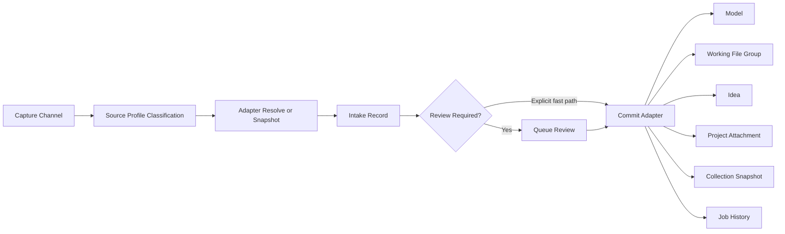

# External Source Intake Design

> **Status**: Proposed design package for issues #1496, #1615, #1616, #1617, #1618, #1619, #183, #1179, #189, #232, #1266, #1372
> **Last updated**: 2026-05-28
> **Scope**: Unified capture, routing, review, and commit architecture for online model sources, task-system links, social saves, collection migration, browser extension capture, and quick actions.

## Why This Exists

These issues all describe one product need from different angles:

- fast intake from external sites
- rich metadata capture (URL/title/creator/images/files)
- optional full-file import, not only link storage
- quick-capture from where the operator already is (browser page, Stream Deck, clipboard)
- collection migration paths (MakerWorld/other lists into local catalog tooling)

This document provides one architecture and UX contract that satisfies all six issues without splitting into competing one-off flows.

The newer issue cluster under #1496 extends that need further: not every captured item should become a Catalog model immediately, and not every source behaves like a downloadable model page. Some sources should land first as an Idea, Project seed, Collection snapshot, or Working-file handoff. This update turns the earlier provider-centric design into a generalized intake-routing contract.

## Issue Coverage Matrix

| Issue | Requirement summary | Covered by |
|---|---|---|
| #183 | Design workflow for capturing models from online services, including scraper and URL capture | Unified intake workbench, provider adapters, capture channels |
| #1179 | Link/import MakerWorld info and show in Catalog | MakerWorld profile, provenance confidence policy, metadata-first then file import |
| #189 | Move/migrate collections into Karakeep/Manyfold workflows | Collection import profile, collection snapshot + migration job contracts |
| #232 | Browser extension for pulling model context from open page | Browser extension capture contract + signed handoff endpoint |
| #1266 | Schema/options for third-party service intake | Intake schema, source records, import mode selection, confidence model |
| #1372 | Stream Deck quick import actions from source sites | Stream Deck action endpoint, preset actions, deferred review workflow |
| #1496 | Import from various sources | Generalized ingress routing, destination targeting, and unified review queue |
| #1615 | Link to or sync from MSFT Todo with `3dprint` tag | Task-system adapter, background sync policy, Idea/Project defaults |
| #1616 | Links to Karakeep | Read-only capture bridge, batch snapshot import, review-first routing |
| #1617 | Link to MakerWorld | Explicit provider routing within the generalized intake contract |
| #1618 | Instagram saved/starred import -> Model/Link/Idea | Social-save capture profile with review-required defaults |
| #1619 | Facebook saved -> Idea/Model/Project | Social-save capture profile with destination chooser beyond Catalog |

## Constraints And Existing Repo Context

- Sidecar-owned catalog authority remains the active baseline; do not reintroduce Manyfold as the authority layer.
- Existing MakerWorld provenance work already defines an offline-first extraction boundary for `.3mf` metadata. This design extends that boundary for online-source capture.
- External import should remain review-first. Operator intent and confidence must be explicit before creating durable catalog records.
- The intake system already has canonical surfaces: `Intake Home`, `Queue Review`, the intake wizard, and `Job History`. New source types should plug into those surfaces rather than creating a parallel product.
- Destination choice is broader than Catalog vs Working. The routing contract must support `Model`, `Working Files`, `Idea`, `Project`, and `Collection` without source-specific redesign each time.

## Confirmed Decisions (Current)

The following decisions are now confirmed:

1. Mockup direction remains open while variants are reviewed.
2. Immediate full import is allowed when confidence is `high`.
3. Implementation uses a provider-aware two-phase strategy, with explicit notes on when to prioritize full import for non-API providers and when API-capable providers can defer file import.
4. Collection migration approach is currently undecided by the operator; this document now includes a recommended default plus alternatives.
5. Review remains the canonical default for externally sourced items, even when auto-import is technically possible.
6. The system should distinguish `capture source` from `destination entity`; they are separate axes.

## 2026-05-28 Routing Update (#1496)

Issue #1496 and its child issues shift this design from "external model import" to "generalized intake from heterogeneous sources".

The architecture now needs to answer three routing questions for every capture:

1. **How did this item arrive?**
2. **What should it become first?**
3. **Does it require queue review before commit?**

### Canonical Position

- All new external-source paths land in the same intake system used by file and folder ingestion.
- `Queue Review` is the canonical review surface for mixed-source items.
- The default policy is `review_required = true`.
- Auto-commit is an explicit fast path, not the baseline path.
- Destination selection is normalized into a small shared set of entity types rather than per-source custom logic.

### Trigger Classes

| Trigger class | Examples | Initiator | Default review policy | Notes |
|---|---|---|---|---|
| `user_direct` | URL paste, browser extension on current tab, manual `Capture` click | operator | required | Operator intent is known, but destination and metadata still need confirmation |
| `user_quick_action` | Stream Deck preset, mobile shortcut, bookmarklet | operator | required unless explicit fast-path preset | Useful for speed, but should still create a durable intake record |
| `service_push` | n8n webhook, Karakeep outbound hook, browser companion | service on behalf of operator | required | Trust transport, not payload semantics |
| `background_sync` | MSFT Todo sync, Karakeep poll, social-save poller | service | required | Creates or refreshes pending items without interrupting the operator |
| `batch_materialization` | collection expansion, saved-list expansion | service after operator or scheduled trigger | required | May produce many review items; batch controls matter |

### Destination Entity Types

| Destination type | Use when | Typical examples |
|---|---|---|
| `model` | A curated, reusable printable asset should be created or matched | MakerWorld model, Printables page, direct downloadable model |
| `working_file_group` | Files should land in active working storage without full curation yet | draft remix bundle, in-progress model pack, manual file handoff |
| `idea` | The source is inspirational or incomplete and may not be printable yet | Instagram save, Facebook save, note/Todo item with weak metadata |
| `project` | The source should seed or attach to an active project context | task-linked model request, design brief, project-specific collection item |
| `collection` | The source is a bundle/list/container that should stay grouped first | Karakeep list, provider collection URL, social saved board |
| `link_only` | Store provenance/reference without creating a durable local asset yet | low-confidence social link, unsupported provider, auth-blocked page |

### Source Profiles

| Source profile | Current/future issues | Characteristics | Common target suggestions |
|---|---|---|---|
| `provider_model_page` | #183, #1179, #1617 | canonical model page, rich metadata, possible file manifest | `model`, `working_file_group`, `link_only` |
| `task_item` | #1615 | lightweight task/URL/note, often project-contextual | `idea`, `project`, sometimes `model` |
| `social_saved_link` | #1618, #1619 | weak metadata, noisy provenance, often inspirational | `idea`, `project`, `link_only` |
| `collection_container` | #189, #1616 | many child items, may need chunking and preflight | `collection`, then per-item `model`/`idea`/`project` |
| `manual_generic_url` | unsupported or future providers | unknown capability at capture time | `link_only`, `idea` |

### Canonical Intake Path



### Review Policy

Review is the canonical default for the #1496 scope.

#### Always review

- any `background_sync` or `service_push` capture
- any `social_saved_link` source profile
- any item targeting `idea`, `project`, or `collection`
- any item with confidence below `high`
- any item with duplicate warnings, ambiguous destination suggestions, or missing auth/file evidence
- any batch materialization flow that expands into multiple child items

#### Fast-path review bypass is allowed only when all conditions hold

- the trigger is operator-initiated (`user_direct` or explicit `user_quick_action` fast preset)
- confidence is `high`
- the source profile is `provider_model_page`
- the chosen target is `model` or `working_file_group`
- no duplicate or collision warnings are present

Even in the bypass case, the system should still write the same intake record and queue/job audit fields so the action is visible in `Job History` and can be retried or reversed.

### Destination Suggestion Rules

The UI should present **suggested targets**, not a single hardcoded destination.

Suggested defaults by source profile:

- `provider_model_page` -> suggest `Model`; secondary choices `Working Files`, `Link Only`
- `task_item` -> suggest `Idea` or `Project`; allow promote-to-Model during review if a real model URL is present
- `social_saved_link` -> suggest `Idea`; secondary choices `Project`, `Link Only`
- `collection_container` -> suggest `Collection`; later materialize child items into `Model`, `Idea`, or `Project`
- `manual_generic_url` -> suggest `Link Only` or `Idea` until stronger provider resolution exists

### n8n Role

`n8n` can be useful as an orchestration layer, but it should not become the intake authority.

Recommended role for `n8n`:

- receive or poll upstream sources that are awkward to integrate directly
- normalize secrets, schedules, and webhook fan-in
- call the sidecar capture endpoint with a signed service identity
- optionally enrich payloads with tags like `project_hint`, `source_folder`, or `capture_preset`

Not recommended for `n8n`:

- owning review state
- being the system of record for captured items
- deciding final destination commits without the sidecar queue/audit model

## Manyfold Patterns We Reuse (And What We Do Not)

Manyfold provides useful design patterns for URL ingestion:

- URL ingestion entrypoint: search/import URL -> queued background job
- Source-specific deserializers with capability maps (what metadata/files a source can provide)
- One generic create-from-URL flow that dispatches to source adapters

Relevant references:

- `app/controllers/imports_controller.rb` (URL intake endpoint)
- `app/jobs/create_object_from_url_job.rb` (queued URL import job)
- `app/deserializers/integrations/*` (source-specific URL parsing/fetch logic)
- `app/jobs/update_metadata_from_link_job.rb` (metadata/file refresh from source links)

Design adoption in this repo:

- keep the adapter/capability pattern
- keep queued async import jobs
- keep URL-first intake
- do not depend on Manyfold runtime internals for authority or storage decisions

## Unified Intake Architecture

## Terminology

- **Capture**: obtaining source context from URL/page/action (no durable model yet)
- **Snapshot**: normalized provider payload retained for review/audit
- **Import**: creating local sidecar records and optional file assets from a reviewed capture

## Layers

1. **Capture Channels**
- URL paste
- Browser extension (open-tab capture)
- Stream Deck quick action
- Karakeep item import bridge

2. **Provider Adapter Layer**
- per-source adapter modules with capability declarations
- modes: `api`, `scrape`, `hybrid`, `manual`

3. **Intake Review Layer**
- operator decides: link-only vs metadata-only vs full import
- confidence and warnings shown before commit

4. **Commit Layer**
- writes sidecar-owned source records
- optionally stages/ingests files into working/inbox flow
- emits lineage/provenance fields for catalog surfaces

5. **Routing Layer**
- suggests allowed destination entity types
- records whether review is required and why
- maps heterogeneous sources into shared commit handlers

## Generalized Intake Record Contract

The previous design focused mainly on provider metadata. #1496 requires a broader routing contract so the same intake record can support Model, Working Files, Idea, Project, or Collection outcomes.

Recommended additions to the normalized intake record:

- `source_profile` (`provider_model_page`, `task_item`, `social_saved_link`, `collection_container`, `manual_generic_url`)
- `trigger_class` (`user_direct`, `user_quick_action`, `service_push`, `background_sync`, `batch_materialization`)
- `review_required` (bool)
- `review_reason_codes` (array)
- `suggested_targets_json`
- `selected_target_type` (nullable until review/commit)
- `selected_target_id` (nullable)
- `capture_batch_id` (nullable; links child items to a collection or sync run)
- `origin_service` (nullable; e.g. `n8n`, `karakeep`, `mstodo`)
- `origin_external_id` (nullable)
- `sync_cursor` (nullable for refreshable sources)

These fields let one queue/review surface handle both classic provider imports and non-provider captures without adding a new table per source.

## External Source Metadata Carry-Forward Contract

External-source capture is only useful if the review and publish surfaces can reuse it. The canonical contract is:

- provider adapters resolve and normalize source metadata into `source_intake_records`
- Queue Review or equivalent publish surfaces treat that metadata as the default destination plan
- operator edits remain authoritative and always override imported defaults

This carry-forward is especially important for MakerWorld, where title, creator, description, source URL, gallery media, and file-instance metadata are already available at capture time.

### MakerWorld Carry-Forward Defaults

| Source-intake data | Default publish field | Intended target |
|---|---|---|
| `title` | `model_name` / group title | Catalog model name or Working Files folder title |
| `creator_name` | `creator_name` | Local model creator/designer metadata |
| `description_raw` | `description` | Local model description or working-side `.modelmeta.json` description |
| `provider_id = makerworld` | `source_origin` | Provenance / publication source |
| `source_url_canonical` | `source_origin_url` | Provenance primary URL |
| `thumbnail_url` | `preview_source_path` candidate | Default preview choice when imported media is available |
| `media_manifest_json` | media candidates | Gallery asset import or preview chooser |
| `snapshot_json.tags` | `tags` / keywords | Local model tags and keyword fields |
| `source_model_id` | provenance custom field | Imported-from-id / reconciliation |
| `snapshot_json.license`, counts, timestamps, creator UID | provenance custom fields | Audit and future enrichment, not primary display fields |
| `file_manifest_json`, `default_instance_id` | instance selector | Review-time choice of which downloadable 3MF to import |

### Shipped vs Planned

Current shipped behavior:

- MakerWorld capture stores the normalized metadata in `source_intake_records`
- full import selects a MakerWorld instance, downloads the 3MF, and creates an intake queue upload

Planned behavior from this design:

- Queue Review should display the captured MakerWorld defaults before publish
- publish actions should use those defaults automatically unless the operator changes them
- provenance-only MakerWorld fields should land in custom fields even when not promoted to top-level model fields

## Provider Capability Contract

Each adapter exposes a capability document:

```json
{
  "provider_id": "makerworld",
  "supports": {
    "model_metadata": true,
    "images": true,
    "downloadables": true,
    "collections": true,
    "auth_required": true,
    "api_mode": "api"
  },
  "auth": {
    "method": "bearer_jwt",
    "token_source": "bambu_cloud_account",
    "token_refresh": true,
    "scopes": ["design-service", "search-service"]
  },
  "rate_limits": {
    "qps": 2,
    "burst": 5,
    "note": "Unofficial API — rate limits are inferred, not documented"
  },
  "confidence_rules": {
    "canonical_url": "required",
    "creator_identity": "guaranteed",
    "file_manifest": "guaranteed"
  }
}
```

This allows consistent UI behavior across providers while still honoring source-specific constraints.

> **Update 2026-05-26**: MakerWorld's provider mode has been upgraded from `scrape` to `api` based on research into community-documented API endpoints (OpenBambuAPI project). The API provides structured JSON responses with full metadata, file manifests, and direct 3MF download — eliminating the need for scraping. Auth is now required (Bambu Cloud JWT). See the [MakerWorld Provider Adapter Spec](./makerworld-provider-adapter.md) for full API mapping.

## Data Model (Issue #1266)

## Table: `source_intake_records`

Purpose: immutable-ish intake snapshot history keyed to provider and source URL.

Suggested fields:

- `id` (uuid)
- `provider_id` (`makerworld`, `printables`, `thingiverse`, `cults3d`, `karakeep`, `other`)
- `capture_channel` (`url_paste`, `browser_extension`, `streamdeck`, `karakeep_sync`)
- `capture_mode` (`link_only`, `metadata_only`, `full_import`)
- `source_profile`
- `trigger_class`
- `source_url_canonical`
- `source_url_original`
- `source_model_id`
- `source_collection_id` (nullable)
- `review_required`
- `review_reason_codes`
- `suggested_targets_json`
- `selected_target_type` (nullable)
- `selected_target_id` (nullable)
- `capture_batch_id` (nullable)
- `origin_service` (nullable)
- `origin_external_id` (nullable)
- `title`
- `creator_name`
- `creator_url`
- `description_raw`
- `thumbnail_url`
- `media_manifest_json`
- `file_manifest_json`
- `confidence` (`high`, `medium`, `low`, `none`)
- `warnings_json`
- `snapshot_json` (full raw response, redacted as needed)
- `captured_at`
- `review_state` (`pending`, `approved`, `rejected`, `imported`)
- `import_job_id` (nullable)

## Table: `source_collection_snapshots`

Purpose: track remote collections/list containers for migration jobs.

Suggested fields:

- `id` (uuid)
- `provider_id`
- `source_collection_id`
- `source_collection_url`
- `collection_title`
- `item_count`
- `snapshot_json`
- `captured_at`
- `sync_cursor` (nullable)

## Table: `source_import_jobs`

Purpose: queue execution + audit for imports.

Suggested fields:

- `id` (uuid)
- `intake_record_id`
- `job_type` (`metadata_refresh`, `full_import`, `collection_migration`)
- `status` (`queued`, `running`, `completed`, `failed`, `partial`)
- `result_json`
- `error_json`
- `started_at`
- `completed_at`

## Operational Flows

## Flow A: URL Paste (Issue #183 baseline)

1. Operator pastes source URL in intake workbench.
2. Adapter resolves provider and normalizes canonical URL.
3. Adapter fetches metadata (API or scrape path).
4. Snapshot stored as `pending` record.
5. Operator chooses import mode:
- Link only
- Metadata only (no files)
- Full import (files + images + metadata)

## Flow B: Browser Extension Capture (Issue #232)

1. Extension reads open-tab URL + selected metadata hints.
2. Extension posts signed capture payload to sidecar endpoint.
3. Sidecar verifies nonce/signature and creates pending intake record.
4. Operator reviews in HA intake workbench and commits import.

Security notes:

- extension payload must be signed with short-lived token
- endpoint must reject unknown origins and stale nonce
- capture path stores evidence even when import is rejected

## Flow C: Stream Deck Quick Action (Issue #1372)

1. Quick action posts URL + preset mode to sidecar.
2. Sidecar creates pending intake record immediately.
3. Optional notification/toast returns intake id and status.
4. Operator later opens intake workbench for review/commit.

Preset actions:

- `Capture URL (review later)`
- `Capture + metadata fetch`
- `Capture + full import attempt`

Recommendation:

- default action remains review-first (`metadata_only`, pending)
- immediate full import is permitted when confidence is `high`
- for confidence below `high`, full import requests are converted to `metadata_only` with a warning

## Flow D: Collection Migration (Issue #189)

1. Operator submits collection URL or imports from Karakeep list.
2. Adapter captures collection snapshot and item URLs.
3. Sidecar creates `collection_migration` job with per-item intake records.
4. UI displays migration progress + per-item review exceptions.

This satisfies "move collections" without forcing immediate full-file import of all items.

## Collection Migration Strategy (Recommended)

Because the preferred approach is still open, use the following default strategy:

- create one `collection_migration_batch` snapshot first
- show preflight summary (item count, resolvable IDs, auth-required items, likely duplicates)
- materialize per-item intake records in chunks after operator confirms
- auto-approve only `high` confidence items if operator enables auto-approval
- route unresolved/low-confidence items into manual review queue

Why this is the recommended default:

- avoids flooding intake with noisy records from large collections
- gives deterministic checkpoint before heavy scraping/downloading
- supports resumable migration for long-running source operations

Alternative modes to retain:

- **Immediate materialization**: create all per-item records at once (faster, noisier)
- **Bundle-only**: keep only batch-level review until explicit "expand" action (cleanest, extra click)

## Collection Migration Decision Matrix

Default threshold policy:

| Estimated item count in source collection | Default mode | Rationale |
|---|---|---|
| `<= 50` | Immediate materialization (fast mode) | Low operational risk, fastest operator feedback |
| `51-100` | Chunked materialization after preflight | Good balance between speed and queue hygiene |
| `101-500` | Chunked materialization (strict) | Prevents intake flooding while preserving progress visibility |
| `> 500` | Bundle-only review first, then chunked expansion | Large/noisy collections need quality gates before record explosion |

Operational defaults by mode:

- **Immediate materialization**
  - chunk size: n/a (single batch)
  - intended for small collections and trusted providers

- **Chunked materialization**
  - default chunk size: `50` per chunk
  - configurable range: `25-100`
  - each chunk emits progress + dedupe summary before next chunk

- **Bundle-only review**
  - no per-item intake records created until operator selects `Expand`
  - expand action then follows chunked materialization rules

Escalation rules:

- if unresolved item ratio exceeds `20%` in preflight, force bundle-only review regardless of size
- if duplicate-likely ratio exceeds `35%`, switch to chunked mode even for small collections
- if auth/session errors occur in two consecutive chunks, pause migration and require operator resume

## MakerWorld-Specific Behavior (Issue #1179)

This design aligns with existing embedded provenance work:

- if `.3mf` embedded provenance exists, use it as first-party evidence
- if online metadata is fetched, store source snapshot separately from curated model fields
- only promote canonical MakerWorld links when URL confidence rules pass

Do not require reverse-proxy iframe embedding as the initial implementation.

### MakerWorld API Integration (2026-05-26)

Research into community-documented MakerWorld APIs (reverse-engineered from the Bambu Handy app, documented in the [OpenBambuAPI](https://github.com/Doridian/OpenBambuAPI) project) reveals that MakerWorld is now an **API-capable provider**, not a scrape-only source. This changes the integration strategy significantly.

The full MakerWorld provider adapter specification is in [makerworld-provider-adapter.md](./makerworld-provider-adapter.md). Key implications for this design:

1. **Confidence is always `high`** for API-resolved models — structured metadata, verified creator identity, complete file manifests, and direct download URLs are all available from a single API call.
2. **Full import can be immediate** per the confirmed decision that `high` confidence allows immediate full import.
3. **Two capture channels are supported**: URL paste (operator pastes `makerworld.com/en/models/{id}`) and browser extension (extension extracts design ID from current tab).
4. **Auth is required** — all MakerWorld API endpoints require a Bambu Cloud Bearer JWT. The sidecar must manage token acquisition, expiry diagnostics, and operator-friendly token rotation. Do not assume the observed refresh-token flow is durable enough to be the only renewal path.
5. **3MF download is direct** — the API provides binary 3MF download via instance ID, which feeds directly into the existing file-based intake pipeline.

### MakerWorld Capture → Import Flow

```
┌──────────────────┐    ┌───────────────────┐    ┌──────────────────┐
│  Capture Channel │    │  Provider Adapter  │    │  Intake Pipeline │
│                  │    │                    │    │                  │
│  URL paste       │───►│  Parse design ID   │───►│  Pending record  │
│  Browser ext     │    │  GET /design/{id}  │    │  + API snapshot  │
│  Stream Deck     │    │  Resolve metadata  │    │                  │
│  HA automation   │    │  Build file list   │    │  Operator review │
│                  │    │  Compute confidence│    │  or auto-commit  │
└──────────────────┘    └───────────────────┘    │  (high conf.)    │
                                                  │                  │
                                                  │  ┌─── on commit ─┐│
                                                  │  │Download 3MF   ││
                                                  │  │Feed to intake ││
                                                  │  │queue (existing)││
                                                  │  │Extract images ││
                                                  │  │Write provenance││
                                                  │  └───────────────┘│
                                                  └──────────────────┘
```

### Provenance Bridge: Offline ↔ Online

When a 3MF is downloaded from MakerWorld via the API, the existing offline provenance extraction (`extract_3mf_source_metadata()`) will naturally find structured Bambu metadata inside the file. This creates a two-source provenance chain:

1. **Online provenance** (API snapshot) — stored in `source_intake_records.snapshot_json`
2. **Embedded provenance** (3MF metadata) — extracted by the existing offline parser

Both should agree. If they diverge, the online API snapshot takes precedence for model identity fields (design ID, creator, title), while the embedded metadata takes precedence for slicer-specific fields (profiles, print settings).

## UX Surfaces

## Intake Home Integration

Do not create a separate full-screen `External Intake Workbench` as the primary path.

External and mixed-source capture should plug into the existing intake surfaces:

- `Intake Home` remains the launch and monitoring surface
- `Queue Review` remains the canonical review and decision surface
- the intake wizard remains for file/folder batch authoring
- `Job History` remains the completed-work surface

`Intake Home` should add:

- a generalized `Capture From Source` lane with URL paste plus source shortcuts
- recent capture/sync health for background channels such as Karakeep, MSFT Todo, and social-save connectors
- collection import and batch expansion entry points

## Queue Review Integration

`Queue Review` should be the single review surface for queued items regardless of whether they came from browser upload, server browse, MakerWorld, Karakeep, MSFT Todo, Instagram, Facebook, or a future connector.

Queue Review detail should show:

- source profile and trigger class
- suggested target chips (`Model`, `Working Files`, `Idea`, `Project`, `Collection`, `Link Only`)
- imported/default metadata
- review-required reasons
- duplicate/provenance warnings
- available commit actions based on the chosen target

## Quick Capture Inbox

The earlier `Quick Capture Inbox` concept remains useful, but it should be implemented as one of these patterns rather than a separate product:

- a filtered `Queue Review` preset (`Quick captures`)
- a compact recent-captures panel on `Intake Home`
- or a popup child view that still uses the same queue APIs and detail schema

### MakerWorld URL Popup Child Flow (#1630, #1627)

Issue #1630 adds a presentation constraint specific to the MakerWorld URL path: the resolved details should not expand inline inside the Intake page body. The recommended implementation is a **popup child wizard** that still uses the same intake records, queue routing, commit handlers, and job audit model described in this document.

Recommended popup rules:

- reuse the shared intake popup shell, stepper, validation cards, footer action row, and completion summary patterns
- use a MakerWorld-specific `Source` + `Review` experience rather than reusing the file-tree source step
- keep `Queue Review` as the canonical deferred-review surface
- allow an explicit fast path to `Complete` when the existing high-confidence rules already permit direct commit

Issue #1627 also broadens the destination stance for MakerWorld provider pages:

- `Model` remains the default suggested target for curated imports
- `Working Files` becomes a first-class target, not a follow-up workaround
- `Link Only` remains the lightweight fallback when the operator wants provenance without local file import yet

When the chosen destination is `Working Files`, the popup should carry forward only the metadata that fits the existing working-files sidecar contract (`display_title`, `origin_url`, `tags`, `primary_file`, `thumbnail`) and keep richer provider metadata in the source-intake snapshot and job audit records.

## HTML Mockups

High-fidelity mockups for this design package:

- `design/mockups/external-intake-workbench-a.html`
- `design/mockups/external-intake-workbench-b.html`
- `design/mockups/external-intake-quick-capture.html`
- `design/mockups/makerworld-url-import-popup.html`

Low-fi canonical intake-surface mockups that this package should now align to:

- `design/intake-home-queue-mockups.md`
- `design/intake-inbox.md`
- `design/makerworld-url-import-popup.md`

## API Contracts (Draft)

`POST /api/intake/source/capture`

- creates pending intake from URL or channel payload
- accepts `trigger_class`, `origin_service`, `capture_channel`, and optional target hints

`POST /api/intake/source/resolve`

- runs provider adapter fetch/normalize pass

`POST /api/intake/source/{id}/commit`

- commits reviewed intake using selected mode (`link_only`, `metadata_only`, `full_import`)
- also accepts `selected_target_type`, optional `selected_target_id`, and target-specific options

`POST /api/intake/source/{id}/route`

- updates target selection, review flags, and queue routing without committing the item

`POST /api/intake/source/{id}/materialize_children`

- expands a collection/container record into child intake items using shared chunking rules

`POST /api/intake/source/collections/capture`

- captures remote collection snapshot

`POST /api/intake/source/collections/{id}/materialize`

- expands a captured batch into per-item intake records (optionally chunked)
- supports `mode` (`immediate`, `chunked`, `bundle_expand`) and `chunk_size` (`25-100`)

`POST /api/intake/source/collections/{id}/migrate`

- starts migration job into pending intake records

`GET /api/intake/source/providers`

- returns adapter capabilities and availability status

## Dedupe And Confidence Rules

- canonical URL is the primary dedupe key
- provider model id is secondary dedupe key
- title-only matches are warnings, never auto-merge
- low confidence records cannot auto-commit full import
- immediate full import is allowed only when confidence is `high`

Confidence thresholds:

- `high`: canonical model URL + stable model id + creator evidence
- `medium`: canonical URL + partial metadata
- `low`: weak page scrape with missing model identity
- `none`: unresolved/invalid source

Execution policy by confidence:

- `high`: allow immediate full import
- `medium`: default to metadata-only; require explicit operator override for full import
- `low`/`none`: link-only or metadata-only; no immediate full import

## Provider-Aware Two-Phase Strategy

This strategy is now required for implementation.

### Phase A: Metadata Capture First (all providers)

- normalize URL and provider identity
- capture title/creator/description/media references/file manifest hints
- compute confidence and warnings
- write snapshot + intake record

### Phase B: File Import Policy By Provider Capability

Provider categories:

- **API-capable providers** (example: MakerWorld)
  - default to metadata-first with deferred/on-demand file import
  - allow later explicit file import refresh per model
  - reduce heavy network/download operations during initial intake
  - when confidence is `high` and operator opts for full import, download 3MF directly via provider API
  - MakerWorld: use `GET /v1/design-service/instance/{instanceId}/f3mf?type=download` for direct binary download

- **Non-API or limited API providers** (example: Printables, Thingiverse)
  - prioritize full import earlier when confidence is `high`
  - keep scraper/hybrid path available for model files and supporting assets
  - retain downloaded asset evidence for reproducibility and retries

## Scraper-Mode Evaluation Notes

Scraper mode can partially overcome API limits and should be treated as a formal adapter mode, not a fallback hack.

Evaluation criteria for each provider:

- reliability across locale/layout variants
- authenticated-session requirements and token expiry behavior
- anti-automation controls and rate limiting
- ability to resolve stable model/file identifiers
- deterministic reproduction of file manifests

Decision guidance:

- use `hybrid` mode when API gives stable IDs/metadata but scraping is needed for file manifests
- use pure `scrape` mode only when API is absent or insufficient
- store scraper evidence in `snapshot_json` plus warnings so later reparses are auditable

## Phased Delivery

Implementation sequencing for the generalized #1496 scope is maintained in [issue-1496-various-sources-plan.md](../planning/issue-1496-various-sources-plan.md).

## Phase 1: Unified Capture Foundation

- URL capture endpoint
- provider capability registry
- pending intake queue + review state
- metadata commit path plus confidence-gated immediate full import when confidence is `high`

## Phase 2: Provider Adapters + MakerWorld/Printables

- MakerWorld adapter with API-mode integration (see [makerworld-provider-adapter.md](./makerworld-provider-adapter.md))
  - Bambu Cloud auth integration (JWT token management)
  - Design resolution via `GET /v1/design-service/design/{designId}`
  - 3MF download via `GET /v1/design-service/instance/{instanceId}/f3mf?type=download`
  - Gallery image capture from API response `images[]`
  - Browser extension + URL paste capture channels
- Printables adapter (scrape/hybrid mode)
- provider-specific file import policy (deferred file import for API-capable providers, priority full import for non-API providers)

## Phase 3: Extension + Stream Deck

- browser extension signed capture
- Stream Deck webhook/action integration
- quick-capture inbox UI

## Phase 4: Collection Migration + Karakeep Bridge

- collection snapshot contracts
- per-item migration jobs
- Karakeep list importer

## Decision Points To Confirm

1. Which mockup direction should become baseline implementation (A, B, or C)?
2. Should Karakeep integration be pull-based (manual sync button) or scheduled background sync?
3. Do the collection migration thresholds in the decision matrix (`<=50`, `51-100`, `101-500`, `>500`) match your operational preference, or should we tune them?

## Recommendation Summary

- adopt review-first capture by default, with confidence-gated immediate full import when confidence is `high`
- keep source snapshots sidecar-owned and auditable
- use adapter capability contracts to avoid source-specific UI forks
- implement provider-aware two-phase policy: prioritize full import early for non-API providers, allow deferred file import for API-capable providers
- treat extension and Stream Deck as first-class channels into the same intake queue
- MakerWorld is now confirmed as an API-capable provider — implement as first adapter using community-documented endpoints
- auth integration (Bambu Cloud JWT) is a prerequisite for MakerWorld adapter; design token management as a shared service for potential future Bambu-ecosystem providers
