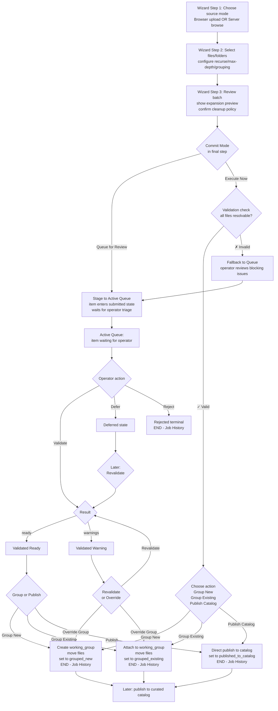
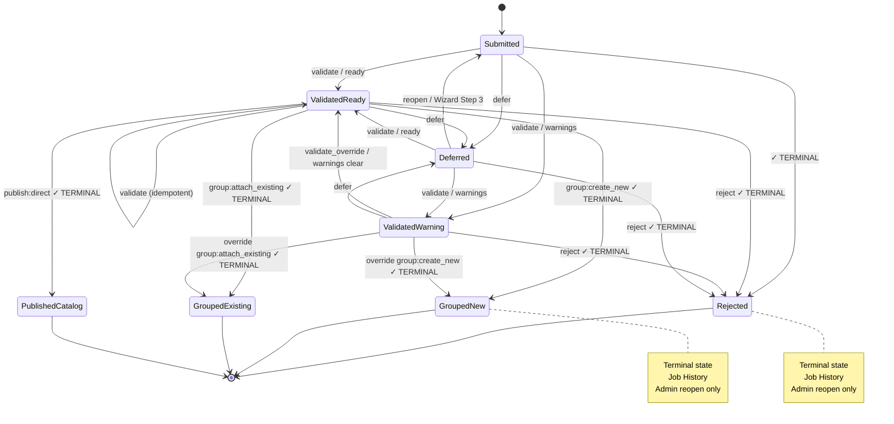
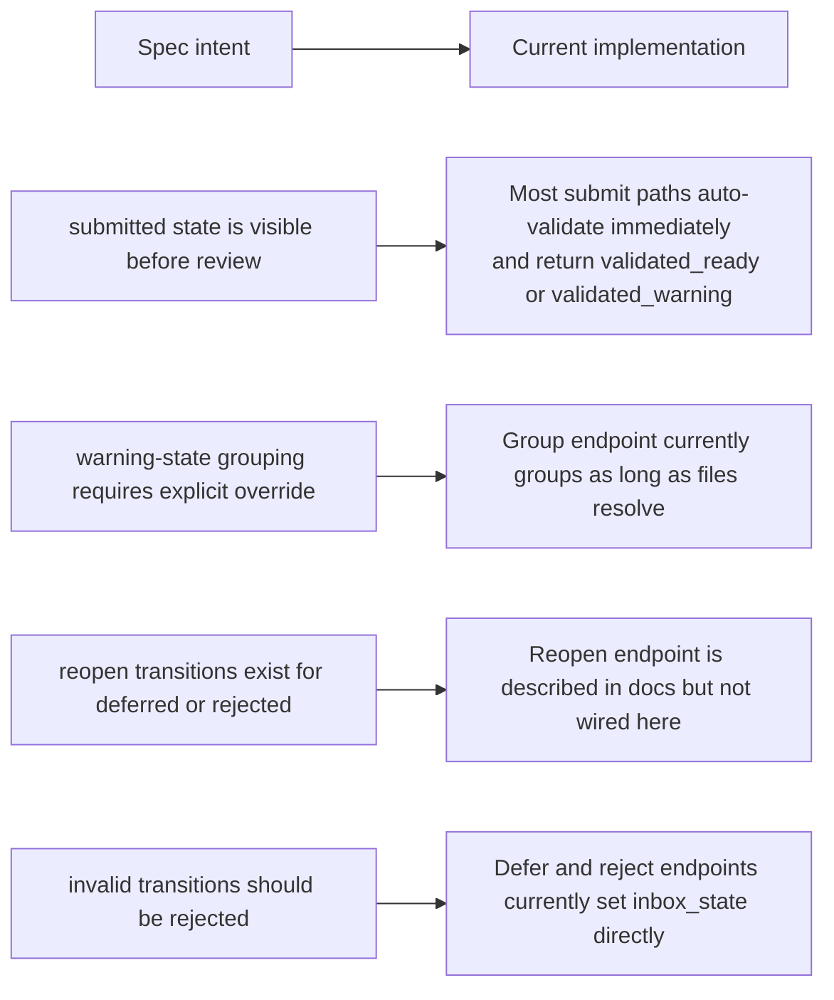
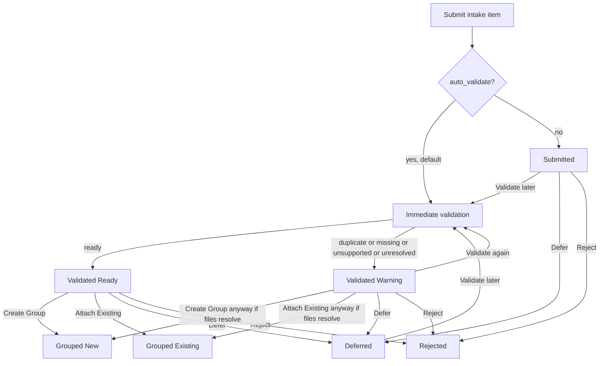

# Model Catalog Import Flow Diagrams

> Status: Updated with clear Queue vs History split and Execute Now decision point (May 2026)
> Last reviewed: 2026-05-02

This document explains the import path from Intake through the Queue (Active Queue and Job History) to Working groups.

The short version:

- Intake is the sidecar-owned staging mechanism (user selects files and submits batch).
- Active Queue is the operator-facing review area where decisions are made (submitted, validated, deferred).
- Job History is the immutable record of completed workflows (grouped, published, rejected).
- Working groups are the first durable handoff target for accepted items.
- Curated catalog publication happens later and is not part of the intake state machine.

Issue #1171 refines the intake operator surface into a stepwise flow: choose one source mode, configure the batch, then choose to Queue for Review or Execute Now.

## Mental Model

Think of the flow as four layers:

1. Source selection: browser upload, server file selection, folder selection, or bulk discovery.
2. Intake submission: the sidecar normalizes the source entries and creates an intake item.
3. Queue decision (in wizard final step): operator chooses Queue for Review (staged to Active Queue) or Execute Now (direct to terminal action).
4. Active Queue review (if queued): operator validates, defers, rejects, or groups the item.
5. Working handoff or terminal action: the item becomes a new working group, attaches to existing, publishes directly, or is rejected.
6. Job History: record of completed workflows immutable and audit-safe.

UI note:

- Browser upload and server browse remain two supported source types, but a single intake batch should use one or the other rather than a hybrid browser+server submission.
- Cleanup policy belongs to the queueing step for the current batch, near recurse/max-depth/grouping decisions.
- Mixed file+folder selections are allowed in one batch, but the wizard review step must show expansion preview so the operator understands what will be imported.

## High-Level Flow: Wizard to Execution

## Canonical Intake State Machine (Intake to Terminal)

This matches the explicit design contract in [intake-state-machine.md](intake-state-machine.md).

**Active Queue States** (operator decisions in progress):

**Terminal State Enforcement:**

Once in any terminal state (marked with ✓), only these operations are allowed:

- View item details
- Delete from Job History log
- **Admin Reopen** (requires admin role + confirmation token)

All intake workflow operations (validate, group, publish, defer, reject) return `HTTP 409 Conflict` with code `item_terminal_*`.

## What Intake, Queue, History, And Groups Mean

### Intake (Submission)

Intake is the ingestion and staging mechanism.

During Intake, the sidecar:

- accepts source files or folders from browser or server roots
- normalizes paths and validates source metadata
- computes hashes when possible
- runs lightweight duplicate and readability checks
- stores cleanup policy and folder traversal option (`recurse`)
- optionally auto-validates (if enabled) or stages as `submitted`

Intake is **transient staging**, not durable storage.

### Active Queue (Review)

Active Queue is the operator-facing review surface for items awaiting decisions.

Active Queue contains intake items in non-terminal states:

- `submitted` — just arrived, not yet validated
- `validated_ready` — clean validation, ready for action
- `validated_warning` — validation found issues, operator review required
- `deferred` — intentionally parked by operator

Operators interact with Active Queue to:

- Validate items
- Defer items for later
- Reject items as noise
- Group items into working groups or publish directly to catalog

**Active Queue is transient** — items exit when they reach a terminal state (grouped, published, rejected).

### Job History (Audit Log)

Job History is the immutable audit record of completed intake workflows.

Job History contains intake items in terminal states:

- `grouped_new` — created new working group
- `grouped_existing` — attached to existing working group
- `published_to_catalog` — published directly to curated catalog
- `rejected` — rejected as noise/invalid

Operators interact with Job History to:

- View details of completed workflows
- Review which group/model was created
- Audit trail (who did what, when)
- Delete log row (soft archive or hard delete) to clean history
- **Admin Reopen** (with confirmation) to return item to Active Queue if needed

**Job History is durable** — items are kept for audit and can only be deleted by explicit operator action with confirmation.

### Groups and Working Files

A group (working_group record) is the first durable handoff after intake.

After an intake item is grouped, the item is **no longer part of intake workflow**. The item's files are linked into working group, and the lifecycle continues in the Working flow (edit, print, iterate), not the Intake flow.

From the operator's perspective:

- Grouped items appear in the Job History with a link to the resulting working group.
- Further work happens in Working flow, not Intake flow.
- Publishing to curated catalog is a later decision in Working or Curated flow.

## Operator Cheat Sheet

| State | What it means | Available Actions | Typical Intent |
|---|---|---|---|
| `submitted` | Item in Active Queue, awaiting triage | Validate, Defer, Reject | New file arrived, needs initial review |
| `validated_ready` | Item in Active Queue, passed validation cleanly | Validate, Group New, Group Existing, Publish Catalog, Defer, Reject | Item is clean and ready for operator decision |
| `validated_warning` | Item in Active Queue, validation found issues | Validate (recheck), Group New (override), Group Existing (override), Defer, Reject | Stop and resolve issues before proceeding |
| `deferred` | Item in Active Queue, intentionally parked | Validate (recheck), Reject | Keep visible but don't commit yet |
| `grouped_new` | Item in Job History, created new working group | View Details, Delete Log Row, Admin Reopen | Workflow complete; new group created |
| `grouped_existing` | Item in Job History, attached to existing group | View Details, Delete Log Row, Admin Reopen | Workflow complete; files added to group |
| `published_to_catalog` | Item in Job History, published to curated catalog | View Details, Delete Log Row, Admin Reopen | Workflow complete; direct publish done |
| `rejected` | Item in Job History, rejected as noise/invalid | View Details, Delete Log Row, Admin Reopen | Workflow complete; intentionally excluded |

### Quick Decision Rules (Active Queue)

- **Validate** when you want to check or re-check file readiness and duplicate status.
- **Group New** when the item represents a new piece of work (start a new working group).
- **Group Existing** when the item belongs to work already in progress (attach to an existing working group).
- **Publish Catalog** (when available) to skip working and publish directly to curated catalog.
- **Defer** when the right answer is not clear yet but the item should stay visible in Active Queue.
- **Reject** when the item is noise, unsupported, accidental duplication, or intentionally excluded.
- **Treat `validated_warning` as a decision point**, not as a green-light state. Review the warnings before proceeding with group or publish.

### Quick Decision Rules (Job History)

- **View Details** to inspect what the intake action created (working group, published model, etc.).
- **Delete Log Row** to clean up completed items from the audit log (soft archive or hard delete).
- **Admin Reopen** (admin users only) if the action was wrong and needs to be redone; requires confirmation.

## Wizard Step-by-Step Behavior

### Step 1: Choose Source Mode
- **Browser Upload**: Files selected and uploaded directly from the operator's computer
- **Server Browse**: Files or folders selected from configured server-side roots

Choose **one mode** for the entire batch (not a mix).

### Step 2: Select Files and Folders, Configure Traversal

- **Individual Files**: Click to select. Each adds one file to the batch.
- **Folders**: Click folder to add. Configure:
  - `recurse`: Whether to include subfolders (default: yes)
  - `grouping_strategy`: How to organize files when expanding (see below)

**Mixed Selections**: You can select individual files AND folders in one batch. All go into a single intake item.

**Grouping Strategy** (per-folder configuration):

- `none` — don't pre-group; operator will decide grouping later
- `by-folder` — group expanded files by their source folder structure
- `by-root` — group expanded files by the root selected folder
- `flat` — put all expanded files into a single group

### Step 3: Review Batch, Confirm Cleanup Policy

Before queuing or executing, you see a preview:

- **Source Path**: Browser Upload or Server path(s)
- **Selected Entries**: Number of files and folders you selected
- **Expanded File Count** (preview): How many actual files will be imported if folders are expanded
- **Grouping Summary**: What will happen when files are grouped (e.g., "by-folder: 3 groups")
- **Warnings**: Any unsupported files, missing files, or duplicates detected
- **Cleanup Policy**: What happens to source files after import (keep, delete_on_verified, replace_with_stub)

**Expand preview** to see exactly which files will be imported and any warnings.

### Step 4 (Final): Choose Commit Mode

- **Queue for Review**: Item enters Active Queue as `submitted` (or auto-validated to `validated_ready`). You review and decide what to do next.
- **Execute Now**: Item bypasses Active Queue and goes directly to the final action you choose:
  - Group New (create working group)
  - Group Existing (attach to working group)
  - Publish Catalog (direct publish)

If **Execute Now** is blocked (e.g., due to validation warnings), you are informed and fallback to Queue for Review.

## Wizard Final Step: Execute Now vs Queue for Review

### Execute Now
- **Best for**: Power users who know exactly what they want to do
- **Requires**: Clean validation (no warnings) or explicit override
- **Action**: Immediate grouping or publish, item goes to Job History
- **Result**: Skip Active Queue entirely, workflow complete in seconds

### Queue for Review
- **Best for**: Normal operation, careful decisions
- **Process**: Item enters Active Queue, you review and decide later
- **Flexibility**: Can defer, defer and come back, change your mind
- **Result**: Item stays in Active Queue until you take action

## Current Implementation Notes

The design docs and the current code are close, but not identical.

### What Is Already True In Code

- Intake items are stored in `intake_queue_uploads`.
- Inbox review uses `inbox_state` and `decision_note`.
- The HA card now exposes Validate, Publish Curated, Send To Working Files, Attach Existing Group, Defer, and Reject at the item level.
- Grouping hands files into `working_groups` and `working_items`.

### Important Gaps Between Spec And Current Behavior

The most important practical consequence is this:

- The intended model is a guarded state machine.
- The current implementation behaves more like a review queue with state labels and soft conventions.

That means operators can currently think of `validated_warning` as "proceed carefully" rather than "hard stop unless an override contract is supplied."

## Actual Current Flow

This is the best current "how it behaves today" picture.

## Recommended Reading Order

If you want to reason about the import flow in order, read these next:

1. `docs/features/model_catalog/workflow-and-ingestion-guide.md`
2. `docs/features/model_catalog/intake-inbox-design.md`
3. `docs/features/model_catalog/intake-state-machine.md`
4. `sidecars/model_catalog/app/main.py` intake endpoints
