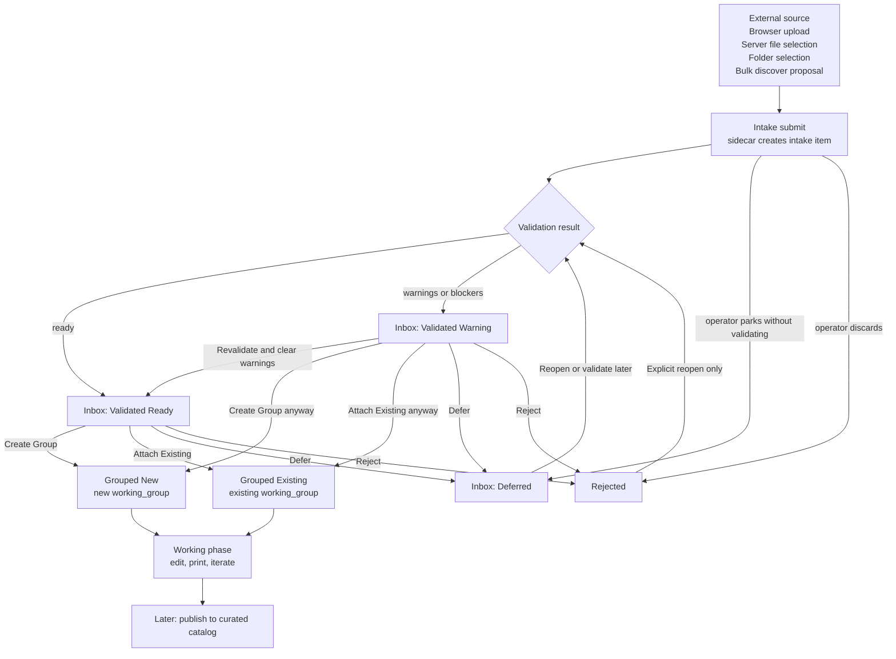
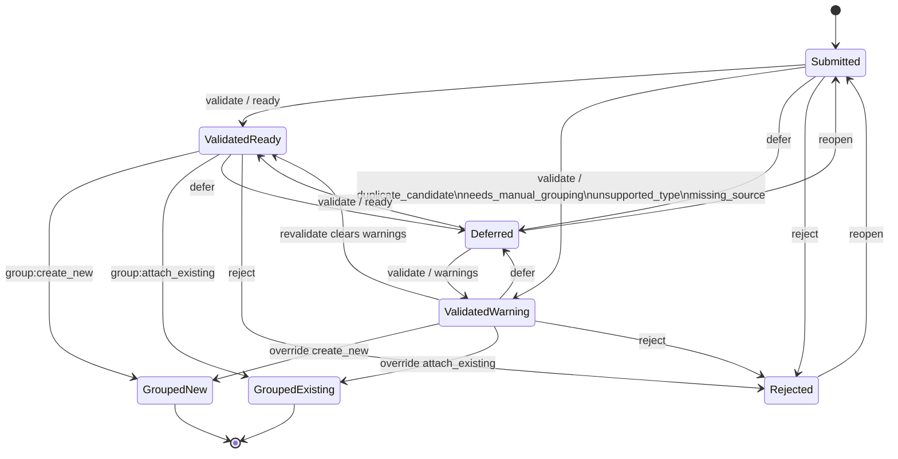
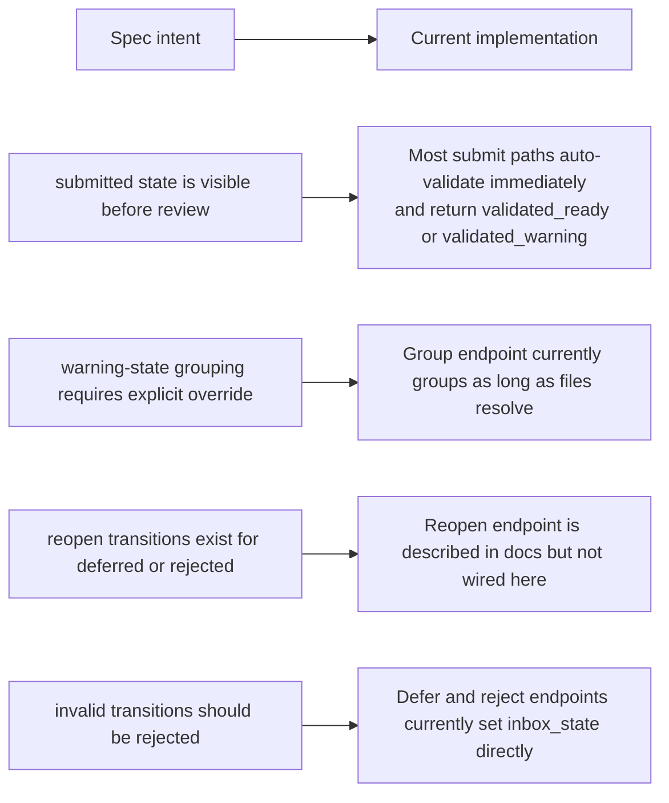
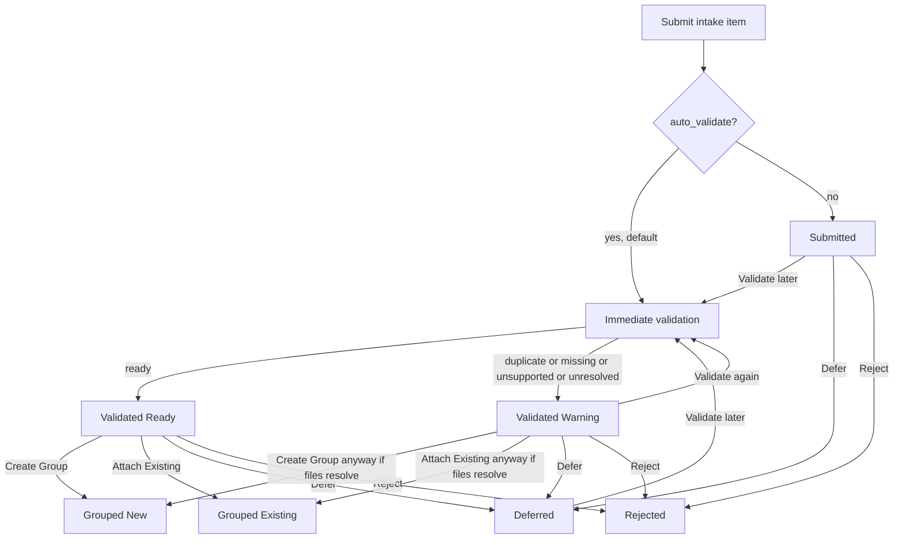

# Model Catalog Import Flow Diagrams

> Status: Working interpretation of current design plus current implementation behavior.
> Last reviewed: 2026-04-30

This document explains the import path from Intake to Inbox review to Working groups.

The short version:

- Intake is the sidecar-owned staging mechanism.
- Inbox is the operator-facing review queue over intake items.
- Working groups are the first durable handoff target for accepted items.
- Curated catalog publication happens later and is not part of the intake state machine.

## Mental Model

Think of the flow as four layers:

1. Source selection: browser upload, server file selection, folder selection, or bulk discovery.
2. Intake submission: the sidecar normalizes the source entries and creates an intake item.
3. Inbox review: the operator validates, defers, rejects, or groups the item.
4. Working handoff: the item becomes a new working group or attaches to an existing one.

## High-Level Flow

## Canonical Intake State Machine

This matches the explicit design contract in the intake state-machine document.

## What Intake, Inbox, And Groups Mean

### Intake

Intake is the ingestion mechanism and staging record.

It is where the sidecar:

- accepts source files or folders
- normalizes paths and source metadata
- computes hashes when possible
- runs lightweight duplicate and readability checks
- stores cleanup policy and review notes

### Inbox

Inbox is not a separate storage system.

Inbox is the operator review queue over intake items, expressed by `inbox_state` values such as:

- `submitted`
- `validated_ready`
- `validated_warning`
- `deferred`
- `rejected`
- `grouped_new`
- `grouped_existing`

### Groups

A group means a `working_group` record has been created or selected and the resolved files have been linked into Working.

After grouping, the intake flow is effectively done.

The next lifecycle is Working-group lifecycle, not Inbox lifecycle.

## Meaning Of The Operator Actions

## Operator Cheat Sheet

| State | What it means | What you can do next | Typical operator intent |
|---|---|---|---|
| `submitted` | Intake item exists, but review is not finished yet | Validate, defer, reject | A new file or selection just arrived and still needs triage |
| `validated_ready` | Files resolved cleanly and are safe to hand off into Working | Create group, attach existing, defer, reject | The item looks good and is ready to become active work |
| `validated_warning` | Validation found duplicate signals, missing files, or grouping ambiguity | Revalidate, create group carefully, attach existing carefully, defer, reject | Stop and make a decision before treating this as a clean new work item |
| `deferred` | The item is intentionally parked in the Inbox queue | Reopen later, validate later | Keep it visible without committing to a group yet |
| `rejected` | The item should not continue through intake right now | Reopen only if the earlier decision was wrong | Preserve the record, but remove it from normal intake progression |
| `grouped_new` | The intake item created a brand new `working_group` | Open the working group and continue in Working flow | This is a new workstream |
| `grouped_existing` | The intake item attached to an existing `working_group` | Open the working group and continue in Working flow | This belongs to work already in progress |

### Quick Decision Rules

- Use `Create Group` when the intake item starts a new piece of work.
- Use `Attach Existing` when the item is another file, revision, or supporting asset for a group you already have.
- Use `Defer` when the right answer is not clear yet but the item should stay visible.
- Use `Reject` when the item is noise, unsupported, accidental duplication, or intentionally excluded.
- Treat `validated_warning` as a decision point, not as a clean green-light state.

### Validate

Validate re-checks the intake item and classifies it.

Typical outcomes:

- `ready`: file set is usable for grouping
- `duplicate_candidate`: at least one file hash matched an existing working item
- `missing_source`: source file is gone or unreadable
- `unsupported_type`: source did not resolve to supported working files
- `needs_manual_grouping`: nothing usable resolved from the selected source entries

### Defer

Defer means "keep this in the queue, but stop acting on it for now."

Operationally it means:

- the item stays visible in Inbox
- no working group is created yet
- the item is not deleted
- the operator can come back later to validate or reopen it

Use defer when:

- you need a naming decision later
- you want to compare duplicates first
- the item belongs to a future batch of work
- the source needs more inspection before grouping

### Reject

Reject means "this should not continue through intake right now."

Operationally it means:

- the item stays in the database for audit/history
- the item should no longer be considered eligible for normal grouping
- the operator note explains why it was rejected

Use reject when:

- the file is noise
- it is an accidental duplicate
- it is invalid or unsupported
- it should be intentionally excluded from Working

### Create Group

Create Group means:

- make a new `working_group`
- add the resolved intake files into that group
- mark the intake item as `grouped_new`

Use it when the item represents a new piece of work.

### Attach Existing

Attach Existing means:

- pick an existing `working_group`
- add the resolved intake files into that group when they are not already present
- mark the intake item as `grouped_existing`

Use it when the intake item is another file, revision, or supporting asset for work already in progress.

## Current Implementation Notes

The design docs and the current code are close, but not identical.

### What Is Already True In Code

- Intake items are stored in `intake_queue_uploads`.
- Inbox review uses `inbox_state` and `decision_note`.
- The HA card exposes Validate, Create Group, Attach Existing, Defer, and Reject.
- Grouping hands files into `working_groups` and `working_items`.

### Important Gaps Between Spec And Current Behavior

The most important practical consequence is this:

- The intended model is a guarded state machine.
- The current implementation behaves more like a review queue with state labels and soft conventions.

That means operators can currently think of `validated_warning` as "proceed carefully" rather than "hard stop unless an override contract is supplied."

## Actual Current Flow

This is the best current "how it behaves today" picture.

## Recommended Reading Order

If you want to reason about the import flow in order, read these next:

1. `docs/features/model_catalog/workflow-and-ingestion-guide.md`
2. `docs/features/model_catalog/intake-inbox-design.md`
3. `docs/features/model_catalog/intake-state-machine.md`
4. `sidecars/model_catalog/app/main.py` intake endpoints
