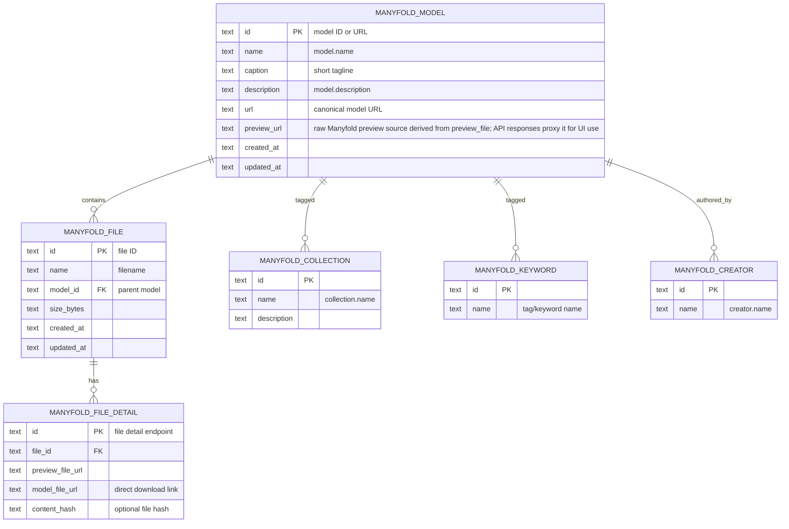
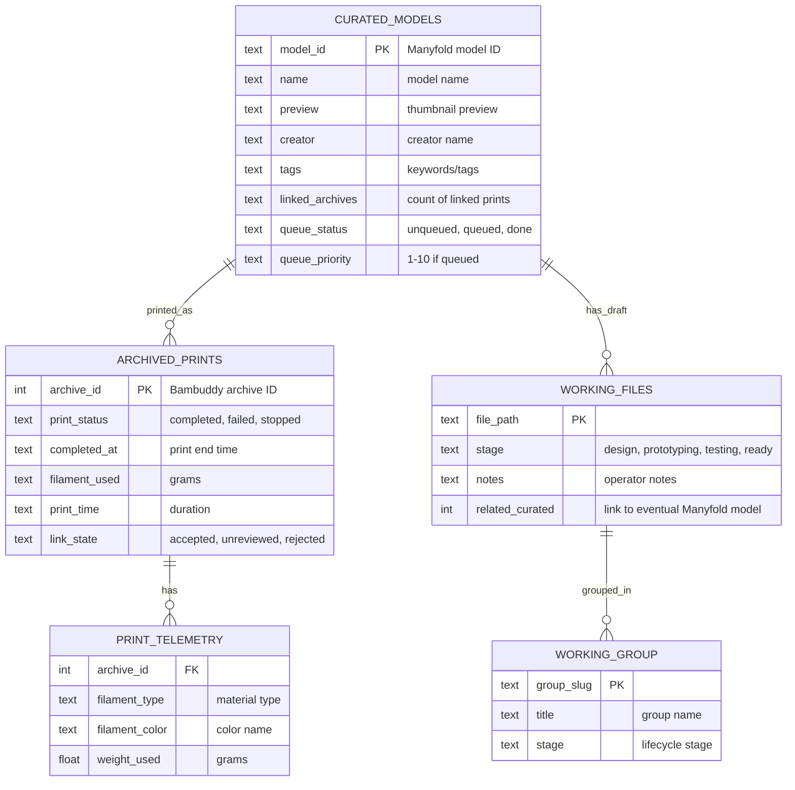
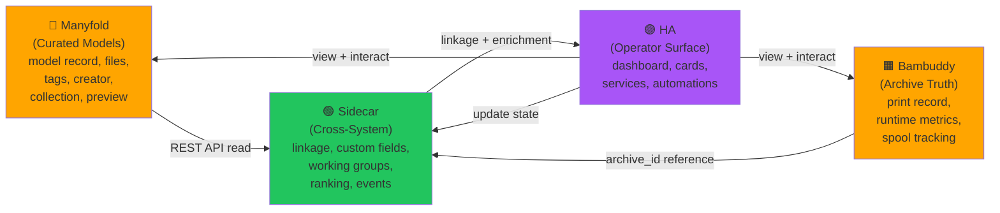

# Model Catalog ER Diagrams and Sidecar Datamodel

> **Status**: ER baseline for model_catalog sidecar and cross-system integration
> **Last updated**: 2026-04-23
> **Scope**: Sidecar-owned SQLite datamodel, Manyfold API contract, and archive linkage boundary

## Diagram A: Complete Sidecar SQLite Schema

Full entity-relationship diagram for the local model_catalog sidecar database (Version 4 migrations applied).

```mermaid
erDiagram
    MANYFOLD_MODEL_SUMMARY_CACHE ||--o{ MODEL_CATALOG_LINKS : linked
    MANYFOLD_MODEL_SUMMARY_CACHE ||--o{ MODEL_CATALOG_CUSTOM_FIELDS : has
    MANYFOLD_MODEL_SUMMARY_CACHE ||--o{ MODEL_CATALOG_MODEL_RANKING : scored
    MODEL_CATALOG_LINKS ||--o{ MODEL_CATALOG_EVENTS : triggers
    MODEL_CATALOG_CUSTOM_FIELDS ||--o{ MODEL_CATALOG_EVENTS : changes
    WORKING_GROUPS ||--o{ WORKING_ITEMS : contains
    WORKING_GROUPS ||--o{ MODEL_CATALOG_EVENTS : generated

    MANYFOLD_MODEL_SUMMARY_CACHE {
        text manyfold_model_url PK "canonical Manyfold model URL"
        text manyfold_model_public_id
        text manyfold_model_name
        text manyfold_model_id
        text preview_url
        text creator_name
        text collection_names_json
        text keyword_names_json
        text raw_json "full Manyfold API response"
        text refreshed_at
    }

    MODEL_CATALOG_LINKS {
        int id PK
        text manyfold_model_url FK
        text manyfold_model_public_id
        text manyfold_model_file_id "Manyfold file ID if file-specific"
        int bambuddy_archive_id FK "archive.id from Bambuddy"
        text relationship_type "model_printed_in_archive, model_file_printed_in_archive, etc"
        text link_role "primary, secondary, candidate"
        text match_method "manual, content_hash_exact, path_exact, etc"
        text match_confidence "high, medium, low"
        text review_state "accepted, unreviewed, needs_review, rejected"
        int is_active "0/1, soft delete flag"
        text created_at
        text updated_at
    }

    MODEL_CATALOG_CUSTOM_FIELDS {
        int id PK
        text entity_type "model, model_file, archive, link"
        text entity_id "manyfold_model_url or bambuddy_archive_id"
        text field_namespace "model_catalog, etc"
        text field_key "origin_type, to_print_status, internal_notes, etc"
        text field_value_json "type-safe JSON storage"
        text value_type "json, string, number, boolean"
        text created_at
        text updated_at
    }

    MODEL_CATALOG_MODEL_RANKING {
        text manyfold_model_url PK FK
        text manyfold_model_public_id
        text last_printed_at
        int linked_archive_count "derived from MODEL_CATALOG_LINKS"
        int print_count "derived from linked archive counts"
        float recent_score "0.0-1.0 derived from last_printed_at"
        float frequent_score "0.0-1.0 derived from print_count"
        float common_score "0.0-1.0 derived from recent + frequent blend"
        text refreshed_at
    }

    MODEL_CATALOG_EVENTS {
        int id PK
        text event_type "link_created, link_confirmed, link_rejected, annotation_updated, etc"
        text entity_type "model_link, custom_field, working_group"
        text entity_id
        text payload_json "context-specific event payload"
        text created_at
    }

    WORKING_GROUPS {
        int id PK
        text slug UK "unique slug for human reference"
        text title
        text stage "design, prototyping, testing, production-ready"
        text notes
        text primary_file_path "path to primary 3MF or file"
        text folder_hint "hint for filesystem folder association"
        text related_manyfold_model_id "optional link to eventual curated model"
        text created_at
        text updated_at
    }

    WORKING_ITEMS {
        int id PK
        int working_group_id FK
        text file_path "relative path to file in working area"
        text item_role "primary, supporting, variant, reference"
        text created_at
        text updated_at
    }

    MODEL_CATALOG_SCHEMA_MIGRATIONS {
        int version PK
        text applied_at
    }
```

### Table Descriptions

**MANYFOLD_MODEL_SUMMARY_CACHE**
- Purpose: High-performance denormalized cache of Manyfold model summaries fetched via REST API
- Ownership: Sidecar-owned cache; upstream authority is Manyfold REST API
- Refresh strategy: TTL-based refresh (configurable, default 7 days); manual refresh via `/api/models/refresh` endpoint
- Key constraint: `manyfold_model_url` is the stable canonical key

**MODEL_CATALOG_LINKS**
- Purpose: Archive-to-model relationship table; the core cross-system linkage boundary
- Ownership: Sidecar-owned; represents the joined truth between Bambuddy archives and Manyfold models
- Match provenance: `match_method` and `match_confidence` document how the link was established
- Review flow: `review_state` tracks operator acceptance; `is_active` soft-deletes inactive links
- Key constraint: unique constraint on (manyfold_model_url, manyfold_model_file_id, bambuddy_archive_id, link_role) to prevent duplicate linkages

**MODEL_CATALOG_CUSTOM_FIELDS**
- Purpose: Extensible key-value store for sidecar-owned metadata that does not belong in Manyfold
- Ownership: Sidecar-owned; defines operator-relevant fields such as origin_type, to_print_status, internal_notes, etc
- Type safety: `value_type` and `field_value_json` allow queries on specific field types
- Entity model: supports model-level, file-level, archive-level, and link-level fields (see entity_type)
- Unique constraint: (entity_type, entity_id, field_namespace, field_key) prevents duplicate field definitions

**MODEL_CATALOG_MODEL_RANKING**
- Purpose: Derived ranking signals for sorting and discovery (recent, frequent, common prints)
- Ownership: Sidecar-owned; computed from archive link counts and print history context
- Derivation: scores are computed from linked archive metadata (last_printed_at, print_count) on refresh
- Query intent: supports quick browse, "recently printed," "frequently printed," and mixed-signal ranking

**MODEL_CATALOG_EVENTS**
- Purpose: Audit log for all state changes; supports review history and manual correction tracking
- Ownership: Sidecar-owned; event is the immutable record of changes to links, fields, and working groups
- Payload: entity-specific JSON for context recovery

**WORKING_GROUPS & WORKING_ITEMS**
- Purpose: Logical grouping and organization of "actively being edited" files outside Manyfold
- Ownership: Sidecar-owned; represents operator's active work-in-progress area
- Stage progression: `stage` field tracks lifecycle (design → prototyping → testing → production-ready → curated publish)
- Folder hint: optional guidance for filesystem folder association; not a hard constraint
- Relationship to curated: `related_manyfold_model_id` (in working_groups) allows future linking to eventual curated model once published to Manyfold

---

## Diagram B: Manyfold API Contract + Sidecar Touchpoints

This diagram shows the relevant Manyfold API entities and the exact sidecar access patterns.



### Sidecar API Access Patterns

| Operation | REST Endpoint | Sidecar Touch Points | Read/Write | Frequency |
|---|---|---|---|---|
| **List models** | `GET /models` | model ID, name, creator, collections, keywords, preview | Read | Periodic TTL refresh (default 7d) |
| **Get model detail** | `GET /models/{id}` | full model record + extended metadata | Read | On-demand (model clicked in UI) |
| **List model files** | `GET /models/{id}/files` | file ID, filename, size, created_at | Read | On-demand (detail view) |
| **Get file detail** | `GET /model_files/{id}` | file hash, preview URL, download URL | Read | On-demand (file clicked) |
| **List collections** | `GET /collections` | collection ID, name | Read | Periodic (used for summary cache) |
| **List creators** | `GET /creators` | creator ID, name | Read | Periodic (used for summary cache) |
| **Cache model summary** | *internal* | store normalized model, creator, collection, keyword summary in `MANYFOLD_MODEL_SUMMARY_CACHE` | Write | During refresh cycle |
| **Refresh ranking** | *internal* | read archive link counts, compute recent/frequent/common scores into `MODEL_CATALOG_MODEL_RANKING` | Write | During ranking refresh cycle |

### Ownership Key

- **Manyfold-owned** (authoritative source): model record, files, tags/keywords, creator, collection, preview selection, description, links, license
- **Sidecar-read** (consumed from Manyfold): all API fields above
- **Sidecar-computed** (cached locally): model summary normalized, ranking scores derived from archive link history
- **Not in Manyfold** (sidecar-only): archive linkage state, custom fields, working groups, review state, event log

---

## Diagram C: Simplified Operator-Facing View

View focused on what operators interact with: curated models, working files, linkage, and queue signals.



---

## Diagram D: Ownership and Data Flow (Colorized)

Flowchart showing component ownership and write boundaries.



**Color Legend**
- 🟧 **Amber (Manyfold, Bambuddy)**: External authoritative sources; sidecar is read-only
- 🟢 **Green (Sidecar)**: Write boundary; owns linkage, custom fields, working groups, ranking, events
- 🟣 **Purple (HA)**: Operator control plane; consumes sidecar, surfaces joined views

---

## Sidecar Field Touchpoint Matrix

Detailed mapping of which sidecar database fields are read/written by each major operation or flow.

### Flow: Archive → Model Link Creation

When operator confirms an archive is linked to a Manyfold model.

| Database Table | Field | Operation | Source | Notes |
|---|---|---|---|---|
| MODEL_CATALOG_LINKS | manyfold_model_url | Write | HA service input | Operator selects or confirms model |
| MODEL_CATALOG_LINKS | bambuddy_archive_id | Write | HA service input | archive.id from Bambuddy |
| MODEL_CATALOG_LINKS | relationship_type | Write | HA service input | e.g., 'model_printed_in_archive' |
| MODEL_CATALOG_LINKS | link_role | Write | Sidecar default | Usually 'primary' on first link |
| MODEL_CATALOG_LINKS | match_method | Write | HA service input | e.g., 'manual', 'content_hash_exact' |
| MODEL_CATALOG_LINKS | match_confidence | Write | HA service input | 'high', 'medium', 'low' |
| MODEL_CATALOG_LINKS | review_state | Write | Sidecar default | 'unreviewed' until accepted |
| MODEL_CATALOG_LINKS | created_at, updated_at | Write | Sidecar timestamp | |
| MODEL_CATALOG_EVENTS | event_type | Write | Sidecar | 'link_created' |
| MODEL_CATALOG_EVENTS | entity_id | Write | Sidecar | MODEL_CATALOG_LINKS.id |
| MODEL_CATALOG_EVENTS | payload_json | Write | Sidecar | Archive and model summary |
| MODEL_CATALOG_MODEL_RANKING | linked_archive_count | Update | Sidecar | Increment on successful link |
| MODEL_CATALOG_MODEL_RANKING | refreshed_at | Update | Sidecar | Current timestamp |

### Flow: Review State Update (Accept/Reject)

When operator accepts or rejects a link in the archive popup.

| Database Table | Field | Operation | Source | Notes |
|---|---|---|---|---|
| MODEL_CATALOG_LINKS | review_state | Write | HA service input | 'accepted' or 'rejected' |
| MODEL_CATALOG_LINKS | updated_at | Write | Sidecar timestamp | |
| MODEL_CATALOG_EVENTS | event_type | Write | Sidecar | 'link_confirmed' or 'link_rejected' |
| MODEL_CATALOG_EVENTS | payload_json | Write | Sidecar | Operator note (if provided) |
| MODEL_CATALOG_CUSTOM_FIELDS | field_value_json | Update (conditional) | Sidecar | If to_print_status → 'done' on accept |

### Flow: Model Ranking Refresh

Periodic or on-demand refresh of recent/frequent/common rankings.

| Database Table | Field | Operation | Source | Notes |
|---|---|---|---|---|
| MODEL_CATALOG_LINKS | bambuddy_archive_id | Read | Sidecar query | Fetch linked archive set |
| MODEL_CATALOG_MODEL_RANKING | linked_archive_count | Write | Sidecar derived | Count(links) per model |
| MODEL_CATALOG_MODEL_RANKING | print_count | Write | Sidecar derived | Sum from archive metadata |
| MODEL_CATALOG_MODEL_RANKING | last_printed_at | Write | Sidecar derived | Max(archive.completed_at) |
| MODEL_CATALOG_MODEL_RANKING | recent_score | Write | Sidecar computed | 0.0-1.0 based on recency |
| MODEL_CATALOG_MODEL_RANKING | frequent_score | Write | Sidecar computed | 0.0-1.0 based on print count |
| MODEL_CATALOG_MODEL_RANKING | common_score | Write | Sidecar computed | Blend of recent + frequent |
| MODEL_CATALOG_MODEL_RANKING | refreshed_at | Write | Sidecar | Current timestamp |

### Flow: Manyfold Summary Cache Refresh

Periodic refresh of model summaries from Manyfold API.

| Database Table | Field | Operation | Source | Notes |
|---|---|---|---|---|
| MANYFOLD_MODEL_SUMMARY_CACHE | manyfold_model_url | Write | Manyfold REST API | Canonical model URL |
| MANYFOLD_MODEL_SUMMARY_CACHE | manyfold_model_name | Write | Manyfold REST API | model.name |
| MANYFOLD_MODEL_SUMMARY_CACHE | creator_name | Write | Manyfold REST API | creator.name |
| MANYFOLD_MODEL_SUMMARY_CACHE | collection_names_json | Write | Manyfold REST API | JSON array of collection names |
| MANYFOLD_MODEL_SUMMARY_CACHE | keyword_names_json | Write | Manyfold REST API | JSON array of keyword names |
| MANYFOLD_MODEL_SUMMARY_CACHE | preview_url | Write | Manyfold REST API | Raw preview source derived from preview_file; response serializers proxy it for UI clients |
| MANYFOLD_MODEL_SUMMARY_CACHE | raw_json | Write | Manyfold REST API | Full model payload |
| MANYFOLD_MODEL_SUMMARY_CACHE | refreshed_at | Write | Sidecar | Current timestamp |

### Flow: Custom Field Update (e.g., to_print_status, internal_notes)

When operator updates a custom field via HA service.

| Database Table | Field | Operation | Source | Notes |
|---|---|---|---|---|
| MODEL_CATALOG_CUSTOM_FIELDS | entity_type | Write | HA service input | Usually 'model' |
| MODEL_CATALOG_CUSTOM_FIELDS | entity_id | Write | HA service input | manyfold_model_url |
| MODEL_CATALOG_CUSTOM_FIELDS | field_key | Write | HA service input | e.g., 'to_print_status', 'internal_notes' |
| MODEL_CATALOG_CUSTOM_FIELDS | field_value_json | Write | HA service input | JSON-encoded value |
| MODEL_CATALOG_CUSTOM_FIELDS | updated_at | Write | Sidecar | Current timestamp |
| MODEL_CATALOG_EVENTS | event_type | Write | Sidecar | 'field_updated' |
| MODEL_CATALOG_EVENTS | entity_id | Write | Sidecar | MODEL_CATALOG_CUSTOM_FIELDS.id |
| MODEL_CATALOG_EVENTS | payload_json | Write | Sidecar | Old and new field values |

### Flow: Working Group Create/Update

When operator creates or modifies a working group.

| Database Table | Field | Operation | Source | Notes |
|---|---|---|---|---|
| WORKING_GROUPS | slug | Write | HA service input or auto-derived | Unique identifier |
| WORKING_GROUPS | title | Write | HA service input | Display name |
| WORKING_GROUPS | stage | Write | HA service input | design/prototyping/testing/production-ready |
| WORKING_GROUPS | notes | Write | HA service input | Operator notes |
| WORKING_GROUPS | primary_file_path | Write | HA service input | Path to primary 3MF or file |
| WORKING_GROUPS | folder_hint | Write | HA service input | Filesystem folder association |
| WORKING_GROUPS | created_at, updated_at | Write | Sidecar | Timestamp |
| WORKING_ITEMS | file_path | Write | HA service input | Files within the group |
| WORKING_ITEMS | item_role | Write | HA service input | primary/supporting/variant/reference |
| MODEL_CATALOG_EVENTS | event_type | Write | Sidecar | 'working_group_created' or 'working_group_updated' |

---

## Maintenance Checklist: Schema Changes and Verification

Use this checklist when the model_catalog datamodel changes or when verifying the integrity of existing deployments.

### Before Deploying a Schema Change

- [ ] **Document the change**: Add a new migration entry in `sidecars/model_catalog/app/db.py` MIGRATIONS tuple with incremented version and SQL statements
- [ ] **Write idempotent migration**: All CREATE TABLE, ALTER TABLE, or index changes must be safe to re-run (use IF NOT EXISTS, IF NOT FOUND, etc.)
- [ ] **Update dataclass definitions** (if applicable): Ensure any new Python dataclass models in `db.py` match table schema
- [ ] **Test migration on empty DB**: Run `bootstrap_database()` locally with a test `.db` file and verify all tables are created
- [ ] **Test migration on existing DB**: Backup a production `.db`, apply the migration, verify no data loss on existing rows
- [ ] **Update ER diagrams** (this file): Refresh Diagram A and B to reflect new/removed tables or columns
- [ ] **Update table descriptions**: Document the purpose, ownership, and refresh strategy of any new table

### After Deploying

- [ ] **Verify sidecar starts**: Sidecar health endpoint returns HTTP 200 with `db_path`, `table_count`, and `schema_version`
- [ ] **Verify table count matches**: `table_count` in health response matches expected tables for deployed schema version
- [ ] **Verify schema version**: `/diagnostics` endpoint reports correct `schema_version` matching deployed MIGRATIONS
- [ ] **Query sidecar endpoints**: Test `/api/models`, `/api/models/{id}`, and any new endpoints to ensure queries work against new schema
- [ ] **HA integration tests**: Confirm HA services for model linkage, custom fields, and working groups execute without DB errors
- [ ] **Backfill old data (if applicable)**: If new required fields were added, write a migration script to compute defaults for existing rows

### When Adding a New Field to an Existing Table

- [ ] **Use ALTER TABLE ADD COLUMN** in migration (not CREATE TABLE replacement)
- [ ] **Set DEFAULT value** for all existing rows to avoid NULL issues: `ALTER TABLE table_name ADD COLUMN new_col TYPE NOT NULL DEFAULT 'value'`
- [ ] **Do not rename columns** without a careful backfill migration (rename is risky; consider add-new + deprecate-old instead)
- [ ] **Document field semantics** in the ER diagram table description
- [ ] **Update any dependent Python dataclasses** if the field is part of a query result

### When Adding a New Table

- [ ] **Use explicit schema version** in migrations; include in MIGRATIONS tuple with unique (version, tuple_of_sql) entry
- [ ] **Include all indexes** needed for common queries in the migration SQL (do not add indexes retroactively)
- [ ] **Document foreign key relationships** in ER diagram if the table references other tables
- [ ] **Add to bootstrap_database() expected table list** if it should appear in the `DatabaseInfo.tables` set

### When Changing Link Uniqueness or Constraints

- [ ] **Identify existing violation**: Query for duplicate rows that would violate the new constraint
- [ ] **Plan backfill**: Decide which duplicate to keep (usually oldest or highest confidence)
- [ ] **Write pre-migration cleanup**: Delete or merge duplicates before adding constraint
- [ ] **Add constraint in migration**: Use ALTER TABLE ADD CONSTRAINT or CREATE UNIQUE INDEX
- [ ] **Test on production backup**: Verify constraint does not reject existing data after cleanup

### Operational Monitoring

- [ ] **Monitor sidecar logs** for migration errors during startup (will appear before /healthz succeeds)
- [ ] **Check database file size**: Track `.db` file size growth over time; large jumps may indicate unindexed bloat or missing cleanup
- [ ] **Audit event log**: Periodically query MODEL_CATALOG_EVENTS to detect unusual creation or deletion patterns
- [ ] **Validate link consistency**: Query MODEL_CATALOG_LINKS to ensure review_state values are only accepted/unreviewed/needs_review/rejected
- [ ] **Verify ranking stability**: Confirm MODEL_CATALOG_MODEL_RANKING scores stay in [0.0, 1.0] range and refreshed_at times are recent

### Rollback Procedure

If a migration causes problems:

1. Stop the sidecar
2. Restore the `.db` backup from before the migration
3. Restart sidecar with the prior code version
4. Investigate the migration issue; do NOT retry until root cause is understood
5. Test the corrected migration on a clean test `.db` before re-deploying

---

## Implementation Notes

### Sidecar API Boundaries

The sidecar exposes these key REST endpoints for HA integration:

- `GET /healthz` — Health check with schema version
- `GET /config` — Sidecar configuration and Manyfold OAuth status
- `GET /diagnostics` — Full service diagnostics including DB tables and schema version
- `GET /api/models` — List cached Manyfold models with optional filtering
- `GET /api/models/{id}` — Get model detail with ranking and link count
- `GET /api/models/{id}/links` — Get all archive links for a model
- `POST /api/models/{id}/links` — Create or update archive link
- `POST /api/models/{id}/links/{link_id}/review` — Accept/reject link
- `GET /api/models/{id}/fields` — Get all custom fields for a model
- `PUT /api/models/{id}/fields/{field_key}` — Set custom field value
- `GET /api/working-groups` — List working groups
- `POST /api/working-groups` — Create working group
- `PATCH /api/working-groups/{id}` — Update working group

### Relationship to Print History

The model_catalog sidecar integrates with print_history via:

- **Archive linkage**: model_catalog reads `archive.id` from Bambuddy and stores linkage in MODEL_CATALOG_LINKS
- **Ranking derivation**: model_catalog reads archive completion date and filament usage from Bambuddy to compute recent/frequent scores
- **HA services**: HA provides archive context (archive ID, print completion status) to model_catalog services; model_catalog provides link state back to HA

The two features do NOT share a database; they communicate through HA services and Bambuddy's public REST API.

### Relationship to Manyfold

The model_catalog sidecar integrates with Manyfold via:

- **REST API read-only**: All Manyfold data is fetched via documented REST endpoints; no direct DB writes
- **Cache and normalize**: Sidecar caches Manyfold summaries in MANYFOLD_MODEL_SUMMARY_CACHE with TTL-based refresh
- **No Manyfold storage-mode conversion**: The sidecar does not attempt to move models between internal/external storage or rename Manyfold-managed folders

### Database Maintenance

- **Backup strategy**: Back up `.db` file alongside Manyfold and Bambuddy backups
- **Vacuum and reindex**: Consider periodic `VACUUM` and `REINDEX` operations for production databases with high churn
- **Event log retention**: The MODEL_CATALOG_EVENTS table grows indefinitely; consider archiving old events or truncating on a periodic schedule

---

## Related Documentation

- [Architecture Overview](../architecture-overview.md) — High-level topology and ownership boundaries
- [Manyfold-Bambuddy Linkage Model](../manyfold-bambuddy-linkage-model.md) — Data contract for archive-to-model relationships
- [Custom Fields Schema](../custom-fields-schema.md) — Detailed semantics of supported custom fields
- [Implementation Plan](../implementation-plan.md) — Phased delivery roadmap
