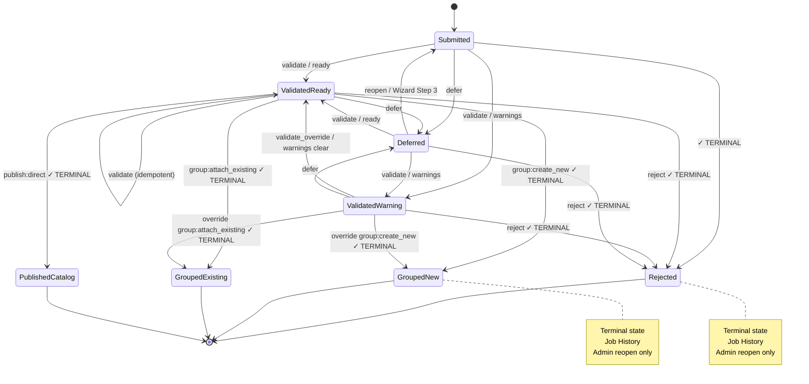
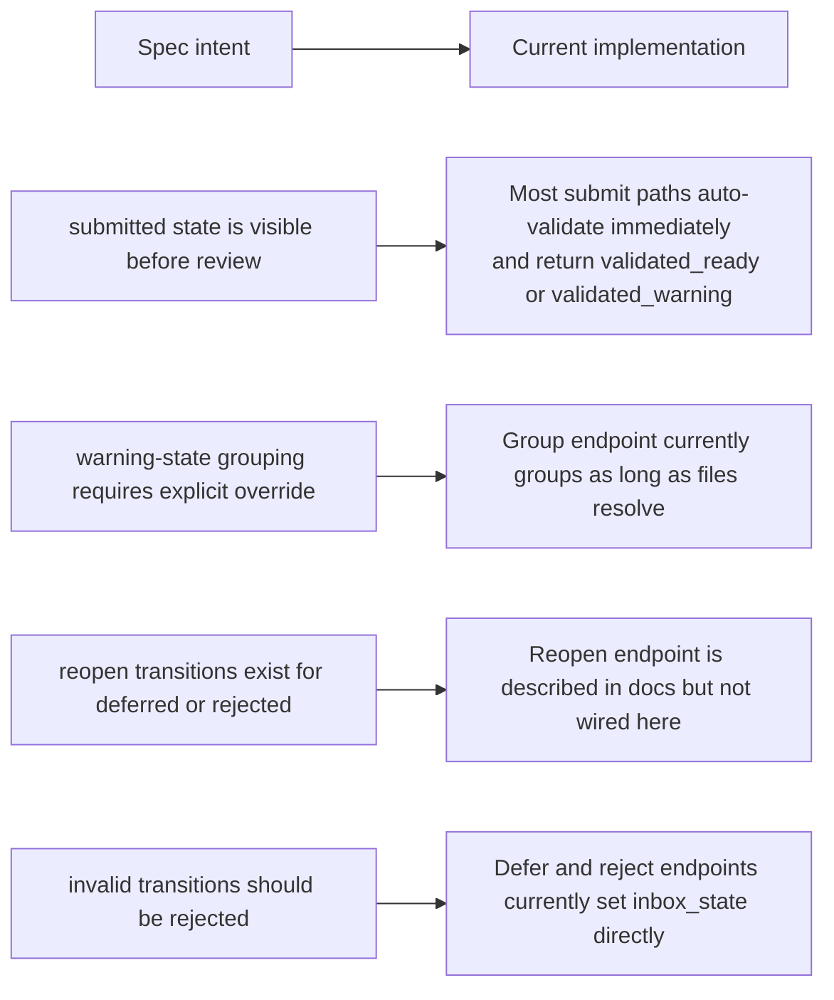
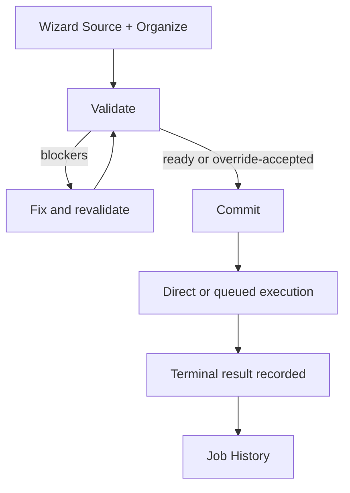

# Model Catalog Import Flow Diagrams

> Status: Canonical intake flow with wizard authoring plus separate Queue Review surface (May 2026)
> Last reviewed: 2026-05-03

This document explains the import path from Intake Home through wizard planning, Queue Review, and final Job History outcomes.

The short version:

- Intake Wizard is the default new-batch authoring flow.
- Queue persists execution/staging state and is surfaced through a separate Queue Review workbench.
- Job History is the visible audit surface for completed jobs regardless of execution path.
- Working and Curated destinations are chosen during wizard Organize step.
- Browser Upload and Server Inbox share one consistent wizard layout: left = actions, right = results.

Issue direction now emphasizes: Source -> Organize -> Validate -> Commit as the canonical wizard sequence.

## Mental Model

Think of the flow as five layers:

1. Source selection: browser upload, server file selection, folder selection, or bulk discovery.
2. Intake submission: the sidecar normalizes the source entries and creates an intake item.
3. Organize planning: logical model decomposition plus destination decision per logical model.
4. Pre-commit validation: destination-aware checks, issue correction, and optional override handling.
5. Commit and execution: run validated plan via direct or queued execution path.
6. Job History: immutable record for completed jobs across all intake execution paths.

UI note:

- Browser upload and server browse remain two supported source types, but a single intake batch should use one or the other rather than a hybrid browser+server submission.
- Cleanup policy belongs to wizard planning and is validated before commit.
- Mixed file+folder selections are allowed in one batch, but the wizard review step must show expansion preview so the operator understands what will be imported.
- For Server browse mode, overlapping parent/child/file selections collapse immediately to the canonical topmost source entries.
- The Organize, Validate, and Commit steps must keep showing the resolved logical-model outputs, not revert to raw overlapping source-entry lists.

Overlap note:

- A selected parent folder absorbs selected child folders and explicit child files.
- This is a normalization rule, not a warning-only workflow branch.
- If the operator needs the child subtree to stand on its own, they must remove the parent selection and select the child directly.
- The operator-facing result summary should communicate the resolved canonical selection and resulting file/model outcome.

## High-Level Flow: Wizard to Execution

```mermaid
flowchart TD
    A[Step 1: Source\nBrowser upload OR Server browse\nLeft: pick inputs\nRight: selected files and folders] --> B[Step 2: Organize\nGroup or split into logical models\nSet naming and destination per model\nLeft: configure\nRight: resulting model outputs]
    B --> C[Step 3: Validate (Pre-Commit)\nRun destination-aware checks\nShow blocking issues and override-eligible warnings]
    C --> D{Validation outcome}

    D -->|Blocking issues| E[Operator corrects source or organize settings\nRe-run validation]
    E --> C

    D -->|Valid or accepted override| F[Step 4: Commit]
    F --> G{Execution path}

    G -->|Direct| H[Execute immediately]
    G -->|Queued/system fallback| I[Persist queue job and execute asynchronously]

    H --> J{Per logical model destination}
    I --> J

    J -->|Working: Create New| K[grouped_new]
    J -->|Working: Attach Existing| L[grouped_existing]
    J -->|Curated: Create New| M[published_to_catalog]
    J -->|Curated: Attach Existing| N[published_to_catalog]

    K --> O[Job History]
    L --> O
    M --> O
    N --> O
```

## Canonical Intake State Machine (Intake to Terminal)

This matches the explicit design contract in [intake-state-machine.md](intake-state-machine.md).

Active queue state semantics remain the operator-facing contract for queued-item review, but they are intentionally handled in Queue Review rather than inside the wizard.



**Terminal State Enforcement:**

Once in any terminal state (marked with ✓), only these operations are allowed:

- View item details
- Delete from Job History log
- **Admin Reopen** (requires admin role + confirmation token)

All intake workflow operations (validate, group, publish, defer, reject) return `HTTP 409 Conflict` with code `item_terminal_*`.

## What Intake, Queue, History, And Groups Mean

### Intake (Submission)

Intake is the ingestion and staging mechanism.

During Intake, the sidecar:

- accepts source files or folders from browser or server roots
- normalizes paths and validates source metadata
- computes hashes when possible
- runs lightweight duplicate and readability checks
- stores cleanup policy and folder traversal option (`recurse`)
- optionally auto-validates (if enabled) or stages as `submitted`

Intake is **transient staging**, not durable storage.

### Active Queue / Queue Review

Active Queue remains a system lifecycle stage and a first-class operator review path.

Active Queue contains intake items in non-terminal states:

- `submitted` — just arrived, not yet validated
- `validated_ready` — clean validation, ready for action
- `validated_warning` — validation found issues, operator review required
- `deferred` — intentionally parked by operator

Primary operator flow is expected to resolve many decisions in wizard Validate + Commit steps, but queued items can continue through the dedicated Queue Review surface.

**Active Queue is transient** — items exit when they reach a terminal state (grouped, published, rejected).

### Job History (Primary Visible Outcome Surface)

Job History is the immutable audit record of completed intake workflows and is the primary post-execution intake surface.

Job History contains intake items in terminal states:

- `grouped_new` — created new working group
- `grouped_existing` — attached to existing working group
- `published_to_catalog` — published directly to catalog
- `rejected` — rejected as noise/invalid

Operators interact with Job History to:

- View details of completed workflows
- Review which group/model was created
- Audit trail (who did what, when)
- Delete log row (subject to implementation constraints)
- inspect outcomes regardless of whether run direct from wizard or through queued/background execution

**Job History is durable** — items are kept for audit and can only be deleted by explicit operator action with confirmation.

### Groups and Working Files

A group (working_group record) is the first durable handoff after intake.

After an intake item is grouped, the item is **no longer part of intake workflow**. The item's files are linked into working group, and the lifecycle continues in the Working flow (edit, print, iterate), not the Intake flow.

From the operator's perspective:

- Grouped items appear in the Job History with a link to the resulting working group.
- Further work happens in Working flow, not Intake flow.
- Publishing to catalog is a later decision in Working or Curated flow.

## Operator Cheat Sheet

| State | What it means | Available Actions | Typical Intent |
|---|---|---|---|
| `submitted` | Item in queue lifecycle before terminal outcome | Validate (system/fallback path) | Non-primary path |
| `validated_ready` | Validation succeeded | Commit eligible | Primary wizard should commit from this state |
| `validated_warning` | Validation found issues | Correct, revalidate, or override if allowed | Primary wizard handles this before commit |
| `deferred` | Parked item (if used) | Optional backend/admin path | Not required in primary UX |
| `grouped_new` | Item in Job History, created new working group | View Details, Delete Log Row, Admin Reopen | Workflow complete; new group created |
| `grouped_existing` | Item in Job History, attached to existing group | View Details, Delete Log Row, Admin Reopen | Workflow complete; files added to group |
| `published_to_catalog` | Item in Job History, published to catalog | View Details, Delete Log Row, Admin Reopen | Workflow complete; direct publish done |
| `rejected` | Item in Job History, rejected as noise/invalid | View Details, Delete Log Row, Admin Reopen | Workflow complete; intentionally excluded |

### Quick Decision Rules (Wizard First)

- **Organize** to define grouping and destination per logical model.
- **Validate before commit** and resolve blocking issues.
- **Use override only with explicit operator confirmation** for warning states.
- **Commit only after intended destination plan is fully validated.**

### Quick Decision Rules (Job History)

- **View Details** to inspect what the intake action created (working group, published model, etc.).
- **Delete Log Row** to clean up completed items from the audit log (soft archive or hard delete).
- **Admin Reopen** (admin users only) if the action was wrong and needs to be redone; requires confirmation.

## Wizard Step-by-Step Behavior (Canonical)

### Step 1: Choose Source Mode
- **Browser Upload**: Files selected and uploaded directly from the operator's computer
- **Server Browse**: Files or folders selected from configured server-side roots

Choose **one mode** for the entire batch (not a mix).

### Step 2: Organize

Organize step applies to both browser and server sources.

For each logical model:

- set Group / Split strategy
- set destination
    - Working (new or existing)
    - Curated (new or existing)
- set title behavior and structure-preservation settings

Canonical Group / Split choices:

- Keep Together In Same Model
- Separate Models By Folder
- Separate Models By File
- Each Root Folder Becomes A Model

The right side of Organize should show the resolved models, included files/folders, and resulting destination plan for each model.

### Step 3: Validate (Before Commit)

Validation runs before commit and returns:

- blocking issues
- warning issues that may be override-eligible
- informational notices

Operator must resolve blockers before commit.

Validate should preserve the same right-side output structure shown in Organize so the operator is validating the exact model plan that will commit.

### Step 4: Commit

- Commit executes the validated plan.
- Outcome is recorded in Job History for all execution paths.

Commit should continue to show the resolved model/group results, with expandable file detail when needed.


## Current Implementation Notes

The design docs and the current code are close, but not identical.

### What Is Already True In Code

- Intake items are stored in `intake_queue_uploads`.
- Inbox review uses `inbox_state` and `decision_note`.
- Current code still contains inbox-oriented actions and queue endpoints that now align with the separate Queue Review surface.
- Grouping hands files into `working_groups` and `working_items`.

### Important Gaps Between Spec And Current Behavior



The key direction is to bring these controls into wizard Validate + Commit so the inbox card is no longer required for normal intake completion.

## Transitional Flow Note

Until implementation catches up, system behavior may still show queue-centric transitions.

This doc defines the target canonical flow for upcoming implementation work.



## Recommended Reading Order

If you want to reason about the import flow in order, read these next:

1. `docs/features/model_catalog/workflow-and-ingestion-guide.md`
2. `docs/features/model_catalog/intake-inbox-design.md`
3. `docs/features/model_catalog/intake-state-machine.md`
4. `sidecars/model_catalog/app/main.py` intake endpoints
