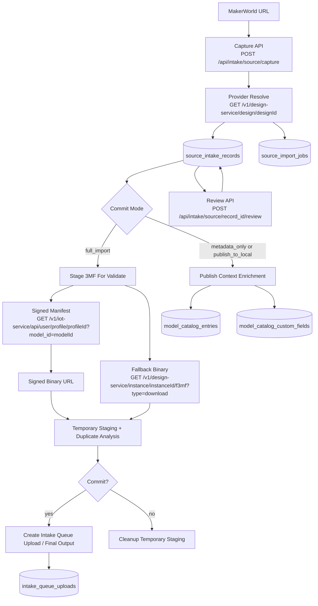
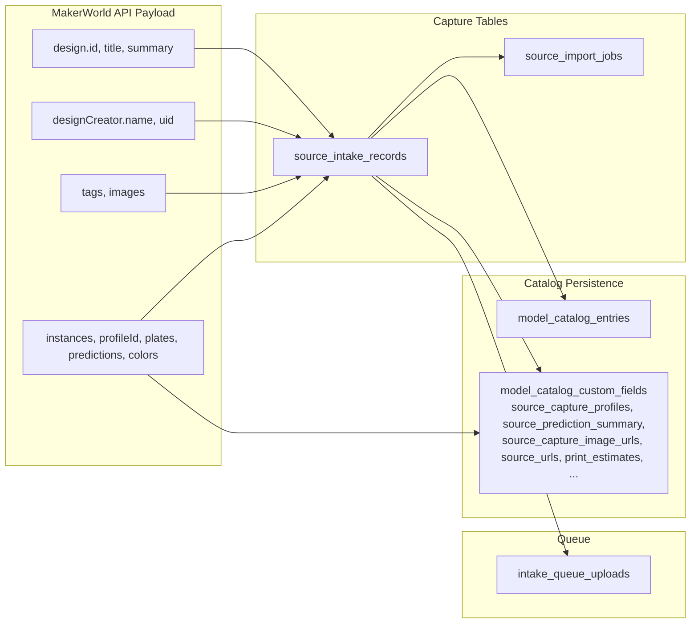
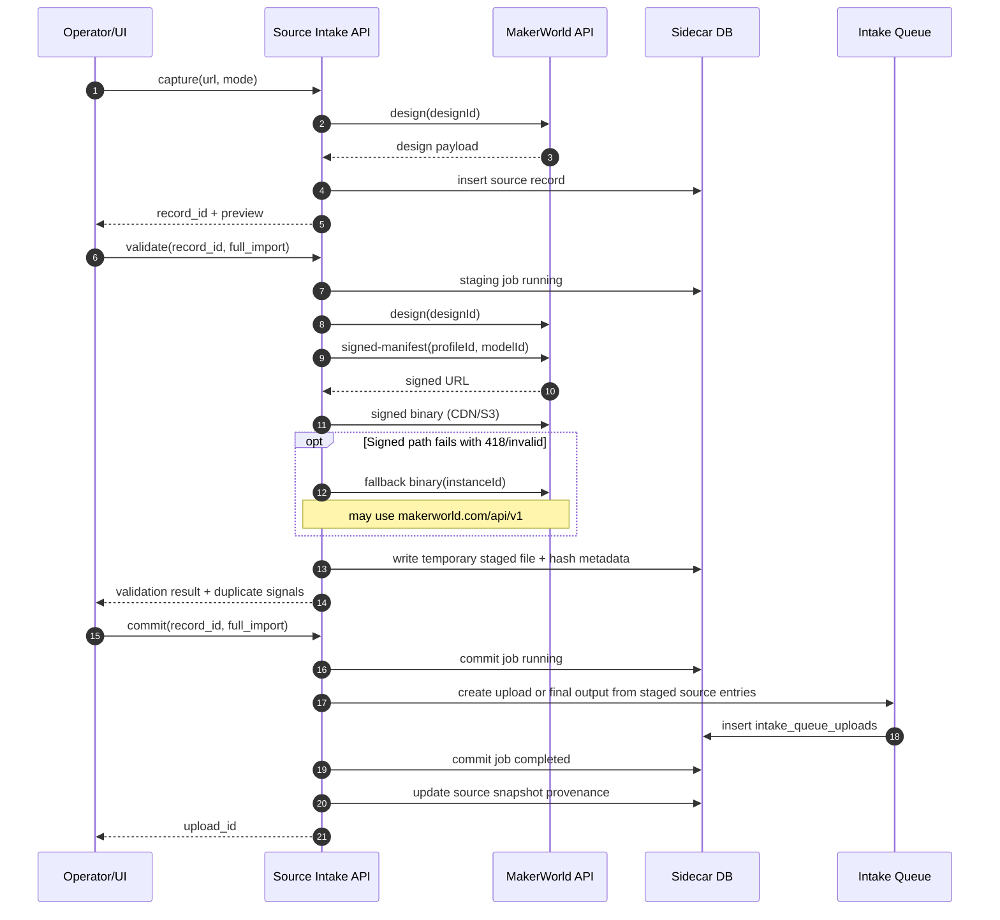
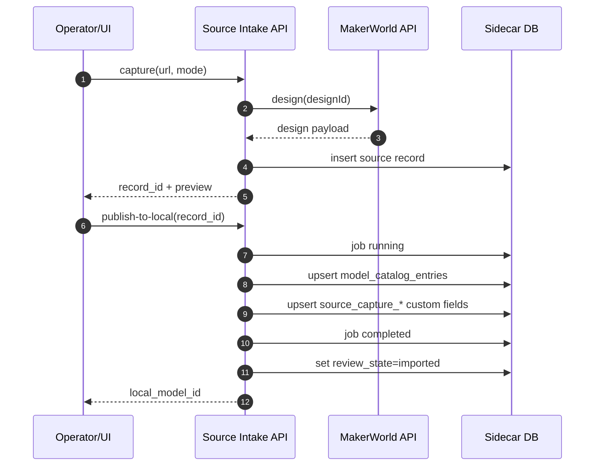

# MakerWorld API to Schema Mapping

> Status: Current implementation summary
> Last updated: 2026-05-29
> Scope: Model Catalog sidecar MakerWorld intake and publish flows

## Purpose

This document answers four questions:

1. What information we can retrieve from MakerWorld.
2. Which MakerWorld APIs we are currently using.
3. Which MakerWorld APIs are available (but not currently used in active intake routes).
4. What data we persist, and exactly where it is stored in our schema.

## Flow Diagram

### Request Order: Full Import

Key:
- `design(designId)` = `GET /v1/design-service/design/{designId}`
- `signed-manifest(profileId, modelId)` = `GET /v1/iot-service/api/user/profile/{profileId}?model_id={modelId}`
- `fallback binary(instanceId)` = `GET /v1/design-service/instance/{instanceId}/f3mf?type=download`

### Request Order: Metadata-Only Publish

## Provider And Route Entry Points

- Provider adapter: `sidecars/model_catalog/app/providers/makerworld.py`
- Source intake routes: `sidecars/model_catalog/app/routers/source_intake.py`
- Publish/context mapping helpers: `sidecars/model_catalog/app/routers/intake.py`
- Schema definitions: `sidecars/model_catalog/app/db_migrations.py`

## MakerWorld Endpoint Inventory

## Endpoints currently used by active flows

| Endpoint | Host/base | Used for | Used by |
|---|---|---|---|
| `GET /v1/design-service/design/{designId}` | `https://api.bambulab.com/v1` | Resolve design metadata, creator, tags, images, instances, plate/prediction data | URL capture and full import resolution |
| `GET /v1/design-service/instance/{instanceId}/f3mf?type=download` | `https://api.bambulab.com/v1` | Download 3MF binary for selected/default instance | Full import (`/api/intake/source/{record_id}/commit`, mode `full_import`) |
| `GET /v1/iot-service/api/user/profile/{profileId}?model_id={modelId}` | `https://api.bambulab.com/v1` | Obtain signed download URL manifest (`url`) | Primary 3MF download path before fallback |
| `GET /v1/design-service/instance/{instanceId}/f3mf?type=download` | `https://makerworld.com/api/v1` | Binary fallback when upstream returns 418 on `api.bambulab.com` path | Automatic fallback in provider |
| Signed binary URL from manifest (`payload.url`) | CDN/S3 host returned by MakerWorld | Final signed binary download | Provider signed URL download path |

Notes:
- All API requests use Bearer auth.
- `makerworld.com/api/v1` is used only as a fallback path for binary download.

## APIs available in adapter but not used by active intake routes

| Endpoint | Host/base | Adapter support | Current route usage |
|---|---|---|---|
| `GET /v1/design-user-service/user/{userId}/collections` | `https://api.bambulab.com/v1` | `MakerWorldAdapter.list_user_collections()` | Not wired into current intake routes |

## Known MakerWorld microservice families (reference)

These are documented in existing design docs and reverse-engineering references.

| Service | What it provides | What it is used for | Likely leverage in this repo? |
|---|---|---|---|
| `design-service` | Core design/model records, creator linkage, instances/profiles, and binary download routes | Resolve a MakerWorld URL into normalized model metadata and download the selected 3MF | Yes. This is the primary MakerWorld dependency for capture/import flows and is already on the critical path. |
| `design-user-service` | User-centric data such as creator profiles, follows, and collections | Potential creator enrichment and collection/favorites migration flows | Maybe. It is relevant if we add collection import or deeper creator views, but current intake does not require it and the collections route is still weakly validated. |
| `design-recommend-service` | Recommendation, trending, and discovery-style feeds | Candidate input for suggested models, related browsing, or popularity-driven discovery surfaces | Maybe later. Useful only if the product adds recommendation-driven browse UX; not needed for direct URL intake or deterministic import. |
| `search-service` | Search and browse navigation endpoints, including category navigation and related-design discovery | Search-backed browse, category pages, and related-model exploration | Maybe. It matters for browse/discovery features, but not for the current import path that starts from a specific MakerWorld URL. |
| `comment-service` | Comments, reviews, and ratings-style community content | Surfacing community discussion or review metadata alongside a model | Unlikely. It adds community context, but there is no current intake or catalog requirement that depends on comments. |
| `operation-service` | Operational or event-oriented backend actions referenced in reverse-engineering notes | Unknown from current grounded docs beyond general operational/event support | Probably not. There is no current documented flow in this repo that points to it, and its contract is not well established in our references. |
| `point-service` | Points/rewards mechanics | Reward, incentive, or points-account views | No current reason. This repo does not model MakerWorld reward workflows. |
| `report-service` | Reporting and abuse/moderation actions | Reporting content or moderation-related submission flows | No current reason. The catalog/intake scope is read/import oriented, not moderation oriented. |

Current implementation primarily depends on `design-service` plus the `iot-service` profile manifest endpoint.

## What We Retrieve From MakerWorld

## Design-level metadata retrieved

From `GET /design-service/design/{designId}` (normalized in provider):

- Design identity: `id`, canonical model URL
- Model text metadata: `title`, `summary`, `license`
- Creator metadata: `designCreator.name`, `designCreator.uid`, `designCreator.avatar`
- Engagement metadata: `likeCount`, `downloadCount`, `collectCount`
- Timing metadata: `createTime`, `updateTime`
- Taxonomy/media: `tags`, `images`, cover image fallbacks
- Instance metadata: `instances[*]` including default flag and profile/plate context

## Instance/profile-level metadata retrieved

From the design payload `instances` array and nested extension content:

- `instance_id`
- `profile_id`
- instance title
- default profile flag
- AMS requirement
- material count
- print count
- instance prediction (print time estimate)
- plate list and plate predictions (print time estimate)  
- filament colors (normalized from variant keys)
- profile owner identity fields (when available), then derived `is_designer_profile`

## File-level metadata retrieved

From selected instance download:

- downloaded 3MF filename/path
- staged 3MF filename/path used for validation when `full_import` is selected
- computed hash / duplicate-comparison inputs derived from the staged file
- source entry metadata used to enqueue intake upload
- selected/attempted instance IDs and selected profile IDs in provenance

## Data Persistence Mapping

## Stage A: Source capture record storage

Table: `source_intake_records`

| Stored column | Source |
|---|---|
| `provider_id` | URL/provider detection (`makerworld`) |
| `capture_channel` | request payload (`url_paste`, etc.) |
| `capture_mode` | request payload mode |
| `source_url_canonical` | normalized canonical design URL |
| `source_url_original` | operator-provided URL |
| `source_model_id` | MakerWorld design id |
| `title` | design title |
| `creator_name` | creator name |
| `description_raw` | design summary/raw description |
| `thumbnail_url` | first image URL fallback |
| `media_manifest_json` | normalized images array |
| `file_manifest_json` | normalized instance manifest (`instance_id`, `profile_id`, `is_default`, `plate_count`) |
| `confidence` | provider resolve confidence |
| `warnings_json` | provider warnings |
| `snapshot_json` | full upstream payload plus intake provenance metadata |
| `review_state` | intake review state |
| `import_job_id` | linked job id when commit starts |
| `captured_at`, `updated_at` | sidecar timestamps |

Table: `source_import_jobs`

| Stored column | Source |
|---|---|
| `id` | generated UUID |
| `intake_record_id` | FK to source intake record |
| `job_type` | commit mode (`full_import`, `metadata_only`, `link_only`, `metadata_only_publish_to_local`) |
| `status` | running/completed/failed |
| `result_json` | mode-specific outputs (`upload_id`, `local_model_id`, etc.) |
| `error_json` | failure details |
| `started_at`, `completed_at`, `created_at`, `updated_at` | sidecar timestamps |

Suggested additional lifecycle support for `full_import` flows:

- a staging/validation job phase that records temporary download state before commit
- `result_json.staged_file_path`
- `result_json.staged_sha256`
- `result_json.staged_filename`
- `result_json.duplicate_analysis_json`
- `result_json.staging_cleanup_state`

These values represent temporary validation artifacts, not final committed outputs.

## Stage A2: Staged download for validation

When the operator selected `full_import`, the sidecar may download the chosen 3MF into temporary staging before Commit so Validate can inspect the real file.

Purpose:

- compare file hash against existing intake/catalog/working-file candidates
- compare upstream filename against existing file-backed entries
- run the same style of duplicate heuristics that Browser Upload can run only after a file has reached the sidecar

Important boundary:

- this staged file is not yet a committed intake upload
- this staged file is not yet a Catalog asset or Working Files asset
- `Next` navigation in the UI still does not mean commit occurred

When the operator selected `metadata_only`:

- no temporary 3MF download is created for Validate
- file-backed duplicate analysis such as hash comparison is not run
- Validate returns those file-backed checks as `not_run` / `unavailable_metadata_only`
- metadata-backed duplicate heuristics still run from `source_intake_records` content and provider metadata

## Stage B: Full import to intake queue

Table: `intake_queue_uploads`

When `full_import` succeeds, staged downloaded files are promoted into source entries and queued through intake.

| Stored column | Source |
|---|---|
| `upload_id` | generated by queue record creator |
| `source_entries_json` | validated entries for downloaded MakerWorld 3MF(s), includes `source_record_id` and `source_type=makerworld_download` |
| `status`, `verification_status`, `cleanup_policy`, `error_json`, timestamps | intake queue lifecycle |

`source_intake_records.snapshot_json` provenance is updated with:

- `import_job_id`
- target/attempted/selected instance and profile IDs
- staged and/or downloaded filename(s)
- staged hash metadata when available
- resulting `upload_id`

## Stage B1: Staging cleanup on cancel/close

If Commit never happens, temporary staged downloads must be cleaned up.

Recommended cleanup contract:

- wizard `Cancel` before Commit: delete staged file and derived temporary inspection artifacts immediately
- popup close before Commit: delete staged file immediately or mark it for short-TTL cleanup
- abandoned sessions: periodic sidecar sweep removes stale staged downloads and orphaned hash metadata
- successful Commit: reuse or promote the staged file instead of discarding and re-downloading it

## Stage C: Publish to local model (metadata-only and post-queue publish)

Core model table: `model_catalog_entries`

| Stored column | Source |
|---|---|
| `model_name` | destination plan defaulted from source title |
| `model_description` | sanitized source description |
| `creator_name` | source creator name |
| `preview_image_url` | source thumbnail/image fallback |
| `source_origin` | `makerworld` |
| `source_origin_url` | canonical/original source URL |
| `tags_json`, `keyword_names_json` | reviewed tags or source tags fallback |

Custom fields table: `model_catalog_custom_fields` (namespace `model_catalog`)

Persisted source context keys:

- `source_capture_provider`
- `source_capture_record_id`
- `source_capture_model_id`
- `source_capture_image_urls`
- `source_description_raw`
- `source_prediction_summary`
- `source_capture_profiles`
- `print_estimates`
- `publication_source`
- `source_platform`
- `source_download_url`
- `source_urls`
- `source_image_preview_url`

Additional intake linkage keys set on metadata publish path:

- `intake_source_entries`
- `intake_imported_at`
- `internal_notes`

## Stage C2: Commit to Working Files

When the selected target is `working_file_group`, the MakerWorld capture still persists through the same intake/audit tables before filesystem materialization.

Filesystem outcome under `Model Working Files/{folder}/`:

- downloaded `.3mf` and any intentionally selected companion files
- `.modelmeta.json` with lightweight carry-forward fields
- optional `README.md` source note when enabled by the operator

Recommended `.modelmeta.json` carry-forward fields for MakerWorld-backed Working Files:

- `display_title`
- `origin_url`
- `tags`
- `primary_file`
- `thumbnail`
- `source_capture_record_id`

Important persistence boundary:

- the authoritative MakerWorld payload remains in `source_intake_records.snapshot_json`
- commit execution/result data remains in `source_import_jobs`
- the Working Files folder stores only the lookup field `source_capture_record_id`, not a copy of the raw snapshot JSON as a user-facing supporting file

Suggested `source_import_jobs.result_json` additions for `working_file_group` targets:

- `working_folder_path`
- `working_primary_file_path`
- `working_metadata_written` (bool)
- `working_readme_written` (bool)

## Stage D: Working Files -> Catalog rehydrate

If a Working Files folder created from MakerWorld intake is later published into the Catalog, the publish flow should check `.modelmeta.json.source_capture_record_id`.

If the linked `source_intake_records` row exists:

- rehydrate `snapshot_json`, `media_manifest_json`, `file_manifest_json`, and linked job provenance
- persist the same Catalog-side source context used by direct MakerWorld Catalog import
- write the Catalog-only supporting-file/custom-field representation there

If the linkage field is absent or cannot be resolved:

- publish proceeds as a normal filesystem-origin Working Files publish
- no MakerWorld snapshot rehydrate occurs

## Derived profile fields persisted in `source_capture_profiles`

Each profile summary currently persists:

- `instance_id`
- `profile_id`
- `title`
- `profile_owner_name`
- `profile_owner_id`
- `is_designer_profile`
- `is_default`
- `need_ams`
- `material_count`
- `print_count`
- `prediction`
- `filament_colors`
- `plate_details` (plate id, prediction, filament colors)

This supports both:

- Intake profile selection UI indicators
- Model detail popup source-profile indicators (including Designer labeling)

## Availability Matrix: Retrieved vs Persisted

| Data category | Retrieved from API | Persisted in schema |
|---|---|---|
| Design id/url/title | Yes | Yes (`source_intake_records`, `model_catalog_entries`, custom fields) |
| Creator identity | Yes | Yes (`source_intake_records.creator_name`, `model_catalog_entries.creator_name`, profile summaries) |
| Tags | Yes | Yes (reviewed/fallback tags into `model_catalog_entries` and keywords) |
| Images/gallery | Yes | Yes (`thumbnail_url`, `media_manifest_json`, `source_capture_image_urls`, preview URL fields) |
| Instances/profile manifest | Yes | Yes (`file_manifest_json`, `source_capture_profiles`) |
| Plate predictions/colors | Yes | Yes (`source_prediction_summary`, `source_capture_profiles`, `print_estimates`) |
| Binary 3MF | Yes (full import mode) | Yes (staged file path -> queued source entry -> asset attach/publish flow) |
| Working Files linkage | Yes | Yes (`.modelmeta.json.source_capture_record_id` -> `source_intake_records.id`) |
| Collections API payload | Adapter supports endpoint | Not currently persisted by active routes |

## Non-goals in current implementation

- No active use of search/recommend/comment/report APIs.
- No active collection sync pipeline wired to `list_user_collections()`.
- Current workflow is centered on single-record capture + review + commit/publish.

## Related docs

- `docs/features/model_catalog/design/makerworld-provider-adapter.md`
- `docs/features/model_catalog/design/external-source-intake.md`
- `docs/features/model_catalog/reference/custom-fields-schema.md`
- `docs/features/model_catalog/reference/intake-source-routing-contract.md`
