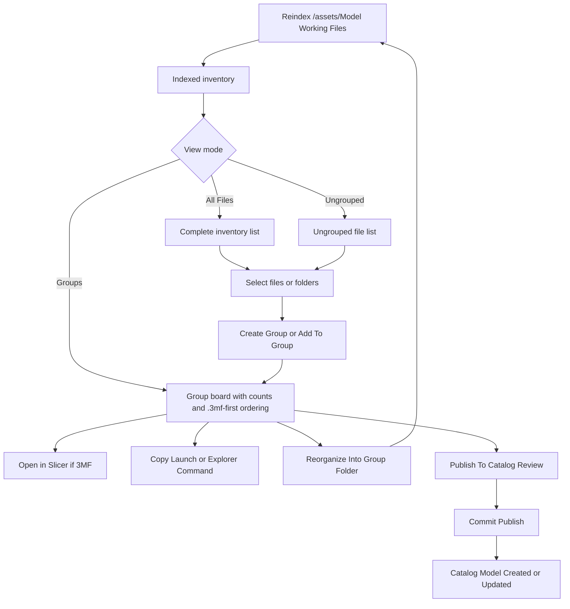

# Working Files Workflow Redesign (Issue #1169)

> Status: Design proposal for approval
> Launch issue: #1169
> Last updated: 2026-05-01
> Scope: Rework Working Files around group-first navigation and inventory rooted at `/assets/Model Working Files`

## Purpose

Define an approval-ready redesign for Working Files that starts with a reliable indexed view of files in `/assets/Model Working Files`, then layers group management and operator actions on top.

This proposal intentionally splits delivery into:

- phase-now: Working Files indexing + group-first operator workflow
- phase-later: Intake/Inbox handoff into Working Files

## Direct Inputs From Issue #1169

The redesign must support:

- show logical `Groups`
- prioritize `.3mf` files in each group
- launch a file directly from filesystem context
- open containing folder in Explorer (`show in explorer` behavior)
- reorganize selected files into a group folder
- list all files in Working Files with refresh
- toggle views between `All` and `Ungrouped`
- create group
- add selected files/folders to group
- publish a Working group to Catalog from the Working surface
- explicit policy for single-group vs multi-group membership

## Scope Boundary

### In Scope (This Redesign)

- indexing root: `/assets/Model Working Files`
- grouped and ungrouped browse experiences over indexed files
- logical grouping controls and membership model
- file-level and group-level quick actions
- publish-to-catalog launch path from Working groups ("Promote" workflow)
- UX mockups and implementation plan for backend + HA UI work

### Deferred (Later Phase)

- full Intake/Inbox to Working Files flow (`/assets/Model Intake` or inbox queue staging)
- cross-surface automation for inbox triage to Working assignment
- deeper lineage visualizations after publish completes

## Core Design Decisions

### 1) Root-First Inventory

Working Files indexing starts at `/assets/Model Working Files`.

Operational contract:

- default reindex root is `/assets/Model Working Files`
- root remains constrained by `MODEL_CATALOG_WORKING_FILES_ROOT`
- explicit reindex still allows narrower child roots when needed

### 2) Group-First UX With Ungrouped Visibility

Primary operator surface is `Groups`, with parallel `Ungrouped` visibility.

Required views:

- `Groups`: grouped logical work items
- `All Files`: complete indexed inventory
- `Ungrouped`: files not currently assigned to any group

### 3) `.3mf` Priority Rules

Within each group:

- show `.3mf` entries first
- then supported geometry files (`.stl`, `.step`, `.stp`, `.obj`)
- then optional intake package types such as `.zip`

### 4) Membership Policy: Multi-Group Allowed

Issue #1169 asked whether a file/folder should belong to one group or many.

Decision:

- allow multi-group membership by default because groups are logical overlays
- support one optional `primary_group` marker for display defaults
- warn (do not block) when adding a file already in other groups

Rationale:

- supports variant/revision workflows without forced duplication
- avoids artificial constraints during iterative organization

### 5) Reorganize Is Explicit And Safe

`Reorganize` is a deliberate file operation, not implicit behavior.

Contract:

- dry-run preview before move
- destination pattern: `/assets/Model Working Files/{group_slug}/`
- destination filename collisions auto-rename with append semantics for variants: `name.ext`, `name-2.ext`, `name-3.ext`
- duplicate-content detection via SHA256 skips move when target already contains identical file content
- preserve audit event with old/new path
- refresh inventory after move

Current endpoint behavior (`POST /api/working-groups/{group_id}/reorganize`):

- dry-run response includes:
   - `operation_plan` (alias: `plan`)
   - `collisions_detected`
   - `collision_renames` (per-file rename details)
   - `duplicate_hash_skips`
   - `duplicate_hash_skipped_count`
   - `conflicts` (blocking issues only, such as missing/blocked source paths)
- execute response includes:
   - `moved_count`
   - `operation_plan` (alias: `plan`)
   - `collisions_detected`
   - `collision_renames`
   - `duplicate_hash_skips`
   - `duplicate_hash_skipped_count`
   - `audit_events`
   - `inventory_refresh`

### 5a) Working Group Slug Naming & Collision Avoidance

### 6) Host-Path Actions Use Host-Path Mapping

**Working group folder names** are derived from group titles and use a simple collision-detection scheme.

**Naming convention**:
- Group slug: URL-safe lowercased version of group title (e.g., "Gridfinity Holders" → `gridfinity-holders`)
- Collision handling: If a slug already exists, append counter: `{slug}-2`, `{slug}-3`, etc.

**Example**:
```
Gridfinity Holders       → gridfinity-holders
Gridfinity Holders (v2)  → gridfinity-holders-2  (collision on slug)
Gridfinity Holders (v3)  → gridfinity-holders-3
```

**Status**: Collision detection is **implemented** in the sidecar ([sidecars/model_catalog/app/routers/working.py](sidecars/model_catalog/app/routers/working.py#L425), `_unique_slug()` function). All working group slugs are guaranteed unique via this mechanism.

**File reorganization collision handling** (implemented in reorganize endpoint):
- When moving files into a group folder, use `_unique_destination_path()` semantics (already used for asset file placement)
- If a file with the same name already exists in the destination group folder, append counter: `filename-2.3mf`, `filename-3.stl`, etc.
- This differs from group slug collision (which is at the group level) and applies at the individual file level within a group


Launch-adjacent actions must resolve indexed container paths to host-visible paths, but the UI should no longer assume a direct browser-launched `file:///` flow.

Primary mapping inputs:

- container-side indexed path (typically under `/assets/...`)
- bind mount declaration (`${ASSETS_ROOT_HOST}:/assets`)
- configured working-files root plus intake roots when cross-surface actions need validation

Default mapping contract:

1. derive `assets_root_host` from `ASSETS_ROOT_HOST`
2. rewrite `/assets/<rest>` to `<assets_root_host>/<rest>`
3. normalize to platform-specific path for launcher execution

WSL and OneDrive guidance:

- if host root starts with `/mnt/c`, treat it as Windows `C:\...`
- if mapped path includes `/OneDrive`, assume OneDrive-backed user storage
- provide optional UI override setting to adjust host path mapping for Explorer launch edge cases

Strict action gating:

- if `ASSETS_ROOT_HOST` does not include `/mnt/c`, disable host-path-derived local actions
- do not attempt partial inference for non-`/mnt/c` hosts in this phase

Operator actions:

- `Open in Slicer`: preferred primary action for `.3mf` via tokenized download flow
- `Copy Launch Command`: manual local-file fallback derived from the mapped host path
- `Copy Explorer Command`: manual local-folder fallback derived from the mapped host path
- `Publish to Catalog`: launch publish review for this Working group (`Publish to Catalog` is the UI label; docs may note this as Promote for continuity)
- companion-backed `Open Local File` and `Open Folder`: optional future enhancement when a trusted local helper exists

Failure behavior:

- if mapping fails, show actionable error with source path and expected mapped host path
- offer copy-path fallback

## Proposed Operator Workflow



## UI Mockups (Low-Fi)

### Working Files Home

```text
┌──────────────────────────────────────────────────────────────────────────────┐
│ Working Files                                                                │
├──────────────────────────────────────────────────────────────────────────────┤
│ Root: /assets/Model Working Files      Last indexed: 2m ago   [Refresh]     │
│ Host map: /mnt/c/OneDrive/... -> C:\Users\...\OneDrive\...                │
│ View: [Groups] [All Files] [Ungrouped]    Search: [___________]             │
│                                                                              │
│ Groups (left)                                  Files (right)                 │
│ ┌────────────────────────────────────────┐      ┌──────────────────────────┐ │
│ │ Gridfinity Holders (12)               │      │ Selected Group:          │ │
│ │  - 3mf: 4  other: 8                   │      │ Gridfinity Holders       │ │
│ │  - updated: 1h ago                    │      │                          │ │
│ │ [Open] [Reorganize] [Publish to Catalog]│     │ .3mf files               │ │
│ ├────────────────────────────────────────┤      │ - holder_v3.3mf          │ │
│ │ Vacuum Adapters (8)                   │      │   [Open in Slicer]       │ │
│ │  - 3mf: 2  other: 6                   │      │   [More ▾]               │ │
│ │ [Open] [Reorganize] [Publish to Catalog]│     │                          │ │
│ └────────────────────────────────────────┘      │ Supporting files          │ │
│                                                 │ - notes.md [More ▾]       │ │
│ Selection Actions:                              │ - dimensions.svg          │ │
│ [Create Group] [Add To Group] [Publish Selected] │ [Add Files] [Set Primary]│ │
│                                                 └──────────────────────────┘ │
└──────────────────────────────────────────────────────────────────────────────┘
```

### Ungrouped Triage Variant

```text
┌──────────────────────────────────────────────────────────────────────────────┐
│ Working Files - Ungrouped                                                    │
├──────────────────────────────────────────────────────────────────────────────┤
│ 23 files are currently ungrouped.                                            │
│ [Select All] [Create Group From Selection] [Add Selection To Existing Group] │
│                                                                              │
│ [ ] benchy_v4.3mf                 12 MB   2026-05-01  [Open in Slicer] [More]│
│ [ ] benchy_notes.md                3 KB   2026-05-01  [More]                 │
│ [ ] adapter_revB.step              8 MB   2026-04-30  [More]                 │
└──────────────────────────────────────────────────────────────────────────────┘
```

## Data And API Direction

### Current Assets To Reuse

- `working_file_inventory` table already stores normalized indexed files
- `working_groups` and `working_items` already model logical groups and file membership
- `/api/working-files/reindex` and `/api/working-files` already provide inventory primitives

### Contract Changes For This Redesign

1. Reindex defaults
   - default root should resolve to `/assets/Model Working Files` (when allowlisted)
2. Group membership endpoints
   - support add/remove membership in batch for selected files
   - return `group_memberships` metadata per file
3. Grouped list endpoint
   - support `.3mf`-first sorting in group payloads
4. Reorganize endpoint
   - dry-run and execute modes for move operations into group folder
5. Explorer-launch mapping
   - include mapped host path in API payload for launch/explorer actions
   - include mapping diagnostics for failed launches

## Approval Plan (Before Code)

### Step 1: Confirm Product Rules

Approve these explicit rules:

- root-first indexing starts at `/assets/Model Working Files`
- multi-group membership is allowed
- `Reorganize` is explicit with preview + audit
- Intake/Inbox handoff is deferred to later phase
- Explorer launch uses inferred host-path mapping from `ASSETS_ROOT_HOST`

### Step 2: Lock API/Schema Delta

Approve backend deltas:

- default root behavior in reindex
- grouped inventory response shape for UI
- membership batch endpoints
- reorganize endpoint contract

### Step 3: Lock HA UI Slice

Approve UI delivery sequence:

- Working Files Home shell with `Groups | All Files | Ungrouped`
- group detail with `.3mf` priority and quick actions
- selection toolbar for create/add/remove group actions
- reorganize confirmation flow

### Step 4: Implement In Code

Proposed code implementation order:

1. sidecar API/root behavior + tests
2. group membership and grouped list endpoints + tests
3. reorganize endpoint (dry-run + execute) + tests
4. HA card updates + integration tests
5. documentation and operator guide refresh

## Acceptance Criteria (Issue #1169)

- indexing starts from `/assets/Model Working Files`
- operator can view `Groups`, `All Files`, and `Ungrouped`
- `.3mf` files are prioritized in group views
- operator can launch file and open containing folder
- operator can create groups and add selected files/folders
- operator can reorganize selected files into a group folder with explicit confirmation
- membership policy supports multi-group logical assignment

## Related Docs

- [working-file-spec.md](working-file-spec.md)
- [workflow-and-ingestion-guide.md](workflow-and-ingestion-guide.md)
- [ux-concepts-and-mockups.md](ux-concepts-and-mockups.md)
- [phase-5-wave-4-ha-ui-design.md](phase-5-wave-4-ha-ui-design.md)