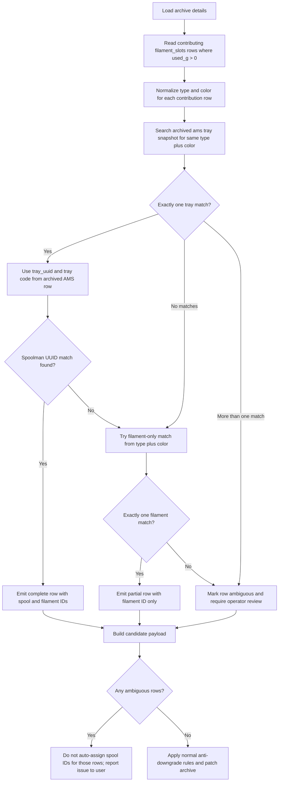

# Archive Enrichment - Current Implementation

This document describes the archive enrichment flow that is actually shipped in this repository today. It is intentionally a current-state document, not a target-design document.

## Summary

When a print ends, Home Assistant PATCHes the Bambuddy archive with these fields:

The preferred write timing is now to PATCH the archive during the print as soon as `archive_id` and trustworthy per-tray print-weight data are both available, then run a final reconciliation write at print completion, failure, or cancellation.

> **April 2026 consolidation**: This file is the canonical archive enrichment design reference.

**Why HA enrichment is essential**: Bambuddy has no awareness of Spoolman. The archive stores the printer's AMS slot info (`filament_slots` with `slot_id`, `used_g`, `type`, `color`) and raw AMS `tray_uuid`/`tag_uid` in `extra_data`, but there are no Spoolman spool IDs anywhere in the Bambuddy data. HA is the only system that bridges both Spoolman and the printer.

The shipped flow does **not** auto-generate archive tags anymore. Tags remain operator-managed and are left unchanged by the enrichment automation.

The implementation is still **partially complete**:

- archive lifecycle trigger wiring is shipped
- archive ID capture is shipped
- native Bambuddy `cost` enrichment is shipped
- native Bambuddy `status` enrichment is shipped
- human-readable notes enrichment is shipped
- photo-review handoff is shipped
- UUID-first tray resolution is not shipped
- tray snapshot fallback consumption is not shipped
- native Bambuddy `failure_reason` enrichment is not shipped
- compact structured note payloads are not shipped

## Active Files

- `homeassistant/packages/3d_printing/print_history/automations/bambuddy_capture_archive_id.yaml`
- `homeassistant/packages/3d_printing/print_history/automations/bambuddy_enrich_archive_on_complete.yaml`
- `homeassistant/packages/3d_printing/print_history/rest_commands/bambuddy_update_archive.yaml`
- `homeassistant/packages/3d_printing/core/template_sensors/print_cost.yaml`
- `homeassistant/packages/3d_printing/common/dashboard_cards/card_templates/print_history_archive_popup_content.yaml`
The revised design defines a narrower enrichment contract:

- Use `tags` only for system identifiers: unique `Filament:<id>` and `Spool:<id>` tags, plus the marker tag `ha_enriched:true`.
- Use `notes` for user-entered text plus an appended hidden JSON payload after the `[HA_ENRICHMENT_V1]` marker.
- Derive enrichment primarily from the same `sensor.print_weight_effective` and `sensor.spoolman_tray_map` data path already used by `spoolman_sync`.
- Treat Bambuddy archive-detail inspection as optional secondary validation, not the primary enrichment source for this feature.

## Triggering

### Start-of-print setup

`bambuddy_capture_archive_id.yaml` runs on `bambuddy_webhook_event` with `event: print_started`.

It does four things:

1. Stores the Bambuddy `archive_id` into `input_text.bambuddy_current_archive_id`.
2. Resets print-history runtime state such as the photo counter and upload result.
3. Stores a compact tray snapshot into `input_text.bambuddy_tray_map_snapshot`.
4. Resets `input_select.bambuddy_photo_review_state` to `idle`.

Important current-state note: the tray snapshot is captured, but the enrichment automation does not actually use it yet.

### End-of-print enrichment
The current automation does not yet implement the revised design:
- it does not append a versioned hidden JSON payload after user notes
- it does not split user notes/tags from system-managed notes/tags in the popup edit flow
- it still derives top-level tags from the broader current tray map instead of the exact contributing trays

So the correct status is still: partially implemented, with the core remaining work centered on usage-scoped tray selection, the new tags/notes contract, and popup-safe round-tripping.

`bambuddy_enrich_archive_on_complete.yaml` runs on:

- `bambuddy_webhook_event` with `event: print_complete`
- `bambuddy_webhook_event` with `event: print_failed`
- `bambuddy_webhook_event` with `event: print_stopped`
- native `bambu_lab` `event_print_canceled`

The automation only proceeds when:

- `input_boolean.bambuddy_integration_enabled` is `on`
- `input_text.bambuddy_current_archive_id` is non-empty and not an unavailable placeholder
There are three reasonable ways to store the enrichment for issue #751.
Store all spool details only in `notes`.

## Data Sources Actually Used

The shipped enrichment automation reads these live HA sources:
- human-readable in one place
- flexible format for multi-tray details and ambiguity notes
- easiest phased rollout when HA needs a compact parseable payload before a sidecar exists

- `input_text.bambuddy_current_archive_id`
- `sensor.print_cost` state for total cost
- `sensor.print_cost` attribute `breakdown`
- `sensor.spoolman_tray_map` attribute `tray_map`
- `counter.bambuddy_captured_photo_count`

The shipped automation does **not** call Bambuddy `GET /archives/{id}` and does **not** inspect archive `extra_data`, AMS tray UUIDs, or Bambuddy's per-archive raw tray metadata.

## PATCH Contract

The active REST command is `rest_command.bambuddy_update_archive`.

Current enrichment calls it with:

- `archive_id`
- `notes`
- `status`
- `cost` when `sensor.print_cost` is available

The underlying REST command is field-optional. Omitted fields are left unchanged, which is what allows enrichment to stop touching archive tags without clearing operator tags.

## Status Mapping

The shipped automation writes Bambuddy native status values derived from the trigger:

- `print_complete` -> `completed`
- `print_failed` -> `failed`
- `print_stopped` or native cancel event -> `cancelled`

The enrichment automation does **not** currently set `failure_reason`; that remains available for manual review/edit flows.

## Cost Handling
- becomes noisy if too much detail is encoded as tags
- difficult to preserve operator-friendly explanations for multi-color prints

**Pros**

- best balance of queryability and readability

When `sensor.print_cost` has a usable numeric value, the automation PATCHes Bambuddy's native `cost` field with that HA-derived total.

If `sensor.print_cost` is unavailable or unknown, the automation leaves Bambuddy's existing `cost` value unchanged and records `Total cost: unavailable` in notes instead of forcing `0`.

## Notes Generated Today

The shipped notes payload is plain human-readable text only. There is no compact machine-readable block today.

Current format:

```text
--- HA Enrichment ---
Status: completed
Total cost: $1.87
Trays used: 2

AMS 1 Tray 1: PLA Basic #FFFFFF
  Vendor: Bambu Lab | Spool ID: 42
  Cost: $0.45 | Weight: 22.5g | Rate: $20.0/kg

AMS 1 Tray 2: PLA Basic #000000
  Cost: $1.42 | Weight: 71.0g | Rate: $20.0/kg
```

Per tray, the current notes can include:
## Recommended Plan
The recommended approach for issue #751 is still a hybrid model, but the contract is now narrower and popup-safe.

- Keep only `Filament:<id>`, `Spool:<id>`, and `ha_enriched:true` as reserved system tags.
- Keep Bambuddy's native `cost` field for total cost when cost enrichment is included.
- Use `notes` for user-entered text plus a hidden JSON payload appended after a version marker.
- Build the payload from the exact trays that contributed non-zero usage according to `sensor.print_weight_effective` and the same tray-map resolution already trusted by `spoolman_sync`.
- Hide the system tags and system JSON from popup editing, then regenerate them on save.

There is intentionally no separate vendor, material, cost, or status system tag in the revised design:

- vendor and material already exist as Bambuddy archive fields
- cost already belongs in Bambuddy's native `cost` field
- archive outcome already belongs in Bambuddy's native `status` field
- the enrichment payload's own `status` field describes enrichment completeness, not print outcome, so it belongs in the JSON payload rather than tags

In practice, tags hold stable searchable identifiers, while notes hold user text plus the compact machine-readable archive enrichment block.

## Consolidated Contract

### Source of truth

The active enrichment path should be derived primarily from the same Home Assistant entities already used by `spoolman_sync`:

- `sensor.print_weight_effective` for per-tray contribution grams
- `sensor.spoolman_tray_map` for tray-to-spool and tray-to-filament resolution
- `input_text.print_weight_backup` and `input_text.print_metadata_backup` as the recovery path when live data is lost after restart

Archive detail data such as `extra_data._print_data.raw_data.ams` remains useful for validation and future reconciliation, but it is no longer the default primary source for the first enrichment write.

### Write timing

The archive should usually receive its first enrichment PATCH during the print, not only at completion.

Recommended flow:

1. Resolve the Bambuddy `archive_id` for the active print.
2. Wait until the print-weight path exposes valid per-tray usage data.
3. Write the current system tags and notes payload immediately.
4. Re-run the same payload builder on print completion, failure, or cancellation for final reconciliation.

This front-loads the archive write while the best tray-level data still exists and reduces the chance of losing enrichment after a Home Assistant restart.

### Tag contract

Use only these reserved system tag forms:

- `Filament:<id>`
- `Spool:<id>`
- `ha_enriched:true`

Rules:

- emit one `Filament:<id>` tag per unique filament used
- emit one `Spool:<id>` tag per unique spool used
- emit `ha_enriched:true` whenever the archive notes/tags have been managed by the enrichment flow
- keep all user-entered tags unchanged
- hide system tags from popup editing
- deduplicate tags before every PATCH

There should be no separate vendor, material, cost, or archive-status tags in the active design.

### Notes contract

The Bambuddy `notes` field is composed of:

1. user-entered notes
2. a hidden machine-readable payload after a deterministic marker

Required marker:

```text
[HA_ENRICHMENT_V1]
```

Stored form:

```text
<user notes>

[HA_ENRICHMENT_V1]
{"status":"complete","Filaments":[{"name":"Bambu PLA Basic Blue","weight":41.2,"tray":"A2","s":123,"f":34,"h":"#C1C3C2"}]}
```

### JSON payload contract

The current compact payload is:

```json
{
  "status": "complete",
  "Filaments": [
    {
      "name": "Bambu PLA Basic Blue",
      "weight": 41.2,
      "tray": "A2",
      "s": 123,
      "f": 34,
      "h": "#C1C3C2"
    }
  ]
}
```

Field meanings:

- `status`: `complete` | `partial` | `unavailable`
- `status` is the enrichment-data completeness state only. It is not a duplicate of Bambuddy's archive `status` field.
- `Filaments`: one record per non-zero tray contribution
- `name`: friendly spool name when available
- `weight`: numeric grams used
- `tray`: `A1-A4`, `B1-B4`, or the equivalent resolved tray code
- `s`: spool ID
- `f`: filament ID
- `h`: normalized `#RRGGBB` filament hex color

### Popup editing contract

The popup must not expose system-managed data for direct editing.

- Notes editor shows only user notes.
- Tags editor shows only user-managed tags.
- Tags editor must hide `Filament:`, `Spool:`, and `ha_enriched:true`.
- Save flow recombines user tags with system `Filament:`, `Spool:`, and `ha_enriched:true` tags.
- Save flow recombines user notes with the `[HA_ENRICHMENT_V1]` JSON block.
- If no fresher enrichment data exists locally, save should preserve the existing stored system block rather than blindly downgrading it.

### Popup display contract

When the structured enrichment payload is present, the popup filament summary should prefer enrichment-derived display names over raw archive color chips.

- The popup `Filaments` strip should render the enrichment row `name` field as the visible label.
- If a tray suffix is useful for disambiguation, it may be appended to the visible label.
- If enrichment row `h` is present, the chip should expose that hex value as hover text while still rendering the color dot.
- If no structured enrichment payload exists, the popup may fall back to the raw archive color list.
- The lower `Enrichment` detail section may continue to show the explicit hex chip and spool/filament IDs for diagnostics.

### Popup Re-Enrich Contract

The archive popup should eventually support a user-triggered `Re-enrich` action for archives whose enrichment is missing, partial, or suspected to be wrong.

Current shipped slice:

- the popup now exposes a manual `Re-Enrich` button for non-printing archives
- the action rebuilds the managed payload from archive detail plus current Spoolman spool entities
- it auto-applies only when the candidate is not lower fidelity than the existing stored payload
- it can write a valid `partial` result with `Filament:<id>` tags but no `Spool:<id>` tag when only filament identity is defensible
- archived-spool timeframe heuristics and operator confirmation are still deferred

Goals:

- let the operator request a fresh enrichment pass after the original print lifecycle is over
- reuse the popup as the operational surface instead of forcing a separate maintenance workflow
- improve or repair the archive enrichment without exposing the raw system JSON for manual editing
- avoid overwriting better existing archive enrichment with a lower-confidence guess

Recommended popup flow:

1. User opens an archive popup.
2. User selects a `Re-enrich` action.
3. HA reads the current Bambuddy archive record and existing `[HA_ENRICHMENT_V1]` payload.
4. HA runs a re-enrichment resolver using archive filament data plus Spoolman data.
5. HA computes a candidate payload and compares it against the currently stored payload.
6. HA either:
  - updates the archive automatically if the candidate is clearly better, or
  - presents the candidate for operator confirmation if the design phase requires validation, or
  - refuses to downgrade the archive and reports why.

The popup should continue to treat the system payload as managed data. The user should trigger re-enrichment as an action, not by editing the hidden notes block or reserved tags.

### Manual Re-Enrich Matching Strategy

Manual re-enrichment is different from the active-print enrichment path. The original live tray-to-spool mapping may no longer exist, and the exact spool used may already be empty, archived, or replaced.

Because of that, the manual re-enrich flow should explicitly allow lower-confidence outcomes and should not assume that a current open spool match is always available.

#### Archive Fields Used For Re-Enrich Matching

Manual re-enrichment should treat these two archive sections as the primary reconstruction inputs:

- `extra_data.filament_slots[]`
- `extra_data._print_data.raw_data.ams[].tray[]`

Their roles are different:

- `filament_slots[]` identifies the contributing print materials and provides `used_g` for each contribution row.
- `ams[].tray[]` provides the archived physical tray snapshot taken at print time, including `tray_uuid`, `tray_type`, and `tray_color`.

Important constraint:

- `filament_slots[].slot_id` is not the AMS tray number and must never be treated as a direct tray index.
- `slot_id` is only a Bambuddy-side print contribution slot identifier.
- re-enrichment must recover tray identity from archived AMS tray attributes, not from `slot_id`.

#### Manual Re-Enrich Decision Flow



#### Manual Re-Enrich Matching Steps

Recommended row-by-row algorithm:

1. Read archive detail and collect every `filament_slots[]` row with `used_g > 0`.
2. For each contributing row, normalize:
  - material/type from `filament_slots[].type`
  - color from `filament_slots[].color` into canonical `#RRGGBB`
  - usage weight from `filament_slots[].used_g`
3. Flatten the archived AMS snapshot from `extra_data._print_data.raw_data.ams[].tray[]` into a single candidate list.
4. For each AMS tray candidate, normalize:
  - material/type from `tray_type`
  - color from `tray_color` by dropping alpha and converting to canonical `#RRGGBB`
  - identity from `tray_uuid`
  - tray location from AMS unit plus tray index, for example `ams.id=0` + `tray.id=2` -> `A3`
5. Match each contributing `filament_slots[]` row to archived AMS tray rows using exact normalized `type + color`.
6. If the `type + color` match returns exactly one AMS tray row, use that row as the recovered print-time tray identity and attempt spool resolution from `tray_uuid`.
7. If the `type + color` match returns no AMS tray rows, skip tray identity recovery and continue with filament-only matching.
8. If the `type + color` match returns more than one AMS tray row, treat that contribution row as ambiguous and surface it to the user instead of guessing.
9. After a unique AMS tray row is recovered:
  - first try exact spool resolution from archived `tray_uuid`
  - if UUID resolution succeeds, emit both `Spool:<id>` and `Filament:<id>`
  - if UUID resolution fails, fall back to filament-only matching by the normalized `type + color`
10. Filament-only fallback is valid only when exactly one filament candidate is defensible.
11. If two or more plausible filament or spool candidates remain for the same contribution row, record the row as ambiguous and require operator review.
12. Build the final payload status from the resolved rows:
  - `complete` when every contributing row has a defensible spool and filament match
  - `partial` when one or more rows have defensible filament matches but spool identity is intentionally withheld
  - `unavailable` when one or more rows cannot be resolved even to a defensible filament match

#### Ambiguity Rule For Duplicate Type And Color

The most important manual re-enrich guardrail is that duplicate archived candidates must not be guessed through.

Rules:

- If two or more archived AMS tray rows share the same normalized `type + color` for a single contributing `filament_slots[]` row, the row is ambiguous.
- If two or more Spoolman candidates remain after UUID-less fallback for the same normalized `type + color`, the row is ambiguous.
- Ambiguous rows must not receive an auto-selected `Spool:<id>` tag.
- Ambiguous rows should not receive an auto-selected `Filament:<id>` either unless there is still exactly one defensible filament candidate.
- The popup should report the ambiguity clearly to the user, because the system cannot prove which physical filament was actually used.

In other words, matching on `type + color` is required for archive reconstruction, but matching on `type + color` is only safe when it produces a unique candidate.

#### Implementation Acceptance Criteria

The first implementation of popup-triggered manual re-enrich should satisfy all of the following:

- It reads `extra_data.filament_slots[]` and only processes rows with `used_g > 0`.
- It treats `filament_slots[].slot_id` as a contribution identifier only and never as an AMS tray index.
- It reads archived tray candidates from `extra_data._print_data.raw_data.ams[].tray[]`.
- It normalizes archive slot colors from `#RRGGBB` and archived tray colors from `RRGGBBAA` into the same canonical `#RRGGBB` form before comparison.
- It requires exact normalized `type + color` for archive-row to archived-tray matching.
- It attempts UUID-based spool resolution only after exactly one archived tray row has been recovered.
- It does not emit `Spool:<id>` when UUID resolution fails and fallback matching is not unique.
- It may emit `Filament:<id>` without `Spool:<id>` only when exactly one filament candidate is still defensible.
- It marks the candidate payload `partial` when at least one row is filament-only but still defensible.
- It marks the candidate payload `unavailable` when one or more contributing rows have no defensible filament match.
- It treats duplicate `type + color` matches as ambiguity and surfaces that to the operator instead of guessing.
- It does not auto-patch ambiguous rows with guessed spool IDs.
- It applies the existing anti-downgrade rule before writing the archive.

#### Candidate Payload Examples

##### Example: Complete

All contributing rows resolve to a unique archived tray and then to a unique Spoolman spool.

```json
{
  "status": "complete",
  "Filaments": [
    {
      "name": "Bambu PLA Basic Black",
      "weight": 61.5,
      "tray": "B2",
      "s": 123,
      "f": 34,
      "h": "#000000"
    },
    {
      "name": "Bambu PLA Basic Red",
      "weight": 6.34,
      "tray": "B1",
      "s": 124,
      "f": 35,
      "h": "#C12E1F"
    },
    {
      "name": "Bambu PLA Basic White",
      "weight": 1.48,
      "tray": "B3",
      "s": 125,
      "f": 36,
      "h": "#FFFFFF"
    }
  ]
}
```

##### Example: Partial

The archive row resolves to a unique filament, but spool identity is not defensible and is intentionally omitted.

```json
{
  "status": "partial",
  "Filaments": [
    {
      "name": "Bambu PLA Basic Black",
      "weight": 61.5,
      "tray": "B2",
      "f": 34,
      "h": "#000000"
    },
    {
      "name": "Bambu PLA Basic Red",
      "weight": 6.34,
      "tray": "B1",
      "s": 124,
      "f": 35,
      "h": "#C12E1F"
    }
  ]
}
```

Expected tags for this case:

- include `Filament:<id>` for defensible filament rows
- include `Spool:<id>` only for rows with defensible spool identity
- keep `ha_enriched:true`

##### Example: Ambiguous

Two archived AMS tray rows share the same normalized `type + color`, so manual re-enrich must stop short of guessing the source tray/spool.

```json
{
  "status": "partial",
  "Filaments": [
    {
      "name": "PLA Black",
      "weight": 61.5,
      "h": "#000000"
    }
  ],
  "ambiguities": [
    {
      "type": "PLA",
      "color": "#000000",
      "weight": 61.5,
      "reason": "multiple archived AMS trays matched type+color"
    }
  ]
}
```

The exact shape of any future `ambiguities` field can evolve, but the operator-visible behavior must remain the same: do not guess through duplicate `type + color` candidates.

#### Re-Enrich Phase 1: Filament-First Recovery

The first implementation of manual re-enrich should prioritize recovering the correct **filament IDs** per contributing tray, even when the exact spool cannot be determined reliably.

Recommended behavior:

- use the archive's stored filament information as the matching basis
- compare archive filament attributes such as material, color, brand/profile clues, and archive AMS data against Spoolman filament/spool data
- follow logic conceptually similar to `spoolman_tray_map`, but targeted at archive reconstruction rather than live tray state
- allow a successful re-enrich result that resolves `f` but leaves `s` unresolved for one or more rows

In this phase, it is acceptable for the resulting payload to be `partial` when:

- the filament match is credible
- the spool match is not credible because multiple open spools share that filament
- the actual spool used may no longer be one of the currently open spools

Implication for stored data:

- `Filament:<id>` tags can still be added or corrected
- `Spool:<id>` tags should only be emitted when the spool match is defensible
- payload `status` should remain `partial` when spool resolution is intentionally withheld

This phase is useful because correcting the archive to the right filament identity is still valuable even if exact spool lineage is no longer reconstructable.

#### Re-Enrich Phase 2: Archived-Spool Timeframe Heuristics

The second implementation phase can widen the candidate set beyond currently open spools by querying the Spoolman API directly, including archived spools.

Recommended behavior:

- search both active and archived Spoolman spools for the matched filament IDs
- use archive timestamps plus Spoolman spool lifecycle metadata such as `last_used` to rank plausible spool candidates
- treat the result as a best-effort guess, not a definitive recovery, unless there is a single strong candidate

Expected outcome:

- improve some `partial` Phase 1 results to `complete`
- recover plausible spool IDs when the original spool has already been archived or replaced
- continue to refuse low-confidence spool guesses when multiple candidates remain similarly plausible

This phase should explicitly document that time-based spool matching is heuristic. It should improve the operator experience without pretending to be exact when the data is inherently ambiguous.

#### Re-Enrich Phase 3: Operator Validation Before Commit

An optional intermediate or later phase should add a validation UI before the archive is patched.

Recommended behavior:

- show the existing stored enrichment next to the candidate re-enriched payload
- show confidence or match rationale per row, for example filament-only, archived-spool guess, or strong spool match
- let the user accept the candidate, reject it, or selectively confirm rows before saving

This phase is especially valuable for:

- filament-first `partial` candidates
- timeframe-based spool guesses from archived spools
- cases where two or more plausible spool candidates exist for the same filament

The validation step should happen before the archive PATCH. Once accepted, the save path should still use the same reserved tags plus `[HA_ENRICHMENT_V1]` payload contract as the normal enrichment flow.

### Re-Enrich Safety Rules

The popup-triggered re-enrich flow should follow the same anti-downgrade rules as terminal reconciliation.

- never overwrite a richer stored payload with a lower-fidelity candidate
- prefer preserving existing spool-level detail if the re-enrich candidate only recovers filament-level detail
- log and notify when a re-enrich request cannot safely improve the archive
- treat `partial` as a valid success state when only filament identity can be recovered confidently

## Phased Enrichment Rollout

The enrichment should be delivered in phases so we do not block on sidecar storage.

### Phase A: Bambuddy-Resident Compact Enrichment

Use Bambuddy as the only persistence target for enrichment.

- tags hold stable searchable identifier facts
- native `cost` holds total filament cost
- notes contain two sections:
  - user-entered notes
  - a compact machine-readable payload for HA parsing after the `[HA_ENRICHMENT_V1]` marker

This phase is intentionally constrained. The structured payload should be compact, versioned, and limited to the fields we actually need for near-term HA workflows.

### Phase B: Operational Hardening

Once the base note contract is working end-to-end:

- keep the sensor-derived enrichment flow authoritative for print-complete usage
- validate the during-print and terminal reconciliation paths against restart, missed webhook, and popup-edit scenarios
- keep the compact payload format stable, extending only when necessary

### Phase C: Actual Usage Reconciliation For Failed Or Cancelled Prints

Once the base during-print enrichment flow is stable, add a future reconciliation phase for non-completed prints.

Goal:

- update the archive with a better estimate of the **actual** filaments consumed when a print failed or was cancelled before the normal print-complete data path is fully reliable

Approach:

- analyze the print's G-code or equivalent slicer/preview artifact after the failure/cancel event
- infer the actual tool/material segments consumed up to the failure point
- use that analysis to refine the archive payload for failed or cancelled jobs where the simple during-print weight snapshot is incomplete or ambiguous

Expected result:

- preserve the current during-print payload as the first-write fallback
- allow a later reconciliation pass to improve the `Filaments` array for failed/cancelled archives
- introduce future payload extensions for projected vs actual values only when the G-code analysis path is implemented

### Phase D: Archive-Detail Correction For Partial Or Unavailable Enrichment

This is an explicitly later correction phase, not part of the primary enrichment path.

Goal:

- recover or improve archive enrichment when the Home Assistant sensor-derived payload ended in `partial` or `unavailable`

When to use it:

- Home Assistant restarted and live per-tray data was lost
- the backup path was missing or invalid
- tray-level mapping was ambiguous during the initial enrichment pass
- the archive still contains useful AMS tray data that can reconstruct some or all of the missing mapping

Potential inputs:

- Bambuddy archive `extra_data._print_data.raw_data.ams`
- Bambuddy archive filament color/material fields
- archived AMS tray UUIDs and tray colors

Role of this phase:

- attempt to recreate some or all of the missing spool/filament resolution after the fact
- improve `partial` or `unavailable` payloads when archive-detail evidence is strong enough
- remain a correction/reconciliation tool, not the default first-pass enrichment path

### Phase E: Sidecar If Needed

Only introduce a sidecar store when the compact note payload is no longer enough.

- move larger structured enrichment state out of Bambuddy
- keep Bambuddy as the searchable/readable operator surface
- preserve backward compatibility by continuing to write the compact `[HA_ENRICHMENT_V1]` payload into the archive notes field when appropriate

## Recommended Refinements

Based on the Bambuddy source review, the core enrichment design should be refined in four ways.

### 1. Use Native `cost` Instead of `cost:$...` Tags

- Bambuddy already provides a first-class numeric `cost` field on archives.
- That field is semantically correct for total filament cost and integrates better with Bambuddy's own archive semantics than a string tag.
- The `cost:$...` tag should therefore be treated as a legacy prototype convention, not the recommended end-state design.

### 2. Keep Notes Operator-Facing, But Allow A Compact Structured Block

- Notes are flexible, but they are also part of Bambuddy's full-text search index and current card UX.
- The design should favor user-entered notes plus a small versioned structured block for HA parsing.
- Do not place raw snapshots, exhaustive provenance payloads, or large semi-structured documents directly in Bambuddy notes.
- If ambiguity or fallback resolution needs to be recorded, keep that wording brief and focused on operator value.

### 3. Keep the Tray Snapshot Compact

- The fallback snapshot does not need the entire `spoolman_tray_map` JSON if the sensor-derived enrichment succeeds in the normal path.
- The default fallback design should therefore store only the minimum tray-level data needed for recovery, such as tray name, spool ID, and optionally a small amount of match metadata.
- A larger persisted snapshot should only be introduced if a later implementation proves that the compact snapshot is insufficient.

### 4. Treat Sidecar Storage as a Structured-Data Escape Hatch

- Core enrichment should stay inside Bambuddy while the data remains compact, readable, and directly useful in Bambuddy search/UI.
- If the design grows toward arbitrary structured metadata, provenance graphs, or reconciliation history, that data should move to a linked sidecar store rather than expanding notes/tags indefinitely.

## Bambuddy Storage Constraints

The Bambuddy source materially shapes how much enrichment should live directly on the archive.

### Notes and Tags Are Flexible, But Not Free

- `notes` and `tags` are stored as database `Text` columns in Bambuddy, with no app-level `max_length` validation in the current backend model or update schema.
- That means there is no practical product-level hard stop for normal enrichment payloads, but very large values still increase storage, payload size, and search/index cost.
- Bambuddy indexes both `notes` and `tags` into its archive FTS search table, so oversized notes or very noisy tag sets create avoidable overhead.

### Tag Semantics Matter

- Tags are stored as one comma-separated string per archive, not as a first-class array column.
- There is no archive-level custom tag object with extra attributes such as confidence, tray UUID, or provenance.
- The global tags endpoint derives all tag counts by scanning archive tag strings, splitting by comma, and counting in application code.

### No Archive Custom Fields

- Bambuddy does not currently provide a custom-fields feature for archives.
- `extra_data` exists on archive records, but it is archive metadata owned by Bambuddy's ingest pipeline and is not part of the normal archive PATCH contract.
- The supported mutable archive fields are the existing API fields such as `print_name`, `notes`, `tags`, `is_favorite`, `cost`, `project_id`, `printer_id`, `status`, `failure_reason`, `quantity`, and `external_url`.

### Do Not Overload Unrelated Fields

- `external_url` is a real UI field for source links, not a hidden spare field.
- `quantity`, `failure_reason`, `status`, `project_id`, and `cost` all carry actual Bambuddy meaning and should not be repurposed for enrichment-only metadata.
- If HA writes them, it should be because HA is intentionally participating in those Bambuddy semantics.

## Sidecar Threshold

If the enrichment ever grows beyond compact searchable facts plus a readable summary, a separate data store becomes the cleaner design.

Use Bambuddy for:

- stable searchable system tags such as `Filament:<id>`, `Spool:<id>`, and `ha_enriched:true`
- user-entered notes plus the compact `[HA_ENRICHMENT_V1]` payload block
- native archive fields when HA is intentionally filling real Bambuddy semantics such as `cost` or `external_url`

Use a sidecar store when you need:

- rich structured per-tray metadata beyond a compact summary
- provenance and confidence details for UUID vs snapshot vs color fallback resolution
- raw snapshots, reconciliation history, or future schema expansion that would make Bambuddy notes/tags noisy
- join-heavy reporting or rendering that does not map well to Bambuddy's stock archive UI

The recommended threshold is therefore:

- keep the core print-history enrichment in Bambuddy when the data is small, searchable, and human-readable
- allow a compact structured note payload during the phased pre-sidecar implementation
- move to a linked sidecar store once the design needs arbitrary structured metadata rather than compact archive annotations

## Current Event Assumption

The shipped enrichment path is still mostly webhook-driven. It assumes HA receives `print_started` so it can capture print context for the active print, and uses `print_complete`/`print_failed` webhook events plus native cancel handling for the cancelled path so it knows when to PATCH the archive.

### Recommended Direction

- Front-load enrichment timing so the first PATCH happens during the print once `archive_id` and per-tray print-weight data are available.
- Use completion/failure/cancel events as the final reconciliation pass rather than the first enrichment pass.
- Move enrichment timing to native `bambu_lab` lifecycle events or state triggers wherever they are already equivalent.
- Retain Bambuddy webhook handling only for lifecycle inputs that provide unique archive context not available from native HA state.

For the current design, that means:

- prefer a state/event driven during-print trigger based on archive availability plus print-weight data readiness
- prefer native `event_print_finished` over webhook `print_complete` for final reconciliation once the enrichment timing against Bambuddy archive availability is confirmed
- prefer native `event_print_canceled` over webhook `print_stopped`
- retain webhook `print_started` if it remains the only exact source of `archive_id`
- retain webhook `print_failed` until native failed handling is verified as equivalent on the current P1S path

Archive REST pulls are enough to inspect archive contents after the fact, but they do not currently replace the trigger timing used by the shipped enrichment automation. If webhook remains disabled, this design should be treated as partially implemented rather than active: the data model is still valid, but the current automation entry points are missing.

## API Response Differences

Both the list and single-archive endpoints return full `extra_data` including `filament_slots`, `_print_data`, and raw AMS tray arrays. The only minor differences:

| Field | List (`/archives?...`) | Single (`/archives/{id}`) |
|---|---|---|
| `duplicates` | `null` | `[]` (array) |
| All other fields | Identical | Identical |

Both endpoints provide per-slot filament breakdowns and full AMS tray data.

## Slot ID Clarification (3MF slicer slots != AMS tray positions)

> **IMPORTANT**: `extra_data.filament_slots[].slot_id` is the **slicer's filament index from the 3MF file**, NOT the physical AMS tray position. The slicer assigns arbitrary slot numbers to the colors used in the model. The printer maps these to actual AMS trays at print time via the AMS mapping table, but this mapping is **not stored** in the archive data (`ams_mapping: null`).

Verified by cross-referencing archive 171 and 170:

**Archive 171** (4-color Hueforge):
| `filament_slots` slot_id | Slicer color | Actual AMS tray (by color match) |
|---|---|---|
| 1 | #000000 (black) | AMS 2 Tray 2 (phys slot 6) |
| 2 | #FFFFFF (white) | AMS 2 Tray 3 (phys slot 7) |
| 7 | #C12E1F (red) | AMS 2 Tray 1 (phys slot 5) |
| 8 | #F4EE2A (yellow) | AMS 1 Tray 4 (phys slot 4) |

None of the slot_ids matched the AMS position. The slicer slot numbers are arbitrary.

### Implication for Enrichment

Since `filament_slots.slot_id` cannot be used to identify which AMS tray (and therefore which Spoolman spool) was used, the enrichment must use other data to resolve spools. The preferred order is now:

1. sensor-derived active-print mapping and weights
2. archive AMS UUID data for validation or later reconciliation
3. compact tray snapshot fallback
4. color-only fallback

Legacy UUID-first detail follows because it is still useful for validation and future reconciliation:

1. **AMS tray UUIDs from the archive** — The archive's `extra_data._print_data.raw_data.ams[].tray[].tray_uuid` stores the physical spool RFID UUID that was loaded in each AMS tray at the moment Bambuddy captured the print. These can be matched directly against Spoolman's `extra_spool_uuid` field.

2. **`sensor.spoolman_tray_map` snapshot** — This sensor already resolves each AMS tray to a Spoolman spool using UUID as the primary strategy. Capturing its state at `print_started` gives us the exact spool-per-tray mapping during the print.

3. **Color matching** — Only as a last-resort fallback when UUID matching is unavailable.

### Recommended Matching Strategy (UUID-First)

The enrichment uses a three-tier strategy to resolve which Spoolman spool contributed each filament used in the print:

#### Tier 1: Direct UUID Lookup from Archive Data (Highest Confidence)

The archive contains the actual AMS state at capture time in `extra_data._print_data.raw_data.ams`. Each tray entry includes `tray_uuid` — the physical RFID UUID of the spool loaded in that tray. This UUID is the same value that Spoolman stores as `extra_spool_uuid`.

**Matching flow:**
1. Extract the `ams` array from `extra_data._print_data.raw_data`
2. Build a lookup of `tray_color → tray_uuid` for all trays across all AMS units
3. For each color in the archive's `filament_color`, find the tray with matching `tray_color`
4. Look up that tray's `tray_uuid` in Spoolman spools via `extra_spool_uuid`
5. This gives us the exact `spool_id` for each filament used

**Why this works even with same-color spools**: Two trays may have the same color (e.g., two black PLA spools — one matte, one basic), but they will have different `tray_uuid` values. The UUID uniquely identifies the physical spool.

**Example from archive 171:**
| AMS | Tray | tray_color | tray_uuid | tray_sub_brands |
|-----|------|-----------|-----------|-----------------|
| 0 | 0 | 0A2989FF | 2A54EDC175324234B2B934B802EAB0B6 | PLA Basic |
| 0 | 1 | 5B6579FF | EECEB50203C24CDDBCDDEEEE267CF1BB | PLA Basic |
| 0 | 2 | F7E6DEFF | 69FED7F0C98C4DC5878036A6720ABA1B | PLA Basic |
| 0 | 3 | F4EE2AFF | CD54F81F81D2453AA5043D883C326D87 | PLA Basic |
| 1 | 0 | C12E1FFF | DFECA877D8CD4711B299FA4A4A116A1F | PLA Basic |
| 1 | 1 | 000000FF | 1CF7FCD88593469C9BA35ECA4282CB0D | PLA Matte |
| 1 | 2 | FFFFFFFF | ... | PLA Basic |
| 1 | 3 | ... | ... | ... |

The archive's `filament_color` is `#000000,#FFFFFF,#C12E1F,#F4EE2A`. Matching:
- `#000000` → AMS 1 Tray 1 → UUID `1CF7FCD8...` → Spoolman lookup → spool_id 42
- `#FFFFFF` → AMS 1 Tray 2 → UUID from that tray → spool_id 18
- `#C12E1F` → AMS 1 Tray 0 → UUID `DFECA877...` → spool_id 55
- `#F4EE2A` → AMS 0 Tray 3 → UUID `CD54F81F...` → spool_id 61

> **Note**: Archive `tray_color` includes alpha channel (`FF` suffix). Normalize by stripping the last 2 hex chars to compare with archive's `filament_color` (6-char hex).

#### Tier 2: Spoolman Tray Map Snapshot (High Confidence)

If the archive doesn't contain AMS `raw_data` (e.g., older archives, external spool prints), fall back to the `sensor.spoolman_tray_map` snapshot captured at `print_started`.

**Matching flow:**
1. At `print_started`, capture the full `tray_map` attribute of `sensor.spoolman_tray_map` into `input_text.bambuddy_tray_map_snapshot`
2. The tray map already resolves spools via UUID → manual_pin → color fallback (same multi-tier logic the tray map sensor uses)
3. At enrichment time, for each color in `filament_color`, find the tray in the snapshot with matching color
4. The tray's `spool_id` is already resolved (via UUID if available)

**Why snapshot at print_started**: Spools can be swapped mid-print or between prints. The snapshot preserves the tray state when the print began.

**Edge case — same-color trays**: If two trays in the snapshot have the same color but different spools, the tray map snapshot provides per-tray `spool_id` already resolved by UUID. We can cross-reference the `filament_slots[].used_g` weights to determine which trays were actually used (trays with >0g usage contributed to the print).

#### Tier 3: Color-Only Fallback (Lower Confidence)

Only used when neither archive AMS data nor tray map snapshot is available:
1. Match each `filament_color` entry to `spoolman_tray_map` trays by color
2. If exactly one tray matches a color, use its `spool_id`
3. If multiple trays match (same color), mark as `ambiguous` and tag all candidate spool IDs with a note

### Edge Cases

| Scenario | Resolution |
|----------|-----------|
| Two trays, same color, different material (PLA Matte vs PLA Basic) | **UUID resolves this** — different physical spools have different UUIDs |
| Two trays, same color, same material (two rolls of black PLA) | **UUID resolves this** — each roll has a unique RFID UUID |
| External spool (no AMS tray) | Use `external_spool` entry in `spoolman_tray_map` snapshot; UUID may not be available for non-RFID spools |
| Non-RFID spool (third-party, no UUID) | Falls back to Tier 2 (tray map with manual_pin or color matching) or Tier 3 |
| Spool swapped mid-print | Snapshot at `print_started` reflects what was loaded when printing began; archive `raw_data.ams` reflects capture time. Both should be consistent for the print-start state. |
| Archive missing `_print_data` or `raw_data.ams` | Falls back to Tier 2, then Tier 3 |
| `filament_color` has a color not matching any loaded tray | Log warning, skip that color, tag as `unmatched_color:#XXXXXX` |

## Data Sources Available in HA

During the active print and again at terminal reconciliation, these sensors contain the relevant data:

| Sensor | Data | Package |
|---|---|---|
| `sensor.spoolman_tray_map` | Per-tray spool_id, filament name/vendor/color, match state, UUID match strategy | core |
| `sensor.print_cost` | Total print cost ($), per-tray breakdown (cost, weight, price_per_kg, name, color, price_source) | core |
| `input_text.print_weight_backup` | Restart-persistent backup of per-tray print-weight attributes | spoolman_sync |
| `input_text.print_metadata_backup` | Restart-persistent validation metadata for the print-weight backup | spoolman_sync |
| `sensor.ntk_ryansoffice_3dprinter_print_weight` | Per-tray weight used (attributes: `AMS 1 Tray 1`, `AMS 2 Tray 3`, etc.) | ha-bambulab |
| `sensor.ntk_ryansoffice_3dprinter_task_name` | Print file name | ha-bambulab |
| `input_text.bambuddy_current_archive_id` | Archive ID to PATCH | print_history |
| `input_text.bambuddy_tray_map_snapshot` | JSON snapshot of `spoolman_tray_map` captured at `print_started` | print_history |

### Archive AMS Data (embedded in GET response)

The archive's `extra_data._print_data.raw_data.ams` contains the AMS state at Bambuddy capture time. Structure:

```json
{
  "extra_data": {
    "_print_data": {
      "raw_data": {
        "ams": [
          {
            "id": "0",
            "humidity": "5",
            "tray": [
              {
                "id": "0",
                "tray_type": "PLA",
                "tray_sub_brands": "PLA Basic",
                "tray_color": "000000FF",
                "tray_uuid": "1CF7FCD88593469C9BA35ECA4282CB0D",
                "tag_uid": "4DD9DA3600000100",
                "remain": 31,
                "cols": ["000000FF"]
              }
            ]
          }
        ]
      }
    }
  }
}
```

Key fields per tray:
- `tray_uuid` — Physical spool RFID UUID (32-char hex, uppercase). **Primary matching key.**
- `tray_color` — 8-char hex with alpha (e.g., `000000FF`). Strip last 2 for 6-char comparison.
- `tray_type` / `tray_sub_brands` — Material type and sub-brand (e.g., "PLA" / "PLA Matte")
- `tag_uid` — RFID tag UID (different from tray_uuid; identifies the physical RFID chip, not the spool)
- `remain` — Estimated remaining percentage
- `cols` — Color array (usually single entry matching `tray_color`)

### Spoolman Tray Map Attributes (per tray)

The `tray_map` attribute of `sensor.spoolman_tray_map` provides a dictionary keyed by tray name. It uses multi-tier matching: UUID → manual_pin → color+material fallback.

```json
{
  "ams_1_tray_1": {
    "spool_entity_id": "sensor.spoolman_spool_42",
    "spool_id": "42",
    "name": "PLA Basic",
    "desiccant": true,
    "filled": "2026-03-15T12:00:00",
    "status": "green",
    "color": "000000",
    "reason": null,
    "match_strategy": "uuid",
    "match_tier": "uuid",
    "match_state": "matched",
    "candidate_count": 0,
    "candidate_spool_ids": [],
    "pin_active": false,
    "pin_spool_id": null,
    "pin_applied": false
  }
}
```

**Match states**: `empty` | `matched` | `ambiguous` | `unmatched`
**Match tiers**: `uuid` | `manual_pin` | `color_type` | `multicolor_first_hex` | `multicolor_any_hex` | `*_ams_preference`

The `match_strategy` and `match_tier` fields indicate how the spool was resolved. When `match_tier` is `uuid`, the match is definitive — the AMS tray's RFID UUID matched a Spoolman spool's `extra_spool_uuid` exactly.

### Print Cost Attributes (per tray)

The `breakdown` attribute of `sensor.print_cost` provides per-tray cost data:

```json
{
  "AMS 1 Tray 1": {
    "cost": 0.45,
    "weight": 22.5,
    "price_per_kg": 20.0,
    "name": "PLA Basic",
    "color": "#FFFFFF",
    "price_source": "spool"
  }
}
```

## Tray Map Snapshot At Print Start

A separate automation captures the `spoolman_tray_map` state when a print begins:

**`bambuddy_snapshot_tray_map_on_start.yaml`** triggers on `print_started` webhook (or `bambuddy_webhook_event` with `event: print_started`) and stores a compact fallback snapshot into `input_text.bambuddy_tray_map_snapshot`.

```yaml
triggers:
  - trigger: event
    event_type: bambuddy_webhook_event
    event_data:
      event: "print_started"

actions:
  - action: input_text.set_value
    target:
      entity_id: input_text.bambuddy_tray_map_snapshot
    data:
      value: >-
        
        
          
          
            
              
            
          
          {{ ns.entries | join(',') }}
        
          unavailable
        
```

> **Recommended default**: Keep the fallback snapshot intentionally small. The active sensor-derived mapping is the primary path; the helper only needs enough data to support fallback matching.
>
> **Escalation path**: If later testing proves the compact snapshot is insufficient, move the richer fallback state to a trigger-based template sensor, sidecar file, or other store designed for larger structured payloads instead of inflating archive notes.

## Enrichment Automation

The implementation should converge on two cooperating paths that share one payload builder:

- a during-print enrichment path that runs once `archive_id` and valid per-tray usage data are available
- a final reconciliation path that runs on print completion, failure, or cancellation

### Tag Strategy

Reserved system tags are:

```
Filament:34
Filament:82
Spool:123
Spool:53
ha_enriched:true
```

These tags should be regenerated deterministically from the current resolved payload and merged with user-managed tags at save time.

Do not add separate tags for vendor, material, cost, or archive status. Those concepts already belong in Bambuddy fields, and the enrichment-completeness `status` belongs in the JSON payload.

> **Recommendation**: Do not emit `cost:$...` as a default enrichment tag. Store the numeric total in the native archive `cost` field and keep tags focused on stable identity and classification facts.

### Notes Strategy

Notes contain user-entered text followed by the hidden machine-readable payload.

```
User-entered notes stay here.

[HA_ENRICHMENT_V1]
{"status":"complete","Filaments":[{"name":"Bambu PLA Basic Blue","weight":41.2,"tray":"A2","s":123,"f":34,"h":"#C1C3C2"},{"name":"Bambu PLA Matte Charcoal","weight":5.3,"tray":"B1","s":53,"f":82,"h":"#000000"}]}
```

Notes reference the resolved physical tray positions, not the slicer's arbitrary slot IDs.

- tray name from `sensor.print_cost.breakdown`
- `name`
- `color`
- `cost`
- `weight`
- `price_per_kg`
- `spool_id` when resolvable from the current tray map
- `filament_vendor_name` when resolvable from the current spool entity

Current notes do **not** include:
- keep only the user note text operator-facing
- include a compact structured payload in a clearly marked, versioned block so HA can parse it later
- preserve the existing system block on popup save if no fresher local data exists
- do not embed raw tray snapshots or large provenance dumps in Bambuddy notes

- match strategy or confidence
- tray UUID
- Bambuddy archive metadata from `extra_data`
- compact structured JSON or versioned payload

## Tags
- status
- tray-scoped filament records
- spool IDs and filament IDs
- grams used per contributing tray
- resolved tray identifier
- normalized filament hex color

The shipped enrichment automation does **not** write any auto metadata tags.

That means the following older tag families are no longer generated by current enrichment:
- keep it versioned with `[HA_ENRICHMENT_V1]`
- keep it compact and single-block so HA can extract it predictably
- avoid duplicating raw Bambuddy archive data or full tray snapshots
- extend conservatively to avoid making notes hard to read or expensive to index

- `spoolman:`
- `vendor:`
- `material:`
- `cost:`
- `status:`
- `ha_enriched:true`

Any tags present on an archive after enrichment are expected to be operator-managed or pre-existing Bambuddy data, not enrichment output from this automation.
```yaml
triggers:
  - trigger: state
    entity_id: sensor.print_weight_effective
    id: during_print_weight_ready
  - trigger: event
    event_type: bambuddy_webhook_event
    event_data:
      event: "print_complete"
  - trigger: event
    event_type: bambuddy_webhook_event
    event_data:
      event: "print_failed"
  - trigger: event
    event_type: bambuddy_webhook_event
    event_data:
      event: "print_stopped"
    id: "print_stopped"
  - trigger: device
    device_id: 210dfdfa64085e8cf073e50eae757d90
    domain: bambu_lab
    type: event_print_canceled
    id: "print_stopped"

## What Happens After The PATCH

After the archive PATCH succeeds, the automation:
actions:
  # 1. Resolve active archive_id
  # 2. For during-print path, require active print state plus valid non-zero per-tray usage data
  # 3. Build payload from sensor.print_weight_effective + sensor.spoolman_tray_map
  # 4. Optionally validate or enrich with archive AMS UUID data when needed
  # 5. Merge system tags/notes with preserved user tags/notes
  # 6. PATCH archive with tags + notes + cost
  # 7. On terminal path, rerun as final reconciliation and only then clear active archive state
```

1. Sets `input_select.bambuddy_photo_review_state` to `pending` if `counter.bambuddy_captured_photo_count > 0`.
2. Clears `input_text.bambuddy_current_archive_id`.
3. Writes a logbook entry summarizing archive ID, derived status, cost availability, and captured photo count.

## What Is Not Implemented Yet

The following ideas appear in older design notes or planning docs, but they are not part of the shipped enrichment behavior:
> **Important**: Tags are a **comma-separated string** in the PATCH body, NOT a JSON array.
> Example: `"tags": "favorite,hueforge,Filament:34,Spool:123"`
> There is no separate `POST /archives/{id}/tags` endpoint — tags are set via the main PATCH endpoint.

- calling Bambuddy `GET /archives/{id}` during enrichment
- UUID-first spool resolution from archive AMS tray data
- consuming the saved `input_text.bambuddy_tray_map_snapshot` as a fallback input
- limiting per-tray provenance to definitively used trays only
- native Bambuddy `failure_reason` updates during enrichment
- compact structured notes payloads for later HA parsing/search
- machine-searchable spool/material provenance separate from human-readable notes

## Current Accuracy Limits
The enrichment automation should be safe to run multiple times for the same archive:
- **Tags**: The enrichment should normalize and deduplicate tags before PATCHing. Bambuddy's regular archive update path does not perform automatic per-archive tag deduplication for us.
- **Notes**: PATCH replaces the notes field entirely, so re-running should regenerate the same user-note plus system-block structure deterministically
- **Cost**: PATCH should overwrite the numeric `cost` field with the same computed total each run
- **Lifecycle**: `input_text.bambuddy_current_archive_id` is cleared after enrichment, so the automation naturally won't re-trigger for the same print cycle

Because the shipped flow derives enrichment from live HA sensors instead of archive detail:

- per-tray spool/vendor details can reflect what is currently loaded, not strictly what the finished archive used
- the captured tray snapshot does not currently protect against spool swaps between print start and print end
- tray-level note data is only as precise as `sensor.print_cost.breakdown` plus the current `sensor.spoolman_tray_map`

## Current UI Coupling

The read-only archive popup still renders archive tags if they exist, but it no longer treats legacy enrichment prefixes as a first-class styling contract.

## Recommended Reading Of Completeness

If you are trying to assess whether enrichment is "done", the practical answer is:

- **Done enough for shipped native archive updates**: yes
- **Done relative to the UUID-first/structured-provenance design**: no

The next major refinement is still:

- resolve spool provenance from archive detail or an actual fallback path
- add a compact machine-readable provenance block to notes or another first-class field
- decide whether searchable spool/material provenance belongs in Bambuddy tags, notes, or a separate HA-side index
On `print_failed` or `print_stopped`/native cancel, the enrichment still runs:
- Tags still include the resolved `Filament:` and `Spool:` system identifiers from whatever trustworthy data exists, plus `ha_enriched:true`
- Notes include the best available current payload, which may be `partial` or `unavailable`
- The native `cost` field can still be written with the partial filament cost known at stop/failure time
- This provides a record of filament wasted on failed prints

Future phase:

- for failed or cancelled prints, a later reconciliation pass may update the archive with better **actual** filament usage derived from G-code analysis or an equivalent execution artifact
- that future pass should refine failed/cancelled archives without removing the initial during-print enrichment write

## Timing

The preferred timing is:

1. during-print first write as soon as `archive_id` and valid per-tray usage data are available
2. terminal-state reconciliation after Bambuddy updates the archive with final status/duration

HA's enrichment adds the spool/cost/filament data that Bambuddy doesn't have access to.

The archive_id should only be cleared after the terminal reconciliation path completes, not after the first during-print write.
