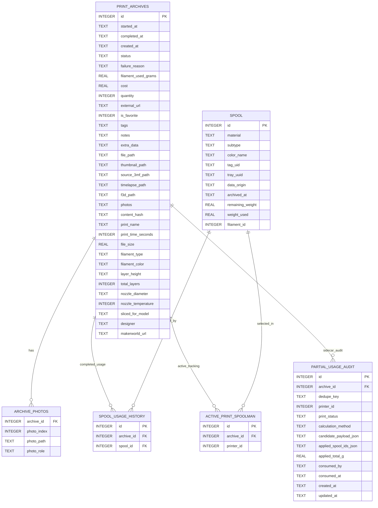
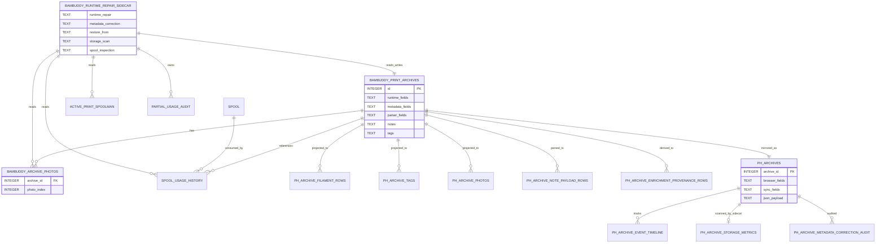
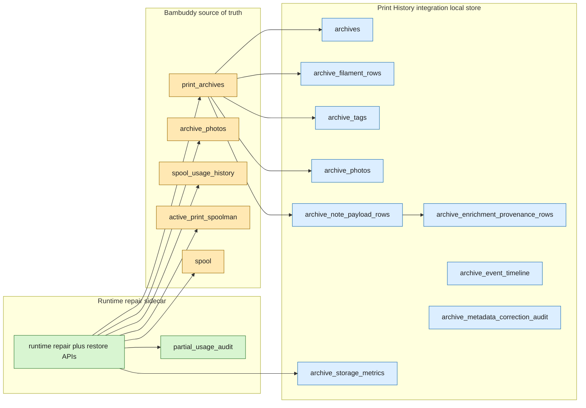

# Print History ER Diagrams (Issue #1122)

## Purpose

Document a stable ER baseline for print history across:

- the Variant 3 local integration store (`homeassistant/custom_components/bambuddy/print_history/store.py`)
- the relevant Bambuddy tables and sidecar touchpoints used by runtime repair, metadata correction, restore, and spool/storage inspection flows

This is intentionally focused on schema structure and field ownership, not card-level formatting.

## Diagram A: Variant 3 Local Integration Store

```mermaid
erDiagram
    ARCHIVES ||--o{ ARCHIVE_FILAMENT_ROWS : has
    ARCHIVES ||--o{ ARCHIVE_TAGS : has
    ARCHIVES ||--o{ ARCHIVE_PHOTOS : has
    ARCHIVES ||--o| ARCHIVE_PRIMARY_PHOTO_SELECTION : selected_primary
    ARCHIVES ||--o{ ARCHIVE_NOTE_PAYLOAD_ROWS : has
    ARCHIVES ||--o{ ARCHIVE_ENRICHMENT_PROVENANCE_ROWS : has
    ARCHIVES ||--o{ ARCHIVE_EVENT_TIMELINE : has
    ARCHIVES ||--o{ ARCHIVE_REPAIR_LINEAGE : lineage_from
    ARCHIVES ||--o{ ARCHIVE_REPAIR_LINEAGE : lineage_to
    ARCHIVES ||--o{ ARCHIVE_METADATA_CORRECTION_AUDIT : correction_audit
    ARCHIVES ||--o| ARCHIVE_REVIEW_STATE : review
    ARCHIVES ||--o| ARCHIVE_MEDIA_REVIEW_STATE : media_review
    ARCHIVES ||--o| ARCHIVE_STORAGE_METRICS : storage
    ARCHIVES ||--o| ARCHIVE_SKIP_OVERLAY_STATE : skip_overlay

    ARCHIVES {
        INTEGER archive_id PK
        TEXT printer_id
        TEXT printer_name
        TEXT print_name
        TEXT status
        TEXT started_at
        TEXT completed_at
        TEXT created_at
        INTEGER actual_time_seconds
        INTEGER print_time_seconds
        REAL filament_used_grams
        TEXT filament_type
        TEXT filament_color
        INTEGER duplicate_count
        INTEGER duplicate_sequence
        INTEGER original_archive_id
        REAL cost
        INTEGER quantity
        INTEGER object_count
        TEXT layer_height
        TEXT nozzle_diameter
        INTEGER nozzle_temperature
        INTEGER total_layers
        TEXT sliced_for_model
        TEXT designer
        TEXT makerworld_url
        INTEGER is_favorite
        TEXT tags
        TEXT notes
        TEXT failure_reason
        TEXT thumbnail_path
        TEXT project_id
        TEXT project_name
        TEXT archive_day_local
        INTEGER has_archive_error
        INTEGER missing_core_3mf
        INTEGER missing_thumbnail
        INTEGER has_source_only
        TEXT archive_error_type
        TEXT archive_error_severity
        TEXT enrichment_status
        TEXT last_synced_at
        TEXT source_updated_at
        TEXT payload_hash
        TEXT json_payload
        TEXT updated_at
    }

    ARCHIVE_FILAMENT_ROWS {
        INTEGER archive_id FK
        INTEGER row_index
        TEXT tray
        TEXT name
        TEXT type
        TEXT color
        REAL used_grams
        TEXT filament_id
        TEXT spool_id
    }

    ARCHIVE_TAGS {
        INTEGER archive_id FK
        TEXT normalized_tag
        TEXT tag
        INTEGER is_system
    }

    ARCHIVE_PHOTOS {
        INTEGER archive_id FK
        INTEGER photo_index
        TEXT photo_path
        TEXT photo_role
    }

    ARCHIVE_PRIMARY_PHOTO_SELECTION {
        INTEGER archive_id PK
        TEXT photo_path
        TEXT updated_at
    }

    ARCHIVE_NOTE_PAYLOAD_ROWS {
        INTEGER archive_id FK
        INTEGER row_index
        TEXT tray
        TEXT name
        TEXT type
        TEXT color
        REAL used_grams
        TEXT filament_id
        TEXT spool_id
        TEXT ambiguity_code
        TEXT filament_match_method
        TEXT provenance_marker
        TEXT spool_match_method
    }

    ARCHIVE_ENRICHMENT_PROVENANCE_ROWS {
        INTEGER archive_id FK
        INTEGER row_index
        TEXT source_code
        TEXT tray
        TEXT name
        TEXT type
        TEXT color
        REAL used_grams
        TEXT filament_id
        TEXT spool_id
        TEXT ambiguity_code
        TEXT filament_match_method
        TEXT provenance_marker
        TEXT spool_match_method
        TEXT evidence_json
    }

    ARCHIVE_EVENT_TIMELINE {
        INTEGER id PK
        INTEGER archive_id FK
        TEXT event_type
        TEXT event_time
        TEXT event_source
        TEXT event_status
        TEXT payload_json
        TEXT derived_from
        TEXT event_key
    }

    ARCHIVE_REPAIR_LINEAGE {
        INTEGER archive_id FK
        INTEGER related_archive_id FK
        TEXT relation_type
        TEXT created_at
        TEXT note
    }

    ARCHIVE_METADATA_CORRECTION_AUDIT {
        TEXT correction_id PK
        INTEGER archive_id FK
        TEXT request_id
        TEXT requested_at
        TEXT applied_at
        TEXT status
        TEXT reason
        TEXT trigger_source
        TEXT updated_fields_json
        TEXT warnings_json
        TEXT before_json
        TEXT after_json
        TEXT derived_impacts_json
        TEXT response_json
    }

    ARCHIVE_REVIEW_STATE {
        INTEGER archive_id PK
        TEXT review_status
        TEXT mismatch_flags
        TEXT reviewed_at
        TEXT review_note
    }

    ARCHIVE_MEDIA_REVIEW_STATE {
        INTEGER archive_id PK
        TEXT review_status
        TEXT requested_at
        TEXT started_at
        TEXT completed_at
        TEXT dismissed_at
        INTEGER photo_count
        TEXT last_action
        TEXT review_note
    }

    ARCHIVE_STORAGE_METRICS {
        INTEGER archive_id PK
        TEXT scan_status
        TEXT scan_basis
        TEXT resolved_archive_dir
        INTEGER archive_3mf_bytes
        INTEGER thumbnail_bytes
        INTEGER source_3mf_bytes
        INTEGER timelapse_bytes
        INTEGER f3d_bytes
        INTEGER photo_bytes
        INTEGER photo_count
        INTEGER other_bytes
        INTEGER other_file_count
        INTEGER files_missing_count
        INTEGER total_bytes
        TEXT extension_breakdown_json
        TEXT artifacts_json
        TEXT source_snapshot_hash
        TEXT computed_at
        REAL scan_duration_ms
        TEXT scan_error
        TEXT updated_at
    }

    ARCHIVE_SKIP_OVERLAY_STATE {
        INTEGER archive_id PK
        TEXT overlay_version
        INTEGER plate_number
        TEXT pick_image_asset_path
        TEXT payload_json
        TEXT updated_at
    }
```

### Integration Mapping Notes (Bambuddy API -> Local Store)

- Base archive mapping is handled by `_archive_row(...)` and `_upsert_archive(...)` in `store.py`.
- Child replacement and rebuild is handled by `_replace_archive_children(...)`.
- High-value source payload paths consumed by the local schema:
  - `archive.filament_slots[]` -> `archive_filament_rows`
  - `archive.tags` -> `archive_tags`
  - `archive.photos[]` -> `archive_photos`
  - hidden enrichment payload in `archive.notes` (`+>` marker) -> `archive_note_payload_rows`
  - derived provenance rows from note payload + source evidence -> `archive_enrichment_provenance_rows`

## Diagram B: Bambuddy Schema Slice + Sidecar Touchpoints

Obsidian Mermaid ER does not support per-entity class styling in this diagram type, so ownership is called out in the key below.

Ownership key:

- Bambuddy tables: `PRINT_ARCHIVES`, `ARCHIVE_PHOTOS`
- Runtime-repair sidecar-owned: `PARTIAL_USAGE_AUDIT`
- Shared/native spool tracking context: `SPOOL`, `SPOOL_USAGE_HISTORY`, `ACTIVE_PRINT_SPOOLMAN`

## Diagram C: Operator-Facing View (Simplified)

This view is intentionally compact for discussions, reviews, and issue triage.

Obsidian Mermaid ER does not support per-entity class styling in this diagram type, so ownership is called out in the key below.

Ownership key:

- Bambuddy tables: `BAMBUDDY_PRINT_ARCHIVES`, `BAMBUDDY_ARCHIVE_PHOTOS`
- Print-history integration local store: `PH_ARCHIVES`, `PH_ARCHIVE_FILAMENT_ROWS`, `PH_ARCHIVE_TAGS`, `PH_ARCHIVE_PHOTOS`, `PH_ARCHIVE_NOTE_PAYLOAD_ROWS`, `PH_ARCHIVE_ENRICHMENT_PROVENANCE_ROWS`, `PH_ARCHIVE_EVENT_TIMELINE`, `PH_ARCHIVE_STORAGE_METRICS`, `PH_ARCHIVE_METADATA_CORRECTION_AUDIT`
- Runtime-repair sidecar-owned: `BAMBUDDY_RUNTIME_REPAIR_SIDECAR`, `PARTIAL_USAGE_AUDIT`
- Shared/native spool tracking context: `SPOOL`, `SPOOL_USAGE_HISTORY`, `ACTIVE_PRINT_SPOOLMAN`

### Simplified Ownership Summary

- Bambuddy remains source-of-truth for archive-core records.
- The Variant 3 local store remains query-optimized and print-history-owned.
- The runtime-repair sidecar is the write boundary for advanced correction and restore workflows.
- Storage metrics in the local store are sidecar-fed, but local-store-owned.

## Diagram D: Ownership Flow (Colorized)

This companion diagram is intentionally a `flowchart` (not `erDiagram`) so Obsidian can render explicit ownership colors reliably.

Color key:

- `Amber`: Bambuddy tables
- `Blue`: print-history integration local store tables
- `Green`: sidecar API and sidecar-owned audit table

## Sidecar Field Touchpoint Matrix

### `print_archives` fields directly written by sidecar

| Flow | Fields written |
|---|---|
| Runtime repair (`runtime_repair_core.py`) | `started_at`, `completed_at`, `created_at`, `status`, `failure_reason`, `notes` |
| Metadata correction (`metadata_correction.py`) | `started_at`, `completed_at`, `created_at`, `status`, `failure_reason`, `filament_used_grams`, `cost`, `quantity`, `external_url`, `notes` |
| Restore-from apply (`repair.py`) | `started_at`, `completed_at`, `created_at`, `status`, `failure_reason`, `is_favorite`, `cost`, `quantity`, `external_url`, `tags`, `notes`, `extra_data` |
| Restore completion finalize (`repair.py`) | `tags`, `notes` |

### `print_archives` fields read by sidecar for planning/inspection

| Flow | Fields read |
|---|---|
| Runtime repair load/snapshot | `id`, `started_at`, `completed_at`, `created_at`, `status`, `failure_reason`, `notes` |
| Metadata correction revision/preview | `id`, `started_at`, `completed_at`, `created_at`, `status`, `failure_reason`, `filament_used_grams`, `cost`, `quantity`, `external_url`, `notes` |
| Restore-from planning | `SELECT *` on `print_archives` for both source and target archive IDs |
| Storage scan | `file_path`, `thumbnail_path`, `source_3mf_path`, `timelapse_path`, `f3d_path`, `photos` |
| Spool linkage inspection | `notes`, `tags`, `extra_data` (plus broad row context via `SELECT *`) |

### Additional table touchpoints used by sidecar

| Table | Usage |
|---|---|
| `archive_photos` | Read for restore merge planning and upload dedupe (`photo_index`, `photo_path`, `photo_role`) |
| `spool_usage_history` | Read-only inspection of completed spool linkage by `archive_id` |
| `active_print_spoolman` | Read-only inspection and partial-usage estimation by `archive_id`/`printer_id` |
| `spool` | Read-only enrichment context for spool metadata and ID resolution by `tag_uid`/`tray_uuid` |
| `partial_usage_audit` | Sidecar-owned audit table (`CREATE TABLE IF NOT EXISTS`, `INSERT`, `UPDATE`) |

## Notes For Ongoing Issue #1122 Work

- Keep this doc as the schema-level anchor.
- If new sidecar mutation flows are added, update the touchpoint matrix before expanding UI docs.
- If local store tables are added in Variant 3, extend Diagram A first, then update feature-specific docs that depend on those tables.

## Issue #1122 Checklist

Use this checklist whenever schema or sidecar mutation contracts change.

- [ ] Update Diagram A when local Variant 3 table/column relationships change.
- [ ] Update Diagram B when Bambuddy-side or sidecar-inspected table usage changes.
- [ ] Update Diagram C if ownership boundaries or the operator mental model changes.
- [ ] Update "Sidecar Field Touchpoint Matrix" when sidecar read/write fields change.
- [ ] Validate field changes against current code paths in `sidecars/bambuddy-runtime-repair/app/*.py`.
- [ ] Validate local projection changes against `homeassistant/custom_components/bambuddy/print_history/store.py`.
- [ ] Confirm links from feature indexes remain present:
    - `docs/features/print_history/README.md`
    - `docs/features/print_history/planning/README.md`
    - `docs/features/print_history/runtime-repair/README.md`
