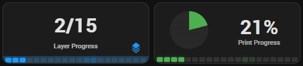
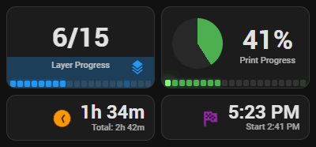

# Print Progress

Animated print progress KPI cards showing layer count, percentage, time remaining, and estimated completion.

## Implementation

**Package**: [`homeassistant/packages/3d_printing/print_progress/`](../../../homeassistant/packages/3d_printing/print_progress/)

### Structure

| Directory | Purpose |
|-----------|---------|
| `dashboard_cards/` | KPI option card variants (`print-progress-kpi-option-*.yaml`) |

### Key Features

- **Layer Progress** — Layers icon bounces upward while printing
- **Print Progress** — Icon spins continuously while printing
- **Time Remaining** — Elapsed-of-total subtitle, clock icon rotates while printing (mushroom card)
- **Est. Completion** — Smart human-readable time with day descriptor and start time subtitle (mushroom card)
- 13 design variants to choose from (options 1–13)
- All animations stop on pause/stop/complete
- 2×2 grid layout

## Screenshots

<!-- SCREENSHOT: id=print-progress-kpi-active | format=png | version=1.0 | package=print_progress | added=2026-03-15 | captured=2026-03-15 -->

<!-- SCREENSHOT: id=print-progress-kpi-animation | format=gif | version=1.0 | package=print_progress | added=2026-03-15 | captured=2026-03-15 -->

<!-- SCREENSHOT: id=print-progress-kpi-idle | format=png | version=1.0 | package=print_progress | added=2026-03-15 -->
<!-- Capture: KPI cards when printer is idle (no animation, zero/dash values) -->
> **📸 Screenshot needed:** Print progress KPI cards — idle state *(png)*

## Documentation

| File | Description |
|------|-------------|
| [print-progress-options-guide.md](reference/print-progress-options-guide.md) | Comparison of all 13 variants with selection checklist |
| [print-progress-dependencies.md](reference/print-progress-dependencies.md) | Runtime dependency map: include chain, required entities, custom cards |
| [mushroom-kpi-card-styling.md](design/mushroom-kpi-card-styling.md) | Mushroom template card styling reference — card-mod technique, typography, and text wrapping |

## Dependencies & Requirements

> **Foundation:** This feature requires the [Core](../core/README.md) and [Common](../common/README.md) packages and the [ha-bambulab](https://github.com/greghesp/ha-bambulab) integration — see [Foundation Packages](../../README.md#foundation-packages).

This is a dashboard-card-only feature — it has no loader in `_feature_loaders.yaml` and is included via `!include` in `view_main.yaml`.

### Custom Frontend Cards (HACS)

| Card | Required | Purpose |
|---|---|---|
| [button-card](https://github.com/custom-cards/button-card) | **Yes** | Animated KPI card rendering for Layer/Print Progress |
| [mushroom](https://github.com/piitaya/lovelace-mushroom) | **Yes** | Time Remaining and Est. Completion KPI cards |
| [card-mod](https://github.com/thomasloven/lovelace-card-mod) | **Yes** | Custom typography and opacity on mushroom cards ([styling reference](design/mushroom-kpi-card-styling.md)) |

### Related Features

| Feature | Relationship |
|---|---|
| [Print Weight & Cost](../print_weight_and_cost/README.md) | Weight and cost tracking for the same print |
| [Printer Dashboards](../printer_dashboards/README.md) | Layout context in the main view |
