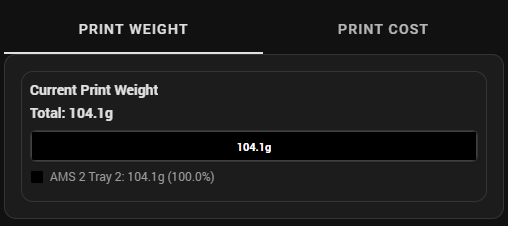

# Print Weight & Cost

Filament weight visualization and cost tracking for active prints, showing per-tray consumption and total weight breakdowns.

## Implementation

**Package**: [`homeassistant/packages/3d_printing/print_weight_and_cost/`](../../../homeassistant/packages/3d_printing/print_weight_and_cost/)

### Structure

| Directory | Purpose |
|-----------|---------|
| `dashboard_cards/` | Weight bar chart and per-tray consumption cards |

### Key Features

- Horizontal stacked bar chart showing filament usage by color
- Per-tray weight display with color-coded warnings (red/orange/yellow/gray based on remaining filament)
- Each segment colored with actual filament color
- Percentage display per filament segment
- Total weight display
- Dark and light mode compatible

## Screenshots

<!-- SCREENSHOT: id=weight-bar-chart-multicolor | format=png | version=1.0 | package=print_weight_and_cost | added=2026-03-15 | captured=2026-03-15 -->

<!-- SCREENSHOT: id=weight-per-tray-warnings | format=png | version=1.0 | package=print_weight_and_cost | added=2026-03-15 -->
<!-- Capture: Per-tray consumption cards showing color-coded warnings (green/yellow/orange/red based on remaining filament) -->
> **📸 Screenshot needed:** Per-tray weight cards with color-coded warnings *(png)*

## Documentation

| File | Description |
|------|-------------|
| [print-weight-and-cost-bar-charts.md](reference/print-weight-and-cost-bar-charts.md) | Weight & cost stacked bar charts: visual design, price fallback logic, legends, troubleshooting |
| [print-weight-per-tray.md](reference/print-weight-per-tray.md) | Per-tray consumption display with color-coded remaining filament warnings |

## Dependencies & Requirements

> **Foundation:** This feature requires the [Core](../core/README.md) and [Common](../common/README.md) packages and the [ha-bambulab](https://github.com/greghesp/ha-bambulab) integration — see [Foundation Packages](../../README.md#foundation-packages).

This is a dashboard-card-only feature — it has no loader in `_feature_loaders.yaml` and is included via `!include` in `view_main.yaml`.

### Feature Dependencies

| Dependency | Required | Purpose |
|---|---|---|
| [Spoolman Sync](../spoolman_sync/README.md) | **Yes** | Provides spool weight data and AMS tray mapping via `input_text.print_weight_backup` |

> **Without Spoolman Sync**, the weight bar chart and per-tray cards will have no data to display. There is no way to disable this dependency — Spoolman Sync is required for this feature to function.

### Related Features

| Feature | Relationship |
|---|---|
| [Print Progress](../print_progress/README.md) | Progress tracking for the same print |
| [Printer Dashboards](../printer_dashboards/README.md) | Layout context |
