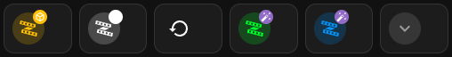

# LED Controls - Visual Reference Guide

<!-- SCREENSHOT: id=led-visual-full-grid | format=png | version=1.0 | package=printer_led | added=2026-03-15 | captured=2026-03-15 -->



<!-- SCREENSHOT: id=led-visual-wled-popup | format=png | version=1.0 | package=printer_led | added=2026-03-15 -->
<!-- Capture: WLED advanced popup dialog showing effect/palette/speed/intensity controls and color picker -->
> **📸 Screenshot needed:** WLED advanced popup — full control panel *(png)*

## Card Layout Overview

```
┌─────────────────────────────────────────────────────┐
│  💡 LED Controls                                    │
│  Printer & AMS Lighting                             │
├─────────────────────────────────────────────────────┤
│  ┌────────────────────┐  ┌────────────────────┐    │
│  │ 💡 Interior Top    │  │ 💡 Chamber Light   │    │
│  │    Light           │  │                    │    │
│  │ ▓▓▓▓▓░░░ 70%      │  │ ▓▓▓▓░░░░ 50%      │    │
│  │ 🎨 Color Control   │  │ ⚙️ Brightness Only │    │
│  └────────────────────┘  └────────────────────┘    │
│                                                     │
│  ┌────────────────────┐  ┌────────────────────┐    │
│  │ 💡 AMS 1 Tray     │  │ 💡 AMS 1 Tag LEDs  │    │
│  │    Light           │  │                    │    │
│  │ ▓▓▓▓▓▓▓▓ 100%     │  │ ▓▓▓▓░░░░ 60%      │    │
│  │ 🎨 Color Control   │  │ 🎨 Color Control   │    │
│  └────────────────────┘  └────────────────────┘    │
│                                                     │
│  ┌────────────────────┐  ┌────────────────────┐    │
│  │ 💡 AMS 2 Tray     │  │ 💡 AMS 2 Tag LEDs  │    │
│  │    Light           │  │                    │    │
│  │ ▓▓▓▓▓▓░░ 85%      │  │ ▓▓▓▓▓░░░ 75%      │    │
│  │ 🎨 Color Control   │  │ 🎨 Color Control   │    │
│  └────────────────────┘  └────────────────────┘    │
│                                                     │
│  ┌─────────────────────────────────────────────┐   │
│  │ 💡 Front Display LED                        │   │
│  │ ▓▓▓▓▓▓▓▓ 100%                              │   │
│  │ 🎨 Color Control                            │   │
│  └─────────────────────────────────────────────┘   │
│                                                     │
├─────────────────────────────────────────────────────┤
│  ┌──────────────┐  ┌──────────────┐               │
│  │ 💡 All On    │  │ 🌑 All Off   │               │
│  │ Turn on all  │  │ Turn off all │               │
│  └──────────────┘  └──────────────┘               │
├─────────────────────────────────────────────────────┤
│  💡 5 of 7 lights on                               │
│  Interior, AMS1 Tray, AMS1 Tags, AMS2 Tray, Front  │
└─────────────────────────────────────────────────────┘
```

## Card Interactions

### 1. Single Tap - Toggle Light
```
┌────────────────────┐
│ 💡 Interior Top    │ ← Single Tap
│    Light [ON]      │ → Toggles On/Off
│ ▓▓▓▓▓░░░ 70%      │
└────────────────────┘
```

### 2. Hold - More Info Dialog
```
┌────────────────────┐
│ 💡 Chamber Light   │ ← Hold/Long Press
│ ▓▓▓▓░░░░ 50%      │ → Opens standard HA dialog
└────────────────────┘
```

### 3. Double Tap - Advanced Popup (WLED only)
```
┌────────────────────┐
│ 💡 AMS 1 Tray     │ ← Double Tap
│    Light           │ → Opens advanced popup
│ ▓▓▓▓▓▓▓▓ 100%     │    with WLED controls
└────────────────────┘
        ↓
┌─────────────────────────────────┐
│ AMS 1 Tray Light (WLED)         │
├─────────────────────────────────┤
│ 💡 Power            [ON]        │
│ 🎨 Effect           Solid       │
│ 🎨 Color Palette    Default     │
│ ⚡ Speed             128         │
│ 💫 Intensity         128         │
├─────────────────────────────────┤
│ [Color Picker & Brightness]     │
└─────────────────────────────────┘
```

## WLED Advanced Popup - Full Layout

### MagWLED Interior Light Popup
```
┌─────────────────────────────────────────┐
│ Interior Top Light (MagWLED)            │
├─────────────────────────────────────────┤
│ 💡 Power                    [ON] ▶     │
│ 🎨 Effect                   Solid ▼    │
│ 🎨 Color Palette            Default ▼  │
│ ⚡ Speed                     [====] 128 │
│ 💫 Intensity                 [====] 128 │
├─────────────────────────────────────────┤
│ Color & Brightness                      │
│ ┌─────────────────────────────────┐     │
│ │   [Color Wheel]                 │     │
│ │   ▓▓▓▓▓▓▓░░░░░ 70%             │     │
│ └─────────────────────────────────┘     │
├─────────────────────────────────────────┤
│ ┌──────┐ ┌──────┐ ┌──────┐             │
│ │  1️⃣   │ │  2️⃣   │ │  3️⃣   │             │
│ │Preset│ │Preset│ │Preset│             │
│ │  1   │ │  2   │ │  3   │             │
│ └──────┘ └──────┘ └──────┘             │
└─────────────────────────────────────────┘
```

### DigQuad LED Popup (AMS/Front)
```
┌─────────────────────────────────────────┐
│ AMS 1 Tag LEDs (WLED)                   │
├─────────────────────────────────────────┤
│ 💡 Power                    [ON] ▶     │
│ 🎨 Effect                   Solid ▼    │
│ 🎨 Color Palette            Default ▼  │
│ ⚡ Speed                     [====] 128 │
│ 💫 Intensity                 [====] 128 │
├─────────────────────────────────────────┤
│ Color & Brightness                      │
│ ┌─────────────────────────────────┐     │
│ │   [Color Wheel]                 │     │
│ │   ▓▓▓▓▓▓▓▓▓░░ 90%              │     │
│ └─────────────────────────────────┘     │
├─────────────────────────────────────────┤
│ ℹ️ Individual Tag Control               │
│                                         │
│ Configure WLED segments for individual  │
│ tray tag control. See WLED              │
│ documentation for segment configuration.│
└─────────────────────────────────────────┘
```

## Status Overview States

### All Lights Off
```
┌─────────────────────────────────────┐
│ ⚫ 0 of 7 lights on                 │
│ All lights off                      │
└─────────────────────────────────────┘
Icon Color: Disabled (Gray)
```

### Few Lights On (1-3)
```
┌─────────────────────────────────────┐
│ 🔵 2 of 7 lights on                 │
│ Chamber, Front                      │
└─────────────────────────────────────┘
Icon Color: Blue
```

### Several Lights On (4-6)
```
┌─────────────────────────────────────┐
│ 🟠 5 of 7 lights on                 │
│ Interior, AMS1 Tray, AMS1 Tags,     │
│ AMS2 Tray, Front                    │
└─────────────────────────────────────┘
Icon Color: Amber
```

### All Lights On
```
┌─────────────────────────────────────┐
│ 🟢 7 of 7 lights on                 │
│ Interior, Chamber, AMS1 Tray,       │
│ AMS1 Tags, AMS2 Tray, AMS2 Tags,    │
│ Front                               │
└─────────────────────────────────────┘
Icon Color: Green
```

## Quick Actions

### All On Button
```
┌──────────────────┐
│ 💡 All On        │ ← Tap to turn on all lights
│ Turn on all      │   simultaneously
│ lights           │
└──────────────────┘
Background: Warm amber glow (rgba(255, 183, 77, 0.1))
```

### All Off Button
```
┌──────────────────┐
│ 🌑 All Off       │ ← Tap to turn off all lights
│ Turn off all     │   simultaneously
│ lights           │
└──────────────────┘
Background: Gray (rgba(158, 158, 158, 0.1))
```

## Visual States

### Light On - Using Color
When a WLED light is on and set to a color, the card shows that color:

```
┌────────────────────┐
│ 💡 AMS 1 Tray     │
│    Light           │
│ ▓▓▓▓▓▓▓▓ 100%     │ ← Color shows as blue
└────────────────────┘
Background: Light blue tint
```

### Light On - Chamber Light
The built-in chamber light shows a warm amber glow when on:

```
┌────────────────────┐
│ 💡 Chamber Light   │
│ ▓▓▓▓▓░░░ 65%      │
└────────────────────┘
Background: Warm amber (rgba(255, 220, 130, 0.15))
```

### Light Off
```
┌────────────────────┐
│ 💡 Interior Top    │
│    Light           │
│ [OFF]              │
└────────────────────┘
Background: Default (no color)
```

## Color Indicator Examples

### Red (Error State)
```
┌────────────────────┐
│ 🔴 AMS 1 Tag LEDs │
│ ▓▓▓▓▓▓▓▓ 100%     │
└────────────────────┘
```

### Green (Printing)
```
┌────────────────────┐
│ 🟢 Front Display   │
│ ▓▓▓▓▓▓░░ 80%      │
└────────────────────┘
```

### Blue (Filament Color Match)
```
┌────────────────────┐
│ 🔵 AMS 1 Tray     │
│ ▓▓▓▓▓▓▓▓ 100%     │
└────────────────────┘
```

### Purple (Status)
```
┌────────────────────┐
│ 🟣 Interior Top    │
│ ▓▓▓▓▓▓▓░ 90%      │
└────────────────────┘
```

## Responsive Layout

### Desktop View (Wide Screen)
```
┌─────────────────────────────────────────────────────┐
│  💡 LED Controls - Printer & AMS Lighting           │
├──────────────────┬──────────────────┬───────────────┤
│ 💡 Interior Top  │ 💡 Chamber Light │               │
│    Light         │                  │               │
├──────────────────┼──────────────────┤               │
│ 💡 AMS 1 Tray   │ 💡 AMS 1 Tag LEDs│               │
│    Light         │                  │               │
├──────────────────┼──────────────────┤               │
│ 💡 AMS 2 Tray   │ 💡 AMS 2 Tag LEDs│               │
│    Light         │                  │               │
├──────────────────┴──────────────────┤               │
│ 💡 Front Display LED                │               │
└─────────────────────────────────────────────────────┘
```

### Mobile View (Narrow Screen)
```
┌─────────────────────────────┐
│  💡 LED Controls            │
│  Printer & AMS Lighting     │
├─────────────────────────────┤
│ 💡 Interior Top Light       │
├─────────────────────────────┤
│ 💡 Chamber Light            │
├─────────────────────────────┤
│ 💡 AMS 1 Tray Light         │
├─────────────────────────────┤
│ 💡 AMS 1 Tag LEDs           │
├─────────────────────────────┤
│ 💡 AMS 2 Tray Light         │
├─────────────────────────────┤
│ 💡 AMS 2 Tag LEDs           │
├─────────────────────────────┤
│ 💡 Front Display LED        │
└─────────────────────────────┘
```

## Integration with Existing Dashboard

### Recommended Placement

1. **After Status Section** - Place below printer status cards
2. **Before Camera Section** - Keep cameras visible below
3. **Separate Tab** - Create a "Lighting" tab for dedicated control
4. **Sidebar** - Add to sidebar for quick access

### Example Dashboard Structure
```
┌─────────────────────────────────────┐
│ 📊 Status Overview                  │
│ [Print Status] [Current Stage]      │
├─────────────────────────────────────┤
│ 💡 LED Controls                     │
│ [All LED Cards Here]                │
├─────────────────────────────────────┤
│ 📹 Camera Views                     │
│ [Camera Cards]                      │
├─────────────────────────────────────┤
│ 🎛️ AMS Status                       │
│ [AMS Cards]                         │
└─────────────────────────────────────┘
```

## Keyboard Shortcuts (Future Enhancement)

Potential keyboard shortcuts for power users:

- `L` - Toggle all lights
- `1-7` - Toggle individual lights
- `Shift+L` - Open light control popup
- `Esc` - Close popup

## Accessibility Features

- **High Contrast Mode**: Icons and text remain readable
- **Screen Reader**: All controls labeled properly
- **Keyboard Navigation**: Full keyboard support
- **Color Blind Friendly**: Uses icons in addition to colors

## Performance Considerations

- **Lazy Loading**: Popups only load when opened
- **Update Frequency**: Status updates every 1-2 seconds
- **Network Efficient**: Minimal API calls
- **Mobile Optimized**: Responsive layout adapts to screen size

## Related Visual Guides

- **WLED Segment Visualization**: `/wled/docs/visual-installation-guide.md`
- **Preset Visual Guide**: `/wled/docs/preset_based_visual_guide.md`
- **AMS Tray Popup Visual**: `../printer_dashboards/ams-tray-popup-visual.md`

---

**Note**: This is a conceptual visual guide. Actual appearance may vary based on your Home Assistant theme, screen size, and custom styling.

