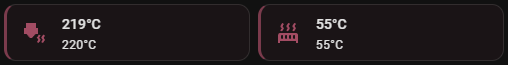

# Printer Temps

Real-time nozzle and bed temperature monitoring cards with color-coded heating/cooling indicators.

## Implementation

**Package**: [`homeassistant/packages/3d_printing/printer_temps/`](../../../homeassistant/packages/3d_printing/printer_temps/)

### Structure

| Directory | Purpose |
|-----------|---------|
| `dashboard_cards/` | `printer-temps.yaml` — canonical temperature card configuration |

### Key Features

- Real-time current and target temperature display
- Color-coded indicators: red (heating), blue (cooling), grey (idle/at target)
- Fixed semantic icons with temperature-based coloring
- Horizontal compact layout for mobile and desktop

## Screenshots

<!-- SCREENSHOT: id=temp-cards-heating | format=png | version=1.0 | package=printer_temps | added=2026-03-15 | captured=2026-03-15 -->

<!-- SCREENSHOT: id=temp-cards-cooling | format=png | version=1.0 | package=printer_temps | added=2026-03-15 -->
<!-- Capture: Both cards in cooling state (blue) — target 0°C, current temps still elevated -->
> **📸 Screenshot needed:** Temperature cards — cooling state (blue indicators) *(png)*

<!-- SCREENSHOT: id=temp-cards-idle | format=png | version=1.0 | package=printer_temps | added=2026-03-15 -->
<!-- Capture: Both cards in idle state (grey) — target 0°C, current temps at room temperature -->
> **📸 Screenshot needed:** Temperature cards — idle state (grey) *(png)*

<!-- SCREENSHOT: id=temp-cards-transition | format=gif | version=1.0 | package=printer_temps | added=2026-03-15 -->
<!-- Capture: Record card transition from idle→heating→at-target — show color indicator changing grey→red→grey. ~8-10s (use ScreenToGif) -->
> **🎬 Animation needed:** Temperature cards — heating cycle color transition *(gif)*

## Documentation

| File | Description |
|------|-------------|
| [printer-temps-cards.md](printer-temps-cards.md) | Full feature documentation, customization, and troubleshooting |
| [printer-temps-quick-start.md](printer-temps-quick-start.md) | 5-minute setup guide |
| [printer-temps-visual-reference.md](printer-temps-visual-reference.md) | Visual examples and color palette reference |
| [printer-temps-mockup.md](printer-temps-mockup.md) | ASCII mockups: desktop, mobile, and state transitions |
| [printer-temps-implementation.md](printer-temps-implementation.md) | Implementation notes |
| [printer-temps-v2-changes.md](printer-temps-v2-changes.md) | V2 changelog |
| [printer-temps-v3-changes.md](printer-temps-v3-changes.md) | V3 changelog |

## Dependencies & Requirements

> **Foundation:** This feature requires the [Core](../core/README.md) and [Common](../common/README.md) packages and the [ha-bambulab](https://github.com/greghesp/ha-bambulab) integration — see [Foundation Packages](../../README.md#foundation-packages).

This is a dashboard-card-only feature — it has no loader in `_feature_loaders.yaml` and is included via `!include` in `view_main.yaml`.

### Custom Frontend Cards (HACS)

| Card | Required | Purpose |
|---|---|---|
| [mushroom](https://github.com/piitaya/lovelace-mushroom) | **Yes** | `mushroom-template-card` for temperature display |

### Related Features

| Feature | Relationship |
|---|---|
| [Printer Controls](../printer_controls/README.md) | Fan controls often placed alongside temps |
| [Printer Dashboards](../printer_dashboards/README.md) | Layout and placement context |
