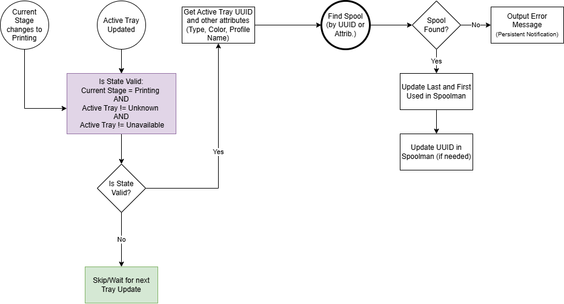

# Active Tray Changed: Update Spoolman Last Used - Home Assistant Automation

## Description: 
This Home Assistant automation is setup to trigger each time the Active Tray sensor is updated for the Bambu Lab printer integrated with Home Assistant and will update the last used datetime for the spool in use. If the spool has never been used (First Used is empty) it will also set the First Used datetime in Spoolman.

## Trigger:
This will also trigger when the current stage changes to 'Printing'. It has additional logic to ensure the current stage is 'Printing', the Active Tray sensor is available and Active Tray sensor is not 'Unknown'

This represents an active print and an active AMS tray. 

## Logic
The automation triggers on filament being actively used. It first uses the Find Spool script to identify the correct spool from your Spoolman inventory. If it finds a match it will update the first and last used datetime in Spoolman. Additionally, if the spool is a Bambu Lab spool, and has a valid UUID (RFID tag) that is being reported by Bambu Lab integration, it will update Spoolman to set the UUID for the matching spool if it is not already on the Spoolman record.

### External Spool Handling
When printing from the **External Spool** on a printer with an AMS, the `active_tray` sensor state becomes `"none"` (the AMS tray index 254/255 is not part of the AMS data structure). The automation now treats this as external spool usage **only when the external spool entity is actively marked as in use**. This prevents false matches during brief AMS transition windows.

If `active_tray` is `"none"` but external spool is not active, the automation assumes it is a tray-switch transition state and skips spool matching for that event.

### Error Notifications
If the automation cannot find a matching spool in Spoolman, it will create a persistent notification in Home Assistant with details about the error. To prevent duplicate notifications during long prints (where the Active Tray sensor may trigger multiple times), the notification uses a unique `notification_id` based on:
- The spool's UUID (if available and valid)
- Or a combination of the filament color and type (if UUID is not available)

This ensures that multiple triggers for the same spool will update the existing notification rather than creating duplicates.

The automation also suppresses persistent error notifications for indeterminate events where matching would be unreliable (for example, transition `none` states or incomplete tray data). These cases are logged to system log/logbook but do not raise persistent user-facing errors.

## Source Code
[Active Tray Changed - Update Spoolman - YAML](../../../homeassistant/packages/3d_printing/spoolman_sync/automations/active_tray_changed_update_spoolman.yaml)

## Prequisites:
- [Find Matching Spool Home Assistant script](find-matching-spools.md) setup and working
- [Update Spool Last and First Used in Spoolman - Home Assistant script](update-spool-last-used.md) setup and working
- All other prerequisites as specified in [README](README.md)
 
## Notes:
- There are several known bugs that I will be cataloging and tracking in GitHub issues in this Repo.
- I have only tested this on my own setup - which is a Bambu Lab P1S with a single AMS attached. I have not, for example used these automations with an AMS Lite, and AMS 2 nor with multiple AMSs.
- External Spool support has been added based on analysis of the ha-bambulab integration source code. The automation correctly detects external spool usage and reads from the appropriate sensor entity.

## Flow of the Logic

