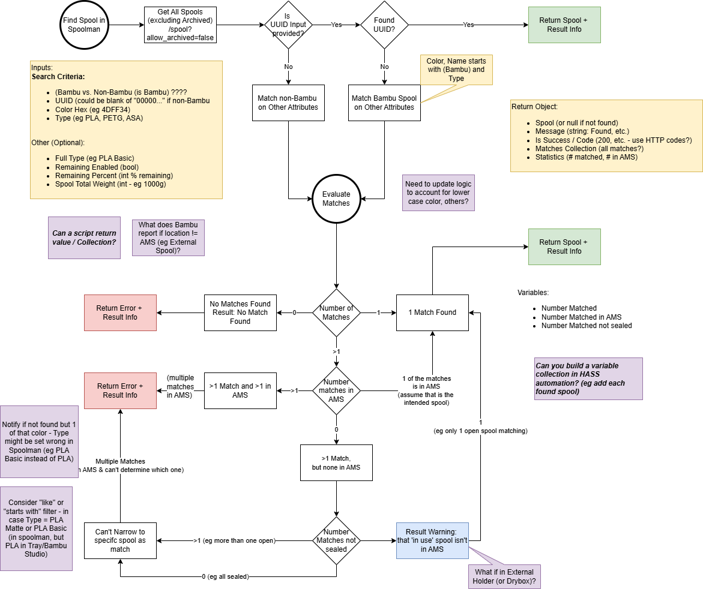

# Find Matching Spool in Spoolman - Home Assistant Script

## Description:
This script calls the Spoolman REST API to identify a spool from tray metadata.

After implementing the spool-matching design analysis Option A, this script is no
longer the primary matcher for the core automations. The authoritative matcher is
now the template sensor `sensor.spoolman_tray_map`.

This script is still kept for:
- Legacy compatibility
- Cross-validation (self-test) against the template matcher
- Troubleshooting and regression comparison

## High Level Logic:
If the UUID (unique ID) of the spool is passed as a parameter, then this is assumed to be a Bambu Lab spool and will search for a match based on that UUID only.

Note: If the UUID isn't provided, is blank or a string of 000000 it is assumed that a UUID isn't provided and thus it is not a Bambu Lab filament.

If either the UUID is not provided, or the UUID cannot be found, then the script uses other attributes to locate a matching spool. This would occur if the Spool is not a Bambu Lab spool (thus does not have a UUID) or is a new spool being used and you have added it to your Spoolman inventory but not entered the UUID for that spool. This allows the script to help you find the correct spool even when the UUID isn't yet set (so that you can manually update the UUID if desired).

## Current Role In The Stack
- Authoritative matcher for production flows: `sensor.spoolman_tray_map`
- Shared tray_map response resolver: `script.resolve_matching_spool_from_tray_map`
- Legacy/reference matcher: this script
- Write-path operations (UUID patch/update usage): still done by automations/scripts

## Source Code
[Find Matching Spool in Spoolman - Script - YAML](../../../homeassistant/packages/3d_printing/spoolman_sync/scripts/find_matching_spool_in_spoolman-script.yaml)

## Inputs: 
- UUID (the unique spool ID from the Bambu Lab RFID tag - if present)
- HEX color of the spool to find
- Filament Material Type (as represented by Bambu Lab integration - eg 'PLA')
- ?? Profile Name - filament profile name as represented in Bambu Lab

## Output:
If successful - the script will a success and return an object with all the attributes of the matching spool from Spoolman
If unsuccessful (cannot find a match): the script will return a failure and error message; an error will also be written as a Home Assistant persistent notification.

## Prequisites:
- Spoolman installed and accessible from Home Assistant
- Custom Fields added to Spoolman as follows: ([detailed instructions](spoolman-custom-fields.md))
  - UUID
  - etc.
- REST integration in Home Assistant installed
- REST endpoint for Spoolman configured (for retrieving all spools from Spoolman API)
- Spoolman integration installed (for updating spoolman)
 
## Notes:
- `sensor.spoolman_tray_map` intentionally excludes sealed spools for template performance and to avoid selecting unopened inventory.
- This script remains useful as a comparator when validating matching behavior changes.

## Flowchart of Logic:

