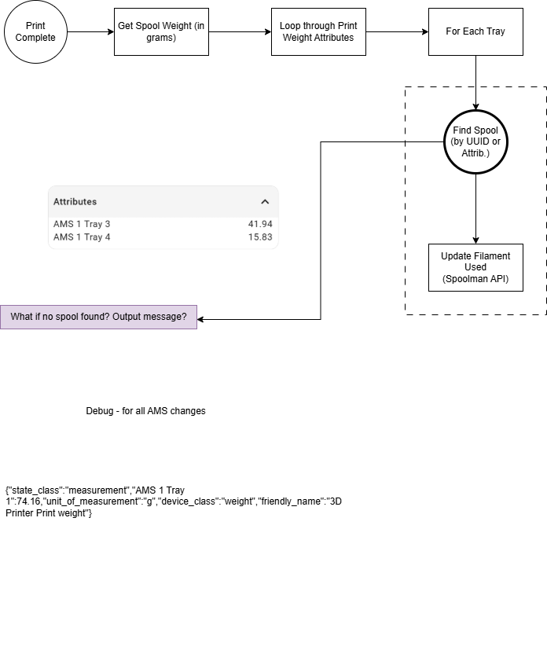

# Print Complete - Update Filament Usage in Spoolman - Home Assistant Automation

## Description
This Home Assistant automation triggers upon a successful completion of a print job on your Bambu Lab printer (as reported by the Bambu Lab integration). It updates Spoolman with the filament usage for each tray that contributed to the print.

## Key Features
- **Backup/restore support**: If Home Assistant restarts during a print, the automation falls back to a backed-up snapshot of print weight attributes (captured after printer status reaches `running`, with wait/retry for MQTT tray data) so Spoolman is still updated correctly. See [Print Weight Persistence](print-weight-persistence.md) for details.
- **Guarded native print-status fallback**: If the Bambu device `print_finished` event is missed, the automation can still run from a `print_status` transition to `finish`/`failed`/`idle`/`offline`. This fallback only runs when the printer transitioned from an active print state and there is usable live tray data or a valid backup payload. It does not rely on a fixed maximum print duration.
- **Multi-AMS tray mapping**: Dynamically resolves AMS tray entities from the reported tray label (e.g., `AMS 2 Tray 3` → `sensor.[printer]_ams_2_tray_3`) so AMS2+ usage updates the correct spool.
- **Runout/swap safety guard**: If an AMS tray UUID is missing at print completion (common after runout or spool swap), the automation skips automatic decrement for that tray to avoid updating the wrong spool.
- **External Spool support**: Handles filament usage for AMS trays and one external spool entity (`sensor.ntk_ryansoffice_3dprinter_external_spool`). The `print_weight` sensor reports external spool usage as `External Spool: <weight>` when the external spool is active.
- **Zero-weight skip**: Trays that contributed 0 grams are silently skipped.
- **No-data warning**: If neither the live sensor nor the backup has per-tray data, a persistent notification is created and Spoolman is not modified, so the user can manually recover.
- **Persistent error logging with likely-cause context**: When a spool cannot be found in Spoolman, the automation records detailed error context (including likely cause and tray entity) in `sensor.spoolman_sync_error_log_storage` (attribute `log`, rolling 10-entry log), `input_text.spoolman_sync_last_error`, `input_datetime.spoolman_sync_last_error_time`, and `input_boolean.spoolman_sync_error_active`, enabling manual recovery via the [Manual Spoolman Recovery script](../../../homeassistant/packages/3d_printing/spoolman_sync/scripts/manual_spoolman_recovery-script.yaml).

## Logic
1. Check whether the live `print_weight` sensor has AMS/External Spool attributes.
2. If not, fall back to the backup stored in `input_text.print_weight_backup`.
3. If neither source has per-tray data, notify the user and stop.
4. For each tray with non-zero usage, resolve tray entity metadata. If AMS tray UUID is missing, skip update for that tray and notify/log why (runout/swap-safe behavior).
5. For trays with usable metadata, call `script.resolve_matching_spool_from_tray_map` (which reads `sensor.spoolman_tray_map`) to locate the matched spool and update its filament usage via `spoolman.use_spool_filament`.
6. On success: log to system log, logbook, and create a persistent notification.
7. On failure (spool not found): write to the persistent error log helpers and create an actionable notification with tray details, tray entity, and likely-cause context for manual recovery.
8. Clear the print weight backup after processing.

## Source Code
[Print Complete - Update Filament Usage - YAML](../../../homeassistant/packages/3d_printing/spoolman_sync/automations/print_complete-update_filament_usage.yaml)

## Prerequisites
- [Print Started - Backup Print Weight automation](../../../homeassistant/packages/3d_printing/spoolman_sync/automations/print_started-backup_print_weight.yaml) enabled (for backup/restore support)
- Helper entities and template sensors loaded via [spoolman_sync_loader.yaml](../../../homeassistant/packages/3d_printing/spoolman_sync/spoolman_sync_loader.yaml)
- All other prerequisites as specified in [README](README.md)

## Notes
- The automation now parses the AMS index from tray labels (for example `AMS 1 Tray 2`, `AMS 2 Tray 2`) instead of hardcoding AMS 1 tray entities.
- Matching now uses `sensor.spoolman_tray_map` as the shared source of truth.
- Sealed spools are intentionally excluded from template matching (same behavior used by this automation through tray_map).
- The status fallback is intentionally guarded by print-context validation rather than a blanket age cutoff. The automation still validates backup task name and total print weight before using backup data, which is the actual protection against stale payloads.
- This automation remains the recommended authority for successful-print
	decrements even if a future Bambuddy hybrid partial-usage fallback is added.
	See [Bambuddy Partial-Usage Sidecar Design](bambuddy-partial-usage-sidecar-design.md).
- **External Spool behavior**: Based on analysis of the ha-bambulab integration source code, when printing from the External Spool on a printer with an AMS, the `print_weight` sensor's per-tray attributes (`External Spool: <weight>`) may be cleared when the print finishes (because the external spool becomes "inactive" as `tray_now` resets to 255). The backup mechanism in [Print Started - Backup Print Weight](../../../homeassistant/packages/3d_printing/spoolman_sync/automations/print_started-backup_print_weight.yaml) captures these attributes once printing is active and is used as a fallback in this scenario.
- **Future extension**: If your environment later exposes a second external spool entity, add `external_spool_2` mapping in the same five files documented in the [README](README.md#external-spool-assumption).

## Flow of the Logic

