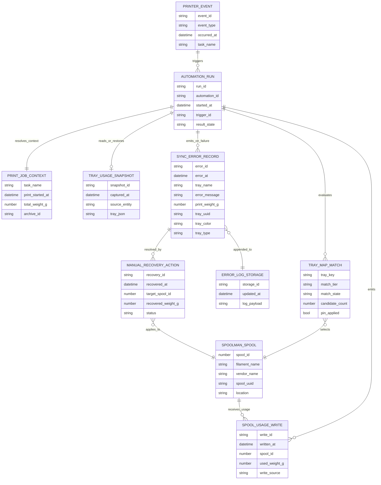
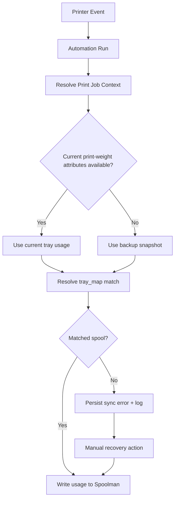

# Spoolman Sync Entity Relationship Diagram

Status: Active
Last Reviewed: 2026-05-23
Functional Owner: spoolman_sync
Replaces: docs/features/spoolman_sync/entity-relationship-diagram.md
Replaced By: none

This document models the core runtime entities and relationships for the `spoolman_sync` feature. It focuses on operational contracts used by automations, helpers, and Spoolman API writes.

## ER Diagram

## Runtime Notes

- `PRINT_JOB_CONTEXT` and `TRAY_USAGE_SNAPSHOT` are restart-safe state anchors used to survive Home Assistant restarts during active prints.
- `TRAY_MAP_MATCH` is authoritative for spool resolution in production paths (`sensor.spoolman_tray_map` + resolver script).
- `SYNC_ERROR_RECORD` is the handoff contract for manual recovery and persistent notification payloads.
- `SPOOL_USAGE_WRITE` is the final side-effect boundary to Spoolman.

## Orchestration View

