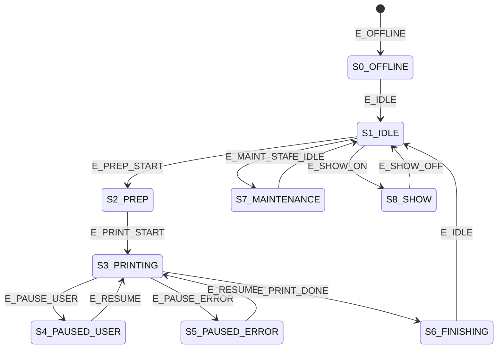

# WLED HA State Machine Package (Skeleton)

This document defines the practical Home Assistant package skeleton for the WLED state machine and how it maps to current Bambu entities in this repo.

## What Was Added

Home Assistant package area:

- `homeassistant/packages/3d_printing/wled/wled_loader.yaml`
- `homeassistant/packages/3d_printing/wled/helpers/input_boolean/wled_3dprinter_state_machine_enabled.yaml`
- `homeassistant/packages/3d_printing/wled/helpers/input_boolean/wled_3dprinter_show_mode_enabled.yaml`
- `homeassistant/packages/3d_printing/wled/helpers/input_select/wled_3dprinter_core_state.yaml`
- `homeassistant/packages/3d_printing/wled/helpers/input_text/wled_3dprinter_last_event.yaml`
- `homeassistant/packages/3d_printing/wled/helpers/input_text/wled_3dprinter_last_transition_reason.yaml`
- `homeassistant/packages/3d_printing/wled/scripts/wled_3dprinter_transition_from_event-script.yaml`
- `homeassistant/packages/3d_printing/wled/scripts/wled_3dprinter_apply_core_state_to_presets-script.yaml`
- `homeassistant/packages/3d_printing/wled/automations/wled_3dprinter_state_machine_orchestrator.yaml`

WLED DigQuad config artifacts:

- `wled/digquad-settings/wled_state_machine_presets_Digquad_skeleton.json`
- `wled/digquad-settings/wled_state_machine_preset_map.json`

## Mermaid State Diagram

## Core State IDs and Names

`input_select.wled_3dprinter_core_state` stores the machine-readable ID values.

| State ID | Human Name | Notes |
|----------|------------|-------|
| `S0_OFFLINE` | Offline | Printer unreachable/offline |
| `S1_IDLE` | Idle | Ready, not printing |
| `S2_PREP` | Preparation | Heating, leveling, checks, prep |
| `S3_PRINTING` | Printing | Active print execution |
| `S4_PAUSED_USER` | Paused (User) | User/manual pause |
| `S5_PAUSED_ERROR` | Paused (Error) | Fault-driven pause |
| `S6_FINISHING` | Finishing | Complete and cooldown |
| `S7_MAINTENANCE` | Maintenance | Cleaning, calibration, service routines |
| `S8_SHOW` | Show Mode | Aesthetic mode, idle only |

## Compact E_* Event Mapping (Current Entities)

| Event | Primary signal(s) | Repo entity mapping |
|------|--------------------|---------------------|
| `E_OFFLINE` | Smart status offline | `sensor.ntk_ryansoffice_3dprinter_smart_status == 'Offline'` |
| `E_IDLE` | Smart status idle | `sensor.ntk_ryansoffice_3dprinter_smart_status == 'Idle'` |
| `E_PREP_START` | Preparing/heating/leveling classes | `sensor.ntk_ryansoffice_3dprinter_smart_status in ['Preparing Print','Heating Bed','Heating Nozzle','Heating Chamber','Cooling Chamber','Bed Leveling','Homing / Checks','Nozzle Prep','Filament Change','Calibration','Identifying Build Plate','Printing Calibration Lines','Inspecting First Layer']` |
| `E_PRINT_START` | Active printing | `sensor.ntk_ryansoffice_3dprinter_smart_status == 'Printing'` |
| `E_PAUSE_USER` | Paused with no explicit fault | `sensor.ntk_ryansoffice_3dprinter_smart_status startswith('Paused')` and no fault token and `binary_sensor.ntk_ryansoffice_3dprinter_hms_errors == 'off'` |
| `E_PAUSE_ERROR` | Paused due to fault/runout | `smart_status` includes runout/clog/AMS-lost/first-layer-error or `binary_sensor.ntk_ryansoffice_3dprinter_hms_errors == 'on'` |
| `E_RESUME` | Return from paused to printing | `smart_status == 'Printing'` while `input_select.wled_3dprinter_core_state in ['S4_PAUSED_USER','S5_PAUSED_ERROR']` |
| `E_PRINT_DONE` | Print finished | `sensor.ntk_ryansoffice_3dprinter_smart_status == 'Print Finished'` |
| `E_MAINT_START` | Maintenance transition from idle/finishing | `sensor.ntk_ryansoffice_3dprinter_current_stage` in maintenance stage set: `cleaning_nozzle_tip`, `filament_loading`, `filament_unloading`, `calibrating_extrusion`, `calibrating_extrusion_flow`, `calibrating_micro_lidar`, `calibrating_motor_noise`, `absolute_accuracy_calibration`, `check_absolute_accuracy_before_calibration`, `check_absolute_accuracy_after_calibration`, `calibrate_nozzle_offset`, `laser_calibration`, `calibrate_birdeye_camera`, `motor_noise_showoff`, `check_door_and_cover`, `check_quick_release`, `check_plaform`, `check_birdeye_camera_position` |
| `E_SHOW_ON` | Manual show-mode request while idle | `input_boolean.wled_3dprinter_show_mode_enabled == 'on'` and smart status idle |
| `E_SHOW_OFF` | Exit show mode while idle | `input_boolean.wled_3dprinter_show_mode_enabled == 'off'` and current state `S8_SHOW` |

## Preset Mapping Used By Skeleton

DigQuad preset IDs used by the script:

- `S0_OFFLINE -> 101`
- `S1_IDLE -> 102`
- `S2_PREP -> 103`
- `S3_PRINTING -> 104`
- `S4_PAUSED_USER -> 105`
- `S5_PAUSED_ERROR -> 106`
- `S6_FINISHING -> 107`
- `S7_MAINTENANCE -> 108`
- `S8_SHOW -> 109`

The matching file to import on DigQuad is:

- `wled/digquad-settings/wled_state_machine_presets_Digquad_skeleton.json`

Deployment note:

- `wled_state_machine_presets_Digquad_skeleton.json` is a partial preset payload for core states (`101-109`).
- Merge/import those preset IDs into your active DigQuad `presets.json`; do not replace your full preset set unless intended.
- `wled_state_machine_preset_map.json` is documentation/reference only and is not uploaded to WLED.

## Phase Plan (Recommended)

### Phase 1: Core State Only (low risk)

1. Load package and verify helper entities appear.
2. Import DigQuad skeleton preset JSON.
3. Enable `input_boolean.wled_3dprinter_state_machine_enabled`.
4. Validate core transitions (`offline`, `idle`, `prep`, `printing`, `paused`, `finished`) with logbook.

Success criteria:

- `input_select.wled_3dprinter_core_state` changes correctly.
- `input_text.wled_3dprinter_last_event` and `input_text.wled_3dprinter_last_transition_reason` update on each transition.
- DigQuad changes preset for each transition event.

### Phase 2: Pause/Error Quality + Show Mode

1. Validate pause routing (`E_PAUSE_USER` vs `E_PAUSE_ERROR`) against real HMS behavior.
2. Validate show mode preemption (`E_SHOW_ON` and `E_SHOW_OFF`) only when idle.
3. Adjust fault token list in orchestrator if your integration emits additional pause reasons.

Success criteria:

- Error pauses consistently route to `S5_PAUSED_ERROR`.
- Show mode never activates outside idle.

### Phase 3: Overlay Expansion

1. Add tray risk overlays (`O_USED_TRAYS`, `O_USED_TRAY_RISK`) as separate scripts called after core preset application.
2. Add humidity/desiccant overlays as idle/maintenance-only overlays.
3. Add allocator logic only if you need temporary segment remaps.

Success criteria:

- Idle-only telemetry remains suppressed during prep/printing/error states.
- No core transition regressions.

## Test Recommendations

1. Add a temporary dashboard card showing:
   - `input_select.wled_3dprinter_core_state`
   - `input_text.wled_3dprinter_last_event`
   - `input_text.wled_3dprinter_last_transition_reason`
2. Run one print job end-to-end and capture event order.
3. Test fault injections:
   - pause from UI
   - runout simulation
   - HMS fault if available
4. Use a rollback toggle:
   - turn off `input_boolean.wled_3dprinter_state_machine_enabled` to stop orchestration quickly.

## Clarifications To Confirm Before Phase 3

1. Final entity names for DigQuad/MagWLED (`light.dig_quad_v3`, `light.magwled`) in your production HA instance.
2. Preferred show mode behavior when `S6_FINISHING` transitions to idle.
3. Whether maintenance should include additional stages beyond loading/unloading/cleaning.
4. Which tray-risk sensors to use first for `O_USED_TRAY_RISK` implementation.
