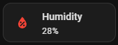
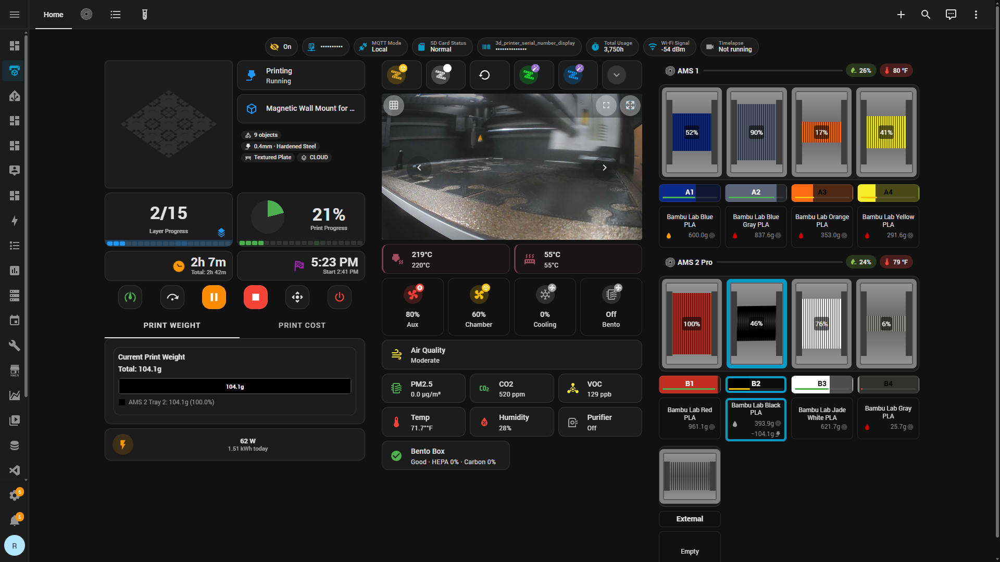

# Screenshot & Animation Guide

How to capture, version, and maintain visual assets across this repository's documentation.

## Screenshot Mode (PII Masking)

Before capturing screenshots for public documentation or sharing, enable **Screenshot Mode** to automatically mask sensitive data on the dashboard.

### What it masks

| Data | Normal Display | Screenshot Mode |
|------|---------------|-----------------|
| Printer IP address | `192.168.1.xxx` | `••••••••••` |
| Printer serial number | `01P00C4601xxxxx` | `••••••••••••••` |
| Printer name (header) | Your printer's configured name | `3D Printer` |

### How to enable

**Option A — Dashboard badge toggle:**
The first badge on the main dashboard view is a Screenshot Mode toggle. Tap it to enable/disable.

**Option B — Developer Tools:**
Go to **Developer Tools → States** and set `input_boolean.screenshot_mode` to `on`.

**Option C — Automation (recommended for Playwright captures):**
```yaml
- action: input_boolean.turn_on
  entity_id: input_boolean.screenshot_mode
```

### Files involved

| File | Purpose |
|------|---------|
| `common/helpers/input_boolean/screenshot_mode.yaml` | The toggle helper |
| `core/template_sensors/screenshot_mode_masks.yaml` | Template sensors that mask values |
| `common/dashboard_views/view_main.yaml` | Dashboard badges and header using masked sensors |

### Capture workflow with Screenshot Mode

1. Enable Screenshot Mode (`input_boolean.screenshot_mode` → on)
2. Wait ~1 second for template sensors to update
3. Capture your screenshots
4. Disable Screenshot Mode to restore normal display

### Additional PII considerations

Entity IDs in the YAML source files (e.g., `ntk_ryansoffice_3dprinter_*`, `p1s_01p00c460102350_*`) contain device-specific identifiers but are **not visible on the rendered dashboard**. They are only visible in the YAML source code. If you are sharing the repository publicly, see the comments in each YAML file for guidance on replacing entity prefixes with your own.

## Directory Structure

All visual assets live under `docs/screenshots/`, organized by feature package:

```
docs/
└── screenshots/
    ├── README.md                  ← Screenshot task tracker (capture checklist)
    ├── printer_dashboards/
    │   ├── dashboard-full-desktop.png
    │   ├── ams-tray-popup-interaction.gif
    │   └── ...
    ├── printer_controls/
    ├── printer_temps/
    ├── printer_led/
    ├── print_progress/
    ├── print_weight_and_cost/
    ├── air_quality/
    ├── humidity/
    ├── hms_alert/
    ├── wled/
    ├── openhasp_display/
    ├── spoolman_sync/
    ├── notifications/
    ├── filament_tag/
    ├── bambuddy_integration/
    └── bambuddy/
```

## Format Recommendations

| Format | Best For | GitHub Rendering | Max Size |
|--------|----------|-----------------|----------|
| **PNG** | Static screenshots of cards, dashboards, layouts | ✅ Native inline | — |
| **GIF** | Short loops (< 15s): animations, state transitions, interactions | ✅ Native inline | 10 MB (GitHub limit) |
| **Animated WebP** | Same as GIF but ~50% smaller file size | ✅ Native inline | — |
| **MP4** (via `<video>`) | Longer demos (15–60s) | ❌ Not rendered on GitHub | Host externally if needed |

**Default choice:** PNG for static content, GIF for anything animated. Use animated WebP only if a GIF exceeds 10 MB.

### What to Animate vs. Screenshot

| Content Type | Format | Why |
|-------------|--------|-----|
| CSS animations (KPI spin/bounce) | **GIF** | The animation is the feature |
| LED state transitions (color changes) | **GIF** | Shows the transition flow |
| Popup open/close interactions | **GIF** | Shows tap → popup → dismiss |
| Slider/control dragging | **GIF** | Shows real-time response |
| Temperature card color shifts | **GIF** | Shows heating → cooling transition |
| Static card layouts | **PNG** | No motion to capture |
| Dashboard overviews | **PNG** | Layout is the focus |
| Physical LED strip effects | **GIF** | Film with phone, convert to GIF |

## Capture Tools (Windows)

### Automated via Playwright MCP + ffmpeg (Recommended)

See [Automated Capture via Playwright MCP](#automated-capture-via-playwright-mcp) below for the full workflow. This is the preferred method for dashboard screenshots and animations — it integrates with Screenshot Mode and produces consistent, repeatable captures.

### For GIFs (Screen Recording → GIF)

| Tool | Cost | Strengths |
|------|------|-----------|
| **[ShareX](https://getsharex.com/)** | Free/OSS | Best all-in-one: screenshots, GIF recording, screen recording, auto-upload. Built-in GIF encoder with region/window capture. Hotkey-driven. **Recommended.** |
| **[ScreenToGif](https://www.screentogif.com/)** | Free/OSS | Dedicated GIF recorder with frame-by-frame editor. Trim, crop, add text overlays, adjust frame rate/delay. Best for polishing GIFs before embedding. |
| **[LICEcap](https://www.cockos.com/licecap/)** | Free | Ultra-lightweight, records directly to GIF. No editor but dead simple. |

### For PNG Screenshots

| Tool | Notes |
|------|-------|
| **ShareX** (same tool) | Region capture, auto-save to folder, auto-naming |
| **Windows Snipping Tool** (`Win+Shift+S`) | Built-in, quick, good for one-offs |

### For Physical Hardware (WLED LED Strips, OpenHASP Displays)

1. Film with phone camera (short video, good lighting, steady)
2. Convert to GIF using:
   - ShareX → import video → convert to GIF
   - ScreenToGif → import video frames → export GIF
   - [ezgif.com](https://ezgif.com/video-to-gif) (online, quick)

### Recommended ShareX Workflow

1. Set the capture output folder to your local clone of `docs/screenshots/<feature>/`
2. Configure hotkeys:
   - `Ctrl+Shift+S` → Region screenshot (PNG)
   - `Ctrl+Shift+G` → GIF recording (region)
3. Rename output files to match the placeholder `id` before committing

## Automated Capture via Playwright MCP

The VS Code Playwright MCP server enables automated screenshot and animation capture directly from the agent, without manual screen recording tools. Two approaches are available:

### Prerequisites

**ffmpeg** is required for stitching frames into GIFs or converting video. Install with winget:

```powershell
winget install --id Gyan.FFmpeg -e --source winget
```

After install, restart your terminal so `ffmpeg` is on `PATH`.

### Approach A — Rapid Screenshots → GIF/MP4 (per-feature, no restart needed)

Use `browser_run_code` to capture a burst of PNG frames from a dashboard animation, then stitch with ffmpeg. This works with an active Playwright MCP session.

**Step 1 — Capture frames via Playwright MCP:**

Use the `browser_run_code` tool to execute a frame-burst capture on the current page:

```javascript
// Capture 30 frames over ~3 seconds (10 fps)
const fs = require('fs');
const dir = 'c:/dev/hass-bambulab-config/docs/screenshots/_frames';
fs.mkdirSync(dir, { recursive: true });
for (let i = 0; i < 30; i++) {
  await page.screenshot({ path: `${dir}/frame-${String(i).padStart(3, '0')}.png` });
  await page.waitForTimeout(100);
}
```

To capture a specific card or region, use a `clip` rectangle or locator:

```javascript
// Capture a specific card by selector
const card = page.locator('.kpi-card-container');
const box = await card.boundingBox();
for (let i = 0; i < 30; i++) {
  await page.screenshot({ path: `${dir}/frame-${String(i).padStart(3, '0')}.png`, clip: box });
  await page.waitForTimeout(100);
}
```

**Step 2 — Stitch into GIF with ffmpeg:**

```powershell
$frames = "c:\dev\hass-bambulab-config\docs\screenshots\_frames"
$output = "c:\dev\hass-bambulab-config\docs\screenshots\<package>"

# Generate optimized GIF (two-pass for best palette)
ffmpeg -framerate 10 -i "$frames\frame-%03d.png" -vf "palettegen" "$frames\palette.png"
ffmpeg -framerate 10 -i "$frames\frame-%03d.png" -i "$frames\palette.png" -lavfi "paletteuse" "$output\<id>.gif"

# Clean up frames
Remove-Item "$frames" -Recurse -Force
```

Or convert to MP4 instead:

```powershell
ffmpeg -framerate 10 -i "$frames\frame-%03d.png" -c:v libx264 -pix_fmt yuv420p "$output\<id>.mp4"
```

**Tuning parameters:**

| Parameter | Default | Adjust when |
|-----------|---------|-------------|
| Frame count | 30 | More frames for longer animations (e.g., 50 for 5s at 10fps) |
| `waitForTimeout` | 100ms | Lower (50ms) for fast CSS animations, higher (200ms) for slow transitions |
| `framerate` | 10 | Match to `1000 / waitForTimeout` — e.g., 100ms intervals = 10fps |

### Approach B — Session Video via `--save-video` (whole session, requires restart)

The Playwright MCP server supports native video recording when launched with `--save-video`. This is configured in `.vscode/mcp.json`:

```json
"playwright": {
  "command": "C:\\Program Files\\nodejs\\node.exe",
  "args": [
    "C:\\...\\@playwright\\mcp\\cli.js",
    "--browser", "msedge",
    "--save-video=1280x720",
    "--output-dir", "c:\\dev\\hass-bambulab-config\\docs\\screenshots"
  ]
}
```

**How it works:**
- Records the **entire browser session** as a WebM file
- Video is saved to `--output-dir` when the browser context closes (i.e., MCP server restarts or session ends)
- Requires a server restart to take effect — does not apply to an already-running session

**Post-processing — extract clips and convert:**

```powershell
# Trim a segment (start at 12s, duration 5s) and convert to GIF
ffmpeg -ss 12 -t 5 -i "docs\screenshots\video.webm" -vf "fps=10,palettegen" palette.png
ffmpeg -ss 12 -t 5 -i "docs\screenshots\video.webm" -i palette.png -lavfi "fps=10,paletteuse" "docs\screenshots\<package>\<id>.gif"
```

**When to use which approach:**

| | Approach A (rapid frames) | Approach B (session video) |
|---|---|---|
| **Best for** | Single card/region animations | Full-page demos, multi-step walkthroughs |
| **Restart needed** | No | Yes |
| **Output** | Per-feature GIF/MP4 | One WebM per session (trim afterward) |
| **Region capture** | Yes (clip/locator) | No (full viewport) |
| **Frame rate control** | Precise | Fixed by browser rendering |

### Complete Workflow Example

Capturing a KPI animation GIF end-to-end:

1. Navigate to the dashboard in Playwright (`browser_navigate`)
2. Enable screenshot mode (`browser_click` the toggle, or call HA service)
3. Trigger the animation state (e.g., start a print, change an entity)
4. Run the frame-burst capture (`browser_run_code` with the loop above)
5. Stitch to GIF with ffmpeg
6. Move the GIF to `docs/screenshots/<package>/<id>.gif`
7. Update the placeholder in the feature README
8. Disable screenshot mode

## Placeholder Format

Every planned screenshot is marked in the documentation with a structured HTML comment and a visible callout:

### For static screenshots (PNG)

```markdown
<!-- SCREENSHOT: id=humidity-cards-desktop | format=png | version=1.0 | package=humidity | added=2026-03-15 -->
<!-- Capture: Desktop view of all 3 humidity cards (AMS1, AMS2, Room) in green/optimal state -->
> **📸 Screenshot needed:** Humidity cards — desktop layout *(png)*
```

### For animations (GIF)

```markdown
<!-- SCREENSHOT: id=print-progress-kpi-anim | format=gif | version=1.0 | package=print_progress | added=2026-03-15 -->
<!-- Capture: Record ~5s loop showing all 4 KPI cards animating during an active print (use ScreenToGif or ShareX GIF mode) -->
> **🎬 Animation needed:** Print progress KPI cards — spinning/bouncing animations during active print *(gif)*
```

### Placeholder fields

| Field | Purpose |
|-------|---------|
| `id` | Unique identifier; becomes the filename (e.g., `humidity-cards-desktop.png`) |
| `format` | `png`, `gif`, or `webp` |
| `version` | Tracks which iteration of the feature the screenshot reflects |
| `package` | Which HA package this belongs to — enables `grep` to find all screenshots for a package |
| `added` | Date the placeholder was created |
| `captured` | Date the screenshot was actually taken (added when replacing placeholder) |

## Capturing a Screenshot (Replacing a Placeholder)

When you capture the image:

1. Save the file as `docs/screenshots/<package>/<id>.<format>`
2. Replace the placeholder block:

**Before:**
```markdown
<!-- SCREENSHOT: id=humidity-cards-desktop | format=png | version=1.0 | package=humidity | added=2026-03-15 -->
<!-- Capture: Desktop view of all 3 humidity cards (AMS1, AMS2, Room) in green/optimal state -->
> **📸 Screenshot needed:** Humidity cards — desktop layout *(png)*
```

**After:**
```markdown
<!-- SCREENSHOT: id=humidity-cards-desktop | format=png | version=1.0 | package=humidity | captured=2026-03-15 -->

```

3. Commit both the image file and the updated markdown.

## Versioning & Maintenance

### How version tracking works

Each placeholder/image carries a `version` field tied to the feature's state at capture time. When a feature changes visually:

1. **Bump the version** in the HTML comment (e.g., `version=1.0` → `version=1.1`)
2. **Re-capture** the screenshot
3. **Update `captured` date**

### Finding screenshots that need updates

```bash
# Find all screenshots for a specific package
grep -rn "package=printer_temps" docs/

# Find all placeholders that still need capturing
grep -rn "Screenshot needed\|Animation needed" docs/

# Find all captured screenshots (to audit freshness)
grep -rn "captured=" docs/

# Find screenshots at a specific version
grep -rn "version=1.0" docs/
```

### When to re-capture

Re-capture screenshots when:
- Card layout or styling changes (card-mod, CSS)
- New entities or data fields are added to a card
- Color schemes or thresholds change
- Dependencies update (mushroom, button-card) with visual changes
- A new design variant replaces an old one

### PR workflow recommendation

When a PR changes a feature package visually:
1. Search for placeholders: `grep -rn "package=<feature>" docs/`
2. If screenshots exist, note in the PR description: _"Screenshots may need refresh"_
3. Re-capture and bump version in the same PR, or open a follow-up issue

## Embedding Syntax

### Standard image

```markdown

```

### Sized image (when full width is too large)

```html

```

### Side-by-side comparison (desktop vs. mobile)

```html
<div>
  
  
</div>
```

### Light/dark mode comparison

```html
<div>
  
  
</div>
```

## Automated Capture with Playwright MCP

The Playwright MCP server is configured in [`.vscode/mcp.json`](../../.vscode/mcp.json) and enables **autonomous screenshot capture** of HA dashboard cards directly from VS Code / Copilot.

### Prerequisites

1. **Node.js** — installed via `winget install OpenJS.NodeJS.LTS`
2. **Playwright MCP** — configured in `.vscode/mcp.json` (runs via `npx @playwright/mcp@latest`)
3. **HA long-lived access token** — stored as the `HASS_TOKEN` Windows user environment variable
4. **HA base URL** — stored as the `HASS_URL` Windows user environment variable (`http://192.168.1.5:8123`)

### Setting up the HA token

1. Open `http://192.168.1.5:8123/profile` in your browser
2. Scroll to **Long-Lived Access Tokens** → **Create Token**
3. Name it `playwright-screenshots`
4. Copy the token (shown only once), then set it as a persistent environment variable:

```powershell
[System.Environment]::SetEnvironmentVariable("HASS_TOKEN", "YOUR_TOKEN_HERE", "User")
```

> **Security:** The token is stored as a Windows user-level environment variable — it never appears in any repository file. The `.env` file is in `.gitignore` as a fallback option.

### How it works

The Playwright MCP server exposes browser automation tools (navigate, click, screenshot, resize viewport, etc.) that Copilot can call directly. The typical workflow:

1. **Navigate** to the HA dashboard URL with authentication
2. **Wait** for cards to fully render (custom cards need ~2-3s)
3. **Screenshot** the full page or a specific element
4. **Save** to `docs/screenshots/<package>/<id>.png`
5. **Replace** the placeholder in the markdown doc

### What Playwright can capture autonomously

| Capture Type | Feasibility | Notes |
|-------------|-------------|-------|
| Static dashboard PNGs | ✅ Fully autonomous | Navigate + screenshot |
| Desktop vs. mobile | ✅ Fully autonomous | Set viewport size before capture |
| Popup interactions | ✅ Autonomous | Click element → wait → screenshot |
| Collapse/expand UI | ✅ Autonomous | Click toggle → screenshot both states |
| CSS animations (GIFs) | ⚠️ Semi-autonomous | Capture frame sequence → stitch externally |
| Physical hardware (WLED) | ❌ Manual only | Requires phone camera for physical LED strips |

### Capture session example

Ask Copilot to run a capture session:

> _"Capture all PNG screenshots for the printer_temps feature. Navigate to the 3D printing dashboard, wait for it to render, then screenshot the temperature cards in heating, cooling, and idle states."_

Copilot will use the Playwright MCP tools to autonomously navigate, interact with the dashboard, and save the images.

### Viewport presets

| Preset | Width | Height | Use For |
|--------|-------|--------|---------|
| Desktop | 1920 | 1080 | Full dashboard, card grids |
| Tablet | 1024 | 768 | Responsive layout testing |
| Mobile | 375 | 812 | Mobile-specific screenshots |

### Limitations

- **First load delay**: HA dashboards with many custom cards can take 3-5 seconds to fully render. Playwright should wait before capturing.
- **Authentication**: Requires the `HASS_TOKEN` environment variable to be set. If not set, the browser will show the HA login page.
- **GIF generation**: Playwright captures individual PNG frames. Stitching to GIF requires an external tool (ImageMagick, ScreenToGif, or ezgif.com).
- **Physical hardware**: LED strips, OpenHASP displays, and other physical devices must be photographed manually.

