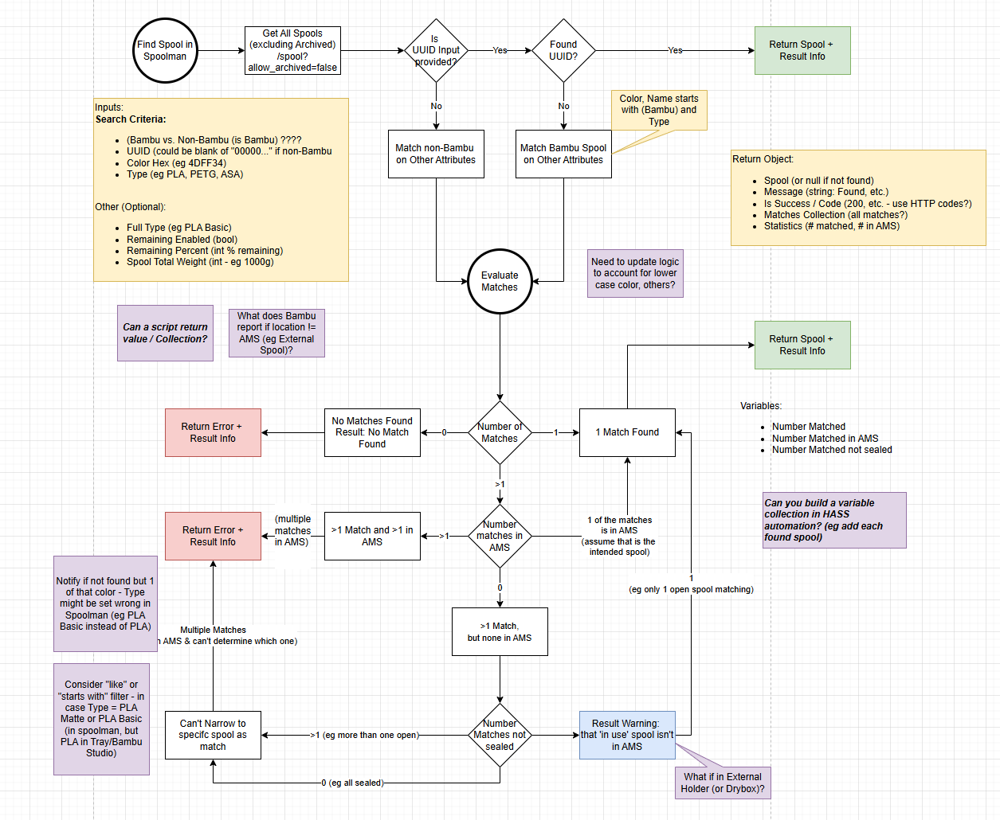

# Find Matching Spool in Spoolman: 

Description: This is a Home Assistant Script designed to use the API provided by Spoolman to identify a spool in your inventory that matches some metadata provided to the script. Given several inputs, the script will use the Spoolman API to attempt to find the correct matching Spool in Spoolman. 

Inputs: 
- UUID (the unique spool ID from the Bambu Lab RFID tag - if present)
- 
- HEX color of the spool to find

- Filament Material Type (as represented by Bambu Lab integration - eg 'PLA')
- ?? Profile Name - filament profile name as represented in Bambu Lab

Output:
If successful - the script will a success and return an object with all the attributes of the matching spool from Spoolman
If unsuccessful (cannot find a match): the script will return a failure and error message; an error will also be written as a Home Assistant persistent notification.

Prequisites:
- Spoolman installed and accessible from Home Assistant
- Custom Fields added to Spoolman as follows: ([detailed instructions](spoolman_custom_fields.md))
  - UUID
  - etc.
- REST integration in Home Assistant installed
- REST endpoint for Spoolman configured (for retrieving all spools from Spoolman API)
- Spoolman integration installed (for updating spoolman)
 

Logic:

